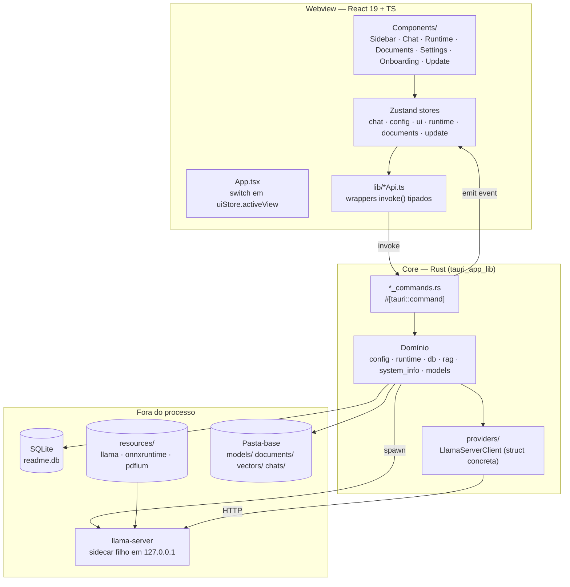

# Architecture

**Revisado em 2026-07-28.** Até esta data o arquivo ainda descrevia `connection_commands::list_connections` e `ConnectionManager::refresh_status` (removidos no M9, AD-039/AD-042) e afirmava que o banco não tinha versionamento — o oposto do `db.rs` desde a **AD-020**, que trocou o `execute_batch(SCHEMA)` único pela lista versionada. É o mesmo defeito que o C-01 do `CONCERNS.md` já tinha registrado, repetido aqui num segundo arquivo. Cada bloco abaixo foi re-conferido contra o código.

**Pattern:** Monolito desktop de duas camadas — webview React (apresentação) sobre um core Rust (domínio + I/O), acopladas apenas por comandos Tauri e eventos. Não há servidor nem rede externa obrigatória. Há **um** processo separado: o `llama-server`, sidecar filho do app, iniciado e morto por ele.

## High-Level Structure

## Identified Patterns

### Comando Tauri como única fronteira

**Location:** `src-tauri/src/*_commands.rs` → registrados em `lib.rs` `invoke_handler![]`
**Purpose:** O frontend nunca toca SQL, filesystem ou HTTP — só chama comandos.
**Implementation:** Cada comando recebe `State<DbState>` e/ou `AppHandle`, valida, delega pro domínio, devolve `Result<T, String>` (erro sempre `String`, nunca tipo customizado).
**Example:** `runtime_commands::set_active_model` → `apply_active_model(&app, &db, &model_name)`, que grava a linha `embedded_runtime` e reinicia o sidecar.
**Contagem:** **39 comandos** registrados no `invoke_handler![]` de `lib.rs` (medido em 2026-07-28) — `commands` 5, `chat_commands` 7, `config_commands` 8, `runtime_commands` 11, `document_commands` 3, `update_commands` 5.

### `DbState` = `Mutex<Option<Connection>>`

**Location:** `src-tauri/src/db.rs:8`
**Purpose:** O banco só existe **depois** que o usuário escolhe a pasta-base no wizard (AD-011). `None` = ainda não configurado.
**Implementation:** Todo comando que precisa do banco chama `db::require_conn(&guard)`, que converte `None` num erro amigável. O helper é **um só**, `pub fn` em `db.rs:201`, importado por quem precisa — a duplicação em 3 arquivos que este documento registrava não existe mais.
**Example:** `commands.rs:5`, `chat_commands.rs:8`, `runtime_commands.rs:4`, `document_commands.rs:1` importam de `crate::db`; `chat/attachments.rs`, `chat/context_assembler.rs`, `chat/memory.rs` e `rag/pipeline.rs` chamam pelo caminho completo.

### Migrações versionadas por `PRAGMA user_version` (AD-020)

**Location:** `src-tauri/src/db.rs` (`const MIGRATIONS`, `fn apply_migrations`)
**Purpose:** Fazer mudança de coluna chegar em banco que já existe no disco. `CREATE TABLE IF NOT EXISTS` sozinho vira **no-op silencioso** ali.
**Implementation:** Lista ordenada `&[(u32, &str)]`; cada entrada com número acima do `user_version` atual roda **em transação** e sobe o pragma no mesmo commit. Hoje são **8 migrações** (`MIGRATION_1_INITIAL` … `MIGRATION_8_CHAT_MEMORY`); a próxima é a 9. Duas entradas com o mesmo número não colidem em compilação — a segunda simplesmente nunca roda.
**Migração destrutiva existe:** a `MIGRATION_7_SINGLE_RUNTIME` derruba `connections` e `model_configs` (SELF-06), e a ordem importa porque `PRAGMA foreign_keys = ON` é ligado no `db::open` — a tabela que referencia cai antes da referenciada.

### Um cliente concreto, sem trait (AD-039)

**Location:** `src-tauri/src/providers/llama_server.rs`
**Purpose:** Falar HTTP com o sidecar.
**Implementation:** `LlamaServerClient` é uma struct, não um `impl` de trait. Até o M9 havia um `trait ProviderClient` com `Box<dyn>`, quatro implementadores e um `match` de provedor — cerimônia que só se paga quando há de fato mais de um provedor para escolher. `runtime_commands::client(&app)` devolve o cliente já apontado para a porta que o processo escolheu; com o sidecar parado, as chamadas reportam `Unavailable`, que é um **estado**, não um erro a tratar.
**Trade-off registrado:** perdeu-se o escape hatch de apontar para um servidor OpenAI-compatible externo. Foi escolha explícita do usuário (AD-039).

### Progresso longo via evento, não polling

**Location:** `runtime_commands::download_model` → `app.emit("model-download-progress", …)`
**Purpose:** Operações longas (download de modelo) empurram progresso pro frontend.
**Implementation:** O comando cria um `tokio::sync::mpsc::channel`, passa o `Sender` para o downloader, e sobe uma task (`tauri::async_runtime::spawn`) que drena o `Receiver` e re-emite cada item como evento Tauri. O frontend escuta com `listen()` no escopo do módulo do store.
**Example:** `runtimeStore.ts` (fim do arquivo) — indexa o progresso pela **URL** do `.gguf`, que é a única identidade que um download tem agora.

### Nav + painel de tela cheia (AD-014)

**Location:** `src/store/uiStore.ts` + `App.tsx` + `components/Sidebar/*Section.tsx`
**Purpose:** Cada área da sidebar é só um botão de navegação; o conteúdo abre num painel à direita que substitui o `ChatPanel`.
**Implementation:** `uiStore.activeView: "chat" | "settings" | "runtime" | "documents"`; `App.tsx` faz um ternário aninhado. Sem react-router.
**Example:** `SettingsSection.tsx` é o template canônico; `RuntimeSection.tsx` segue ele.

### Store Zustand por domínio

**Location:** `src/store/*.ts`
**Purpose:** Estado + ações no mesmo objeto, sem reducers/actions separados.
**Implementation:** `create<State>((set, get) => ({ …dados, …ações }))`. Toda ação assíncrona segue o mesmo shape: `try { await api…; set({…}) } catch (err) { set({ error: String(err) }) }`. Erro é sempre `string | null` no store.

## Data Flow

### Boot / onboarding

1. `App.tsx` monta → `configStore.loadConfig()` → `invoke("get_app_config")`
2. Backend lê `config.json` do `app_config_dir` (**não** da pasta-base — AD-012, resolve o ovo-e-galinha de "onde está a pasta-base?")
3. Sem config ou `onboarding_completed: false` → `status: "needs-onboarding"` → renderiza `Wizard`
4. Wizard chama `complete_onboarding(basePath, theme, language)` → backend cria as 4 subpastas, abre/cria o `readme.db`, popula `DbState`, salva o `config.json`
5. `status: "ready"` → renderiza `Sidebar` + painel. **Só a partir daqui** qualquer comando que precise do banco é chamado.

### Preparar o runtime (M9)

1. `RuntimeCard` monta → `runtimeStore.loadStatus()` → `invoke("runtime_status")`
2. Sem `binary_path` gravado, o estágio é `not_prepared` e o card oferece **Preparar**
3. `prepare_runtime` resolve `resources/llama/vulkan/llama-server` pelo `resource_dir`, roda `--list-devices` e lê a saída (`probe_devices`). GPU → `-ngl -1`; só CPU → `-ngl 0`; binário que não executa → cai para o backend CPU embutido. **Nenhuma requisição HTTP acontece aqui.**
4. Grava só a metade "motor" da linha `embedded_runtime` — o modelo já escolhido sobrevive a um re-preparo
5. Sem modelo, o estágio é `no_model`, que é o estado normal de uma instalação nova; com modelo, o sidecar sobe e o estágio vira `running`

### Download de modelo (M9)

1. `ModelsList` → `downloadModel(url)` → `invoke("download_model", { url })`
2. Backend valida que a URL termina em `.gguf`, cria o canal mpsc e baixa para a pasta de modelos
3. Cada item vira evento `model-download-progress` com a URL como `identifier`; o store atualiza `downloadProgress[url]`; o card re-renderiza a barra
4. No fim, um quadro `success`/`error` fecha a barra — sem ele, um download concluído ficaria parado na última porcentagem

## Code Organization

**Approach:** Híbrido — backend por **camada** (comandos / domínio / providers), frontend por **área funcional** (`components/Runtime/`, `components/Chat/`).

**Module boundaries:**
- `src/types.ts` é o contrato compartilhado: toda struct Rust que cruza a fronteira tem o tipo correspondente lá. O espelhamento **era** manual (C-03); desde **2026-07-28** o arquivo é **gerado** por `ts-rs = "12"` + `src-tauri/src/types_export.rs`, e leva o cabeçalho `GENERATED FILE — do not edit by hand`. Regenere com `cd src-tauri && cargo test --lib types_export -- --ignored`. O gate `types_export::tests::types_ts_matches_rust_structs` falha se o arquivo commitado divergir das structs — e ele é a **única** coisa que fala: uma divergência de tipo deixa `cargo check` e `npm run build` os dois limpos (medido na run 001, estreitando `Message.role`).

  > Este parágrafo dizia *"nesta data `src/types.ts` ainda é o arquivo escrito à mão"* até a **run 002**. Era verdade na hora em que foi escrito — durante a run 001, com a migração em curso — e deixou de ser antes do fim da mesma run. Os outros seis documentos de `codebase/` foram atualizados naquele dia; este ficou para trás. É o mesmo padrão da L-007: prosa escrita como estado momentâneo e lida depois como fato.
- `providers/` só conhece HTTP; não conhece SQLite nem Tauri. Não há mais trait — `LlamaServerClient` é uma struct concreta desde a AD-039.
- `*_commands.rs` conhece tudo, mas não implementa nada.
