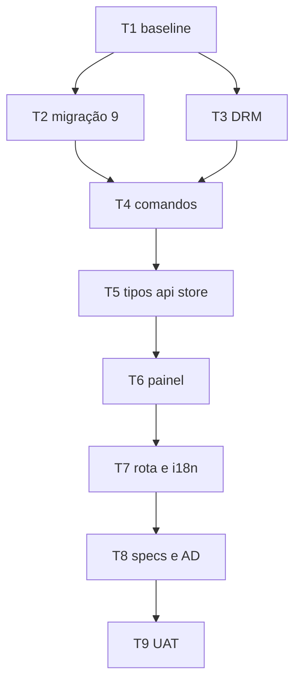

# Biblioteca de livros — Tasks

**Spec:** `.specs/features/book-library/spec.md`
**Design:** `.specs/features/book-library/design.md`
**Status:** T1–T8 executadas (2026-09-05) — ver o Execution Log. **Só a T9 (UAT) está aberta.** A T8 não tocou em código: ela fechou a revogação nas specs antigas, corrigiu a AD-052 e o `AGENTS.md`, registrou a AD-054 e pôs os 12 LIB-xx em `Implemented` — **nenhum em `Verified`**, porque o app não foi aberto. Arquivos de código alterados até aqui: `src-tauri/src/db.rs` (migração 9), `src-tauri/src/library_commands.rs` (funções puras + os quatro comandos), `src-tauri/src/lib.rs` (`mod` e as quatro linhas do `invoke_handler`) e `src-tauri/src/document_commands.rs` (uma linha: `unique_destination` virou `pub(crate)` para ser reusada), `src/types.ts` (`BookRecord`, `ImportBooksResult`), `src/lib/libraryApi.ts` (novo), `src/store/libraryStore.ts` (novo), `src/components/Library/LibraryPanel.tsx` (novo), `src/components/Library/BookRow.tsx` (novo), `src/store/uiStore.ts` (`ActiveView`), `src/App.tsx` (rota), `src/components/Sidebar/LibrarySection.tsx` (novo, substitui o `DocumentsSection.tsx`, **apagado**), `src/components/Sidebar/Sidebar.tsx` (import da seção) e `src/i18n/locales/en.json` / `pt.json` (bloco `library.*` + `sidebar.library`).

---

## Test Coverage Matrix

Segue a matriz de `.specs/codebase/TESTING.md`: função pura em Rust é teste obrigatório; comando Tauri que só orquestra I/O não tem runner de integração e portanto não é testado; componente React depende de a suíte Vitest existir na árvore.

| Requisito | Tipo de prova | Onde |
| --- | --- | --- |
| LIB-01 | manual (UAT) — seletor nativo é UI do SO | T9 |
| LIB-02 | unit — colisão de nome resolvida com sufixo | T4 |
| LIB-03 | unit — classificação por extensão | T3 |
| LIB-04 | manual (UAT) — depende do estado de configuração | T9 |
| LIB-05 | unit — PalmDB com o campo de criptografia em 0, 1 e 2 | T3 |
| LIB-06 | unit — zip EPUB com e sem `META-INF/encryption.xml` | T3 |
| LIB-07 | unit — `INSERT` + `SELECT` contra banco em memória migrado | T2, T4 |
| LIB-08 | unit — após importar, `SELECT COUNT(*) FROM documents` é 0 | T4 |
| LIB-09 | unit — ordenação por `imported_at DESC` | T4 |
| LIB-10 | unit — remoção com arquivo ausente não erra | T4 |
| LIB-11 | manual (UAT) — abre o explorador do SO | T9 |
| LIB-12 | manual (UAT) — caminho visível na tela | T9 |

**Cobertura que esta feature não tem, dito com todas as letras:** os quatro comandos Tauri em si (`import_books`, `list_books`, `delete_book`, `library_path`) não são exercitados por teste automatizado — não há runner de integração Tauri neste projeto. O que é testado são as funções puras que eles chamam e o SQL contra um banco em memória. A prova de que o comando está corretamente ligado é a T9, clicando.

---

## Gate Check Commands

```bash
cd src-tauri && cargo test --lib      # baseline HEAD a medir na T1; cada task não pode reduzir
cd src-tauri && cargo check --lib     # sem warnings novos
npm run build                          # tsc + Vite limpos
npm test                               # SÓ se a suíte Vitest existir na árvore restaurada (ver T1)
npm run test:scripts                   # não aplicável: nenhuma task mexe em scripts/
```

O `AGENTS.md` registra `cargo test --lib` em **181 passando / 0 falhas / 16 ignorados** e `npm test` em **63 em 8 arquivos**, medidos em 2026-07-28. Esses números **não** foram confirmados nesta sessão e o `HEAD` não contém o código que os produziria. A T1 mede o baseline real e é ele que vale.

---

## Execution Plan



**Fase 1 — backend (T1–T4).** Nada aparece na tela; o critério é o `cargo test`.
**Fase 2 — frontend (T5–T7).** A aba muda de dono; o critério é o `npm run build` e a tela abrindo.
**Fase 3 — documentação e verificação (T8–T9).** Fecha a revogação nas specs antigas e prova o que só clicando se prova.

São 9 tasks — acima do lote de ~8, então a execução deve começar pela oferta de sub-agents (um lote por fase), com o Verifier obrigatório no fim.

---

## Task Breakdown

### T1: Medir o baseline real

**O quê:** conferir se `src-tauri/src/types_export.rs` existe, se `package.json` tem script `test`, e rodar os gates para anotar os números.
**Onde:** working tree (nenhum arquivo de código editado)
**Tests:** none — é uma medição, não uma mudança de comportamento
**Gate:** `cd src-tauri && cargo test --lib` e `npm run build` executados, com a saída colada no log deste arquivo
**Done when:** está escrito aqui (a) o baseline de testes medido, (b) se `src/types.ts` é gerado ou escrito à mão nesta árvore, (c) se `npm test` existe
**Por que primeiro:** o baseline citado no `AGENTS.md` (181 testes Rust, 63 no frontend) não foi confirmado em nenhuma sessão recente, e sem número medido não dá para detectar teste perdido. Contexto: os 124 arquivos de código chegaram a ser apagados do working tree e commitados assim em `9afb29a`; foram restaurados de `674b1c6` em 2026-09-04, com o rename `local-mind`→`read-me` aplicado a eles no mesmo passo.

### T2: Migração 9 — tabela `books`

**O quê:** `MIGRATION_9_BOOKS` com o `CREATE TABLE` do design, entrada `(9, MIGRATION_9_BOOKS)` no fim de `MIGRATIONS`. **Conferir na lista que 9 está livre** antes de escrever — duas migrações com o mesmo número não colidem em compilação, a segunda simplesmente nunca roda.
**Onde:** `src-tauri/src/db.rs`
**Depends on:** T1
**Tests:** unit — banco migrado do zero chega em `user_version = 9`; banco parado na 8 sobe para 9 mantendo as linhas de `chats`, `messages` e `documents` (LIB-07)
**Gate:** `cargo test --lib` no baseline da T1 + os testes novos

### T3: Detecção de formato e de DRM

**O quê:** as funções puras: `is_supported_book(path)` para as 5 extensões, `has_drm(path)` despachando PalmDB (bytes 12..14 do registro 0, `u16` BE ≠ 0) e EPUB (`META-INF/encryption.xml` no zip, com o crate `zip` que já está no `Cargo.toml`).
**Onde:** `src-tauri/src/library_commands.rs`
**Depends on:** T1
**Tests:** unit — PalmDB sintético com o campo em 0 (passa), 1 e 2 (recusa); zip EPUB com e sem `encryption.xml`; extensão `.docx` e `.kfx` recusadas; arquivo ilegível vira erro de leitura, não "sem DRM" (LIB-03, LIB-05, LIB-06)
**Gate:** `cargo test --lib` verde
**Nota:** o caso perigoso é o inverso do óbvio — um arquivo que **não** dá para inspecionar não pode ser tratado como "sem DRM"; o teste precisa fixar isso.

### T4: Os quatro comandos

**O quê:** `import_books`, `list_books`, `delete_book`, `library_path`; o helper `library_dir()` com `create_dir_all` (LIB-11.3); `unique_destination` no molde do que já existe em `document_commands.rs`; registro em `lib.rs`.
**Onde:** `src-tauri/src/library_commands.rs` (e a linha de `mod`/`invoke_handler` em `src-tauri/src/lib.rs`)
**Depends on:** T2, T3
**Tests:** unit contra banco em memória migrado — insere, lista em `imported_at DESC`, remove com arquivo ausente sem erro, e um teste que afirma `SELECT COUNT(*) FROM documents = 0` depois de importar (LIB-02, LIB-07, LIB-08, LIB-09, LIB-10)
**Gate:** `cargo test --lib` verde, `cargo check --lib` sem warnings novos

### T5: Tipos, wrapper de `invoke` e store

**O quê:** `BookRecord` e `ImportBooksResult` em `src/types.ts` — **gerados ou à mão conforme o que a T1 apurou**; `libraryApi.ts` com os 4 wrappers; `libraryStore.ts` no molde do `documentsStore` **sem** o listener de `document-status`.
**Onde:** `src/lib/libraryApi.ts` (mais `src/types.ts` e `src/store/libraryStore.ts`)
**Depends on:** T4
**Tests:** none no `HEAD` — não há runner de frontend nele. **Se a T1 achar a suíte Vitest**, então um teste do store é obrigatório: importar com uma seleção parcialmente recusada mantém os aceitos e expõe os recusados
**Gate:** `npm run build` limpo

### T6: Painel da Biblioteca

**O quê:** `LibraryPanel.tsx` (botão importar com o filtro dos 5 formatos, botão abrir pasta chamando `openPath(library_path())`, caminho absoluto visível, lista, recusados nomeados) e `BookRow.tsx` (nome, formato, tamanho, remover).
**Onde:** `src/components/Library/LibraryPanel.tsx` (mais `src/components/Library/BookRow.tsx`)
**Depends on:** T5
**Tests:** none no `HEAD`; se houver Vitest, um teste de que a lista vazia mostra o estado vazio e que o caminho aparece na tela (LIB-12)
**Gate:** `npm run build` limpo

### T7: Rota, sidebar e i18n

**O quê:** `ActiveView` `"documents"` → `"library"`; `App.tsx` renderiza `LibraryPanel`; `DocumentsSection` vira `LibrarySection` com contagem total; bloco `library.*` em `en.json` e `pt.json`.
**Onde:** `src/store/uiStore.ts` (mais `src/App.tsx`, `src/components/Sidebar/LibrarySection.tsx`, `src/components/Sidebar/Sidebar.tsx`, `src/i18n/locales/en.json`, `src/i18n/locales/pt.json`)
**Depends on:** T6
**Tests:** none — i18n tem gate próprio de paridade de chaves
**Gate:** `npm run build` limpo **e** `en.json`/`pt.json` com exatamente o mesmo conjunto de chaves

### T8: Fechar a revogação nas specs antigas

**O quê:** anotar em `documents-rag/spec.md` que a UI de importação para RAG foi revogada (por qual spec e por qual AD), sem apagar os requisitos; registrar a **AD-052** em `STATE.md` com o pivô, o trade-off e o **gatilho escrito** da remoção do chat/RAG; abrir o **M10** no `ROADMAP.md`; atualizar a rastreabilidade de `book-library/spec.md` com o que ficou verificado.
**Onde:** `.specs/project/STATE.md` (mais `.specs/features/documents-rag/spec.md`, `.specs/project/ROADMAP.md`, `.specs/features/book-library/spec.md`)
**Depends on:** T7
**Tests:** none — documentação
**Gate:** `grep` mostrando que nenhuma spec ainda descreve a aba Documentos como base de RAG acessível pela UI

### T9: UAT — o que só clicando se prova

**O quê:** abrir o app (`npm run tauri dev`) e exercitar: seletor filtrado (LIB-01); importação sem pasta-base configurada (LIB-04); botão abrir pasta com a pasta vazia (LIB-11); caminho na tela (LIB-12); uma seleção misturando válido, extensão inválida e — **se houver um arquivo Kindle real com DRM à mão** — um protegido.
**Onde:** nenhum arquivo (verificação)
**Depends on:** T8
**Tests:** none — é UAT manual
**Gate:** cada critério acima registrado com o que **aconteceu**, e os que não puderam ser exercitados listados como não verificados, com o motivo
**Nota:** se não houver arquivo com DRM real disponível, LIB-05 e LIB-06 ficam provados **só** por teste unitário com arquivo sintético. Isso precisa estar escrito, não presumido.

---

## Execution Log

### T1 — Medir o baseline real (2026-09-05, executada)

Nenhum arquivo de código tocado. Único arquivo alterado: este.

#### (a) Baseline medido

| Gate | Comando | Resultado medido |
| --- | --- | --- |
| Rust | `cd src-tauri && cargo test --lib` | **177 passando / 0 falhas / 15 ignorados** (exit 0, 7,03s) |
| Frontend build | `npm run build` | **exit 0** — 1859 módulos, `dist/assets/index-ng6tE1z0.js` 316,03 kB (gzip 96,22 kB) |
| Frontend testes | `npm test` | **exit 1 — "No test files found"**. Zero arquivos casam `src/**/*.test.ts(x)` |
| Scripts Node | `npm run test:scripts` | **49 passando / 0 falhas** (exit 0, 142ms) |
| `cargo check --lib` | — | **não rodado**: `cargo test --lib` compila a lib e passou; a T1 não pede este gate |

Saída literal do Rust:

```
test result: ok. 177 passed; 0 failed; 15 ignored; 0 measured; 0 filtered out; finished in 7.03s
```

Saída literal do `npm test`:

```
 RUN  v4.1.10 D:/read-me

No test files found, exiting with code 1

include: src/**/*.test.ts, src/**/*.test.tsx
```

**Desvio contra o `AGENTS.md`.** Ele registra 181 passando / 0 falhas / 16 ignorados (2026-07-28). O medido é **177 / 0 / 15**: faltam **4 testes passando e 1 ignorado**. Não houve regressão de comportamento — as 4 provas ausentes são do módulo `types_export`, que não existe nesta árvore (ver (b)). O baseline que vale para as T2–T7 é **177 / 0 / 15**; qualquer queda abaixo disso é teste perdido.

O `AGENTS.md` também registra `npm test` em 63 testes em 8 arquivos. Aqui são **0 testes em 0 arquivos**. `npm run test:scripts` = 49, que **bate** com o documentado.

**Pré-condição que precisou ser resolvida antes de medir:** o `node_modules/` da árvore estava incompleto — 46 pacotes, sem `typescript`, `vite`, `vitest`, `jsdom` nem `react`. Com ele, `npm run build` falhava com `Cannot find module 'D:
ead-me
ode_modules	ypescriptin	sc'` e `npm test` com `Cannot find module '.../vitest/vitest.mjs'` — falha de instalação, não de código. Rodei `npm ci` (exit 0), que instala a partir do `package-lock.json` sem alterá-lo, e só então os números acima. `node_modules/` e `dist/` são ignorados pelo `.gitignore`; o working tree continua limpo.

`protoc` **está presente** (`libprotoc 35.1`), então o pré-requisito do `lancedb` não bloqueou nada. Node 24.12.0 / npm 11.6.2, acima do mínimo 22.

#### (b) `src/types.ts`: escrito à mão nesta árvore

`src-tauri/src/types_export.rs` **não existe** — `ls src-tauri/src/types_export.rs` → *No such file or directory*, e `grep -rn "types_export" src-tauri/src/` não retorna nada. Também não existe em commit nenhum: `git ls-files src-tauri/src/types_export.rs` e `git ls-tree -r 674b1c6 | grep types_export` vêm vazios.

Logo o gate `types_export::tests::types_ts_matches_rust_structs` **não existe aqui**, e o comando `cargo test --lib types_export -- --ignored` do `AGENTS.md` não roda. `src/types.ts` é um arquivo **escrito à mão**, com marcador `// SPEC: app-shell (SHELL-04), chat-messaging (CHAT-06, CHAT-14), ...` no topo.

**Consequência direta para a T5:** `BookRecord` e `ImportBooksResult` vão para `src/types.ts` **à mão**, e nada vai detectar divergência entre a struct Rust e a interface TS — nem `cargo check`, nem `npm run build`. Os campos precisam ser conferidos um a um contra a struct.

#### (c) `npm test`: o script existe, os testes não

`package.json` **tem** `"test": "vitest run"` (e `"test:watch": "vitest"`), `vitest` e `jsdom` estão nas `devDependencies`, e `vitest.config.ts` existe e está completo (jsdom, `setupFiles: ["./src/test/setup.ts"]`, alias para dobles de `@tauri-apps/api`).

Mas o que o config aponta **não existe**: `src/test/` (setup e dobles) não existe, e não há um único `*.test.ts` ou `*.test.tsx` sob `src/`. Nem no working tree nem em commit algum — `git ls-files "src/test*" "src/**/*.test.*"` vem vazio.

Ou seja: a infraestrutura sobreviveu, os testes não. **A T5 e a T6 seguem sem teste de frontend**, como o plano previa para o caso de a suíte não existir. A linha `npm test` da seção *Gate Check Commands* fica resolvida como **não aplicável**.

#### (d) `MIGRATIONS` termina na 8 — o número 9 está livre

Conferido na lista de `src-tauri/src/db.rs`, não no `AGENTS.md`:

```
164:const MIGRATIONS: &[(u32, &str)] = &[
165:    (1, MIGRATION_1_INITIAL),
...
172:    (8, MIGRATION_8_CHAT_MEMORY),
```

Última entrada `(8, MIGRATION_8_CHAT_MEMORY)`, e nenhuma constante `MIGRATION_9_*` existe no arquivo. **A T2 pode usar o 9.**

#### Achado que contradiz a AD-052 (relatar, não corrigir aqui)

A AD-052 registra que o `HEAD` não continha `types_export.rs` **nem o script `test` no `package.json`**, e que as pastas `.specs/features/generated-types/` e `frontend-testing/` estavam untracked. Medido hoje:

- `types_export.rs` ausente — **confere**;
- script `test` no `package.json` — **presente**, junto com `test:watch`, as devDeps de teste e o `vitest.config.ts` completo. A AD está errada neste ponto;
- as duas pastas de spec estão **committadas** (`git ls-files` lista os seis arquivos) e o working tree está limpo.

O quadro real é mais específico do que "não commitado": as duas features deixaram para trás **só a configuração** (`package.json`, `vitest.config.ts`) e a documentação; o **código** delas (`types_export.rs`, `src/test/**`, todos os `*.test.ts(x)`) não existe em commit algum deste repositório. Corrigir o texto da AD-052 é trabalho da **T8**, que já mexe em `STATE.md`; a T1 só apura.

#### O que ficou sem prova de execução

- **`npm run tauri dev`** — o app não foi aberto. Nenhuma afirmação desta entrada é sobre comportamento em runtime; é tudo compilação, teste e leitura de arquivo.
- **`cargo check --lib`** — não rodado como comando separado.
- **Os 15 testes `#[ignore]`** — não exercitados; continuam dependendo de recurso externo (binário do llama.cpp, banco real) por variável de ambiente.
- **Por que faltam exatamente 4 passando e 1 ignorado** contra o `AGENTS.md` — a atribuição ao módulo `types_export` é inferência a partir da ausência do arquivo, não um diff teste a teste contra a árvore de 2026-07-28, que não existe mais para comparar.

### T2 — Migração 9, tabela `books` (2026-09-05, executada)

Arquivo de código alterado: **`src-tauri/src/db.rs`** — nenhum outro. Este arquivo também foi atualizado.

#### O que foi feito

1. **Conferência do número antes de escrever.** A lista `MIGRATIONS` terminava em `(8, MIGRATION_8_CHAT_MEMORY)` e `grep -n "MIGRATION_9" src-tauri/src/db.rs` vinha vazio. **9 livre**, confirmado na lista, não no `AGENTS.md`.
2. **`MIGRATION_9_BOOKS`** com o `CREATE TABLE IF NOT EXISTS books` **literal do `design.md`** (5 colunas: `id`, `filename`, `format`, `size_bytes`, `imported_at`). Sem `file_path` e sem posição de leitura, com o porquê de cada ausência no doc-comment, em inglês.
3. **Entrada `(9, MIGRATION_9_BOOKS)`** no fim de `MIGRATIONS`. O mecanismo que faz o `user_version` avançar é o `apply_migrations`, que pula toda migração com `version <= current`, roda o `execute_batch` **dentro de uma transação** e só então grava o `PRAGMA user_version` — lido ponta a ponta antes de escrever; nada de novo foi acrescentado a ele.
4. **Marcador `SPEC:`** do topo do arquivo estendido com `book-library (LIB-07)`, ao lado das cinco features que `db.rs` já atendia.

`books` não referencia nenhuma tabela, então `PRAGMA foreign_keys = ON` (aplicado em `open`) não impõe ordem alguma aqui — confirmado lendo o SQL, e exercitado de fato pelo teste que migra um banco em arquivo via `open`.

#### Testes novos (3, no `#[cfg(test)] mod tests` do próprio `db.rs`)

| Teste | O que prova |
| --- | --- |
| `books_is_migration_nine` | a constante está registrada na lista **com o número 9** — no molde de `conversation_memory_is_migration_eight` |
| `a_fresh_database_gets_the_books_table_at_version_nine` | banco do zero chega em `user_version = 9`, a tabela `books` existe e o `PRAGMA table_info` devolve exatamente as 5 colunas na ordem do design |
| `a_database_stopped_at_eight_upgrades_to_nine_keeping_its_rows` | banco parado em `user_version = 8` com 1 linha em `chats`, 1 em `messages` e 1 em `documents` sobe para 9 **mantendo as três**, e `books` chega vazia (LIB-07) |

**Migrar duas vezes é no-op:** não escrevi teste novo. O `applying_migrations_twice_is_idempotent`, que já existia, roda a lista inteira duas vezes e compara `user_version` e o conjunto de tabelas — ele passou a cobrir a 9 no momento em que ela entrou na lista. Duplicar isso seria um segundo teste com o mesmo corpo.

#### Gate executado

```
cd src-tauri && cargo test --lib
test result: ok. 180 passed; 0 failed; 15 ignored; 0 measured; 0 filtered out; finished in 7.05s
```

**180 = 177 (baseline da T1) + 3 novos**, 0 falhas, ignorados inalterados em 15. Nenhum teste foi removido, enfraquecido ou renomeado. Confirmação por nome com `cargo test --lib db::`: **15 passando / 0 falhas / 1 ignorado**, com os três testes novos listados como `ok`.

#### O que ficou sem prova de execução

- **`cargo check --lib`** — não rodado como comando separado; o `cargo test --lib` compilou a lib e passou. **Warnings novos não foram medidos** de forma isolada.
- **`npm run build`, `npm test`, `npm run test:scripts`** — não rodados: a T2 não toca em `src/` nem em `scripts/`.
- **`npm run tauri dev`** — o app não foi aberto. Nada aqui é afirmação sobre runtime.
- **Banco real do usuário** — não tocado. Os testes rodam em memória ou em arquivo temporário; `db::real_database` continua `#[ignore]` e não foi executado, então **a migração 9 não foi ensaiada contra uma cópia de um banco real** — só contra bancos sintéticos parados na 8.
- **`INSERT`/`SELECT` de verdade em `books`** — nenhum: os testes desta task conferem esquema e preservação, não escrita de linha. A metade de LIB-07 que grava o registro é da **T4**.

### T3 — Detecção de formato e de DRM (2026-09-05, executada)

Arquivos de código alterados: **`src-tauri/src/library_commands.rs`** (novo) e **`src-tauri/src/lib.rs`** (uma linha `mod library_commands;` + o marcador `SPEC:` do topo estendido com `book-library (LIB-03, LIB-05, LIB-06)`). Este arquivo também foi atualizado. **Nenhum comando registrado no `invoke_handler`** — isso é da T4.

#### O que foi feito

1. **`is_supported_book(path)`** sobre `SUPPORTED_BOOK_EXTENSIONS = ["pdf", "epub", "mobi", "azw", "azw3"]`, reusando `rag::parsing::extension_of` (que já normaliza para minúsculas) em vez de reescrever a extração de extensão. `.kfx` fica de fora de propósito, com o porquê no doc-comment.
2. **`has_drm(path) -> Result<bool, String>`** despachando por extensão: EPUB → zip, PalmDB (`.mobi`/`.azw`/`.azw3`) → cabeçalho, o resto (PDF) → `Ok(false)` com comentário dizendo que isso é decisão de escopo, não medição.
3. **Nenhuma dependência nova.** O `zip = "2"` foi conferido lendo o `Cargo.toml`; o padrão de `ZipArchive`/`ZipWriter` veio de `update/portable.rs`, que já os usa.

#### A assinatura: `Result<bool, String>`, não `bool`

Os três desfechos precisam ser distinguíveis (LIB-05.3): protegido (`Ok(true)`), limpo (`Ok(false)`), **não deu para inspecionar** (`Err(motivo)`). O `String` do erro é o mesmo tipo que `RejectedImport.reason` consome, então a T4 escreve `Err(e) => reject(e)` sem tradução no meio. Um enum de três variantes daria a mesma informação e obrigaria a T4 a mapear duas variantes para a mesma string — foi descartado por não pagar por si.

#### O defeito que o teste achou durante a própria task

A primeira versão de `palmdb_has_drm` lia o offset do registro 0 e seekava para `offset + 12` sem validar o offset. Um arquivo de **86 bytes zerados** produz offset `0`, e a função lia os bytes 12..14 do **cabeçalho** — zeros — devolvendo `Ok(false)`: exatamente o inverso do que a Nota da task manda evitar, um arquivo corrompido relatado como limpo. O teste falhou de verdade (`registro 0 ausente virou 'sem DRM'`), e a correção foi recusar offset `< 78`, que é onde o cabeçalho fixo termina. O motivo está comentado no código e a asserção que o pegou continua no teste.

#### Testes novos (9, no `#[cfg(test)] mod tests` do próprio arquivo)

| Teste | O que prova | Requisito |
| --- | --- | --- |
| `the_five_book_formats_are_accepted` | pdf, epub, mobi, azw, azw3 e `.EPUB` maiúsculo aceitos | LIB-03 |
| `other_formats_are_refused` | `.docx` (aceito pelo importador de RAG, não pode vazar para a biblioteca), `.kfx`, `.txt`, `.md` e arquivo sem extensão recusados | LIB-03 |
| `a_palmdb_without_encryption_passes` | campo de criptografia em **0** → `Ok(false)` | LIB-05 |
| `a_palmdb_with_a_non_zero_encryption_field_is_refused` | campo em **1** e em **2** → `Ok(true)` | LIB-05 |
| `a_truncated_palmdb_is_a_read_error_not_a_clean_file` | 3 casos: 40 bytes (cabeçalho curto), 86 bytes zerados (offset inválido), offset além do fim, e o arquivo inexistente → **todos `Err`** | LIB-05.3 |
| `an_epub_with_encryption_xml_is_refused` | zip com `META-INF/encryption.xml` → `Ok(true)` | LIB-06 |
| `an_epub_without_encryption_xml_passes` | zip com `container.xml` e sem `encryption.xml` → `Ok(false)` | LIB-06 |
| `an_epub_that_is_not_a_zip_is_a_read_error` | `.epub` que não abre como zip → `Err`, nunca "limpo" | LIB-06 |
| `a_pdf_is_never_inspected` | fixa a decisão de Out of Scope; **marcado dentro do teste como inconclusivo** sobre DRM de PDF, para ninguém o ler como prova | — |

Todos os arquivos de teste são **sintéticos**, montados em `std::env::temp_dir()` no molde já usado por `db.rs` e `update/portable.rs`. A pasta-base do usuário não é aberta em ponto nenhum.

#### Gate executado

```
cd src-tauri && cargo test --lib
test result: ok. 189 passed; 0 failed; 15 ignored; 0 measured; 0 filtered out; finished in 7.04s
```

**189 = 180 (T2) + 9 novos**, 0 falhas, ignorados inalterados em 15. Nenhum teste foi removido, enfraquecido ou renomeado. Confirmação por nome com `cargo test --lib library_commands`: **9 passando / 0 falhas**, os nove listados como `ok`.

#### O que ficou sem prova de execução

- **Nenhum arquivo `.mobi`, `.azw`, `.azw3` ou `.epub` real foi exercitado** — nem com DRM nem sem. Tudo que passou pelas funções foi construído byte a byte pelos testes. Os offsets do PalmDB (lista de registros em 78, entrada de 8 bytes, criptografia em 12..14 do registro 0) foram implementados **como o `design.md` os descreve** e conferem com o formato documentado, mas não foram validados contra um arquivo produzido por um Kindle. A T9 é onde isso pode acontecer, e a própria T9 já registra que, sem um arquivo protegido à mão, LIB-05 e LIB-06 ficam provados **só** por sintético.
- **`cargo check --lib`** — rodado, e ele emite **6 warnings novos de `dead_code`** (`SUPPORTED_BOOK_EXTENSIONS`, `is_supported_book`, `has_drm`, `read_error`, `palmdb_has_drm`, `epub_has_drm`): nesta task não há chamador fora dos testes. Não foram silenciados com `#[allow(dead_code)]` de propósito — a **T4** é quem passa a chamar as funções e faz os seis desaparecerem. Se sobrar warning depois da T4, é sinal de código realmente órfão.
- **`npm run build`, `npm test`, `npm run test:scripts`** — não rodados: a T3 não toca em `src/` nem em `scripts/`.
- **`npm run tauri dev`** — o app não foi aberto. Nada aqui é afirmação sobre runtime.
- **PDF com senha/DRM** — não verificado, por decisão de escopo. `has_drm` devolve `Ok(false)` para qualquer PDF.
- **Rastreabilidade em `spec.md`** — não atualizada aqui; LIB-03, LIB-05 e LIB-06 continuam `pending` na tabela, porque o ciclo só fecha quando a T4 liga as funções ao `import_books`. É trabalho da T8.

### T4 — Os quatro comandos (2026-09-05, executada)

#### Arquivos alterados

| Arquivo | O que mudou |
| --- | --- |
| `src-tauri/src/library_commands.rs` | `BookRecord`, `ImportBooksResult`, `library_dir`, `import_all`, `select_books`, `remove_book`, os quatro `#[tauri::command]` e **6 testes novos**. Marcador `SPEC:` estendido para `book-library (LIB-02, LIB-03, LIB-04, LIB-05, LIB-06, LIB-07, LIB-08, LIB-09, LIB-10, LIB-11, LIB-12)` |
| `src-tauri/src/lib.rs` | 4 linhas no `invoke_handler` (`import_books`, `list_books`, `delete_book`, `library_path`); marcador `SPEC:` estendido com os mesmos IDs. **Nada no `setup`** — a biblioteca não tem trabalho a retomar no boot |
| `src-tauri/src/document_commands.rs` | **uma linha**: `fn unique_destination` → `pub(crate) fn unique_destination`, com o comentário dizendo que a biblioteca a reusa (LIB-02). A função **não** foi reescrita nem duplicada |
| `.specs/features/book-library/tasks.md` | este log |

Nenhuma dependência nova. `db.rs` não foi tocado.

#### Reuso, não reescrita

`unique_destination` e `RejectedImport` vêm de `document_commands.rs` — a regra de colisão e o contrato de recusa são literalmente os mesmos. O que **não** foi copiado do molde foi o `MAX_FILE_BYTES` de 100 MB: sem RAG a importação é um `fs::copy`, e o `design.md` marca esse limite como indevido aqui.

#### Forma serializada (o que a T5 precisa escrever à mão em `src/types.ts`)

Nenhuma das structs tem `#[serde(rename_all)]`, então os campos cruzam a fronteira exatamente como estão declarados, em `snake_case`:

```ts
interface BookRecord {
  id: string;
  filename: string;      // o nome NO DISCO; em colisão é "livro (2).pdf", não o original
  format: string;        // extensão minúscula, sem ponto: "pdf" | "epub" | "mobi" | "azw" | "azw3"
  size_bytes: number;    // u64 no Rust
  imported_at: string;   // RFC 3339
}

interface RejectedImport {  // já existe, reusada de document_commands.rs
  path: string;             // o caminho de ORIGEM, não o de destino
  reason: string;
}

interface ImportBooksResult {
  imported: BookRecord[];
  rejected: RejectedImport[];
}
```

Parâmetros do `invoke`, em camelCase do lado TS (o Tauri converte): `import_books` recebe `{ paths }`, `delete_book` recebe `{ id }`, `list_books` e `library_path` não recebem nada. Retornos: `ImportBooksResult`, `void`, `BookRecord[]` e `string`.

**Não há gerador nesta árvore** (a T1 apurou que `types_export.rs` não existe): nada vai detectar divergência entre a struct Rust e a interface TS. Os cinco campos de `BookRecord` precisam ser conferidos um a um.

#### Decisões de implementação que não estavam ditas no design

1. **`filename` guarda o nome de destino, não o de origem.** Se `unique_destination` renomeou o arquivo para `livro (2).pdf`, é esse nome que vai para a linha. Como não existe coluna `file_path` e o caminho é sempre `<base_path>/library/<filename>`, gravar o nome original faria a UI listar um livro que ela nunca conseguiria abrir nem apagar. Fixado no teste da colisão.
2. **`library_dir()` faz o `create_dir_all` e é o único caminho de acesso à pasta** — os quatro comandos passam por ele. Isso faz LIB-11.3 valer também para `library_path` com a biblioteca vazia (o caso que a T9 exercita) e não só para a importação. Ele também é quem devolve o erro de LIB-04, herdado do `load_config` do `config.rs`.
3. **Falha do `INSERT` remove o arquivo já copiado.** Sem isso sobraria um arquivo na pasta sem linha correspondente — invisível na UI e impossível de remover por ela.
4. **`remove_book` com `id` inexistente devolve `Err`**, seguindo o molde do `delete_document`. A spec não trata esse caso; o que ela trata (arquivo ausente no disco) é `Ok`, e está testado.
5. **O `Mutex` do banco fica travado durante as cópias.** A importação é uma ação de primeiro plano que o usuário acabou de disparar e não há pipeline de fundo para inanir — o comando acaba quando o `fs::copy` acaba, que é o que "sem RAG" significa aqui.

#### Testes novos (6)

| Teste | O que fixa | Requisito |
| --- | --- | --- |
| `books_are_listed_from_the_newest_to_the_oldest` | 3 linhas com `imported_at` explícito → ordem `novo, meio, velho` | LIB-09 |
| `removing_a_book_whose_file_is_already_gone_still_drops_the_row` | arquivo inexistente no disco → `Ok(())` e a linha some | LIB-10 |
| `removing_a_book_deletes_the_file_too` | o caso normal: linha **e** arquivo somem | LIB-10 |
| `a_second_book_with_the_same_name_gets_a_suffix_instead_of_overwriting` | dois arquivos de mesmo nome e conteúdo diferente → `livro.pdf` continua com "primeiro", `livro (2).pdf` tem "segundo", e a linha grava `livro (2).pdf` | LIB-02 |
| `importing_a_book_writes_to_books_and_never_to_documents` | após importar: `COUNT(*) FROM books = 1` e **`COUNT(*) FROM documents = 0`** | LIB-07, LIB-08 |
| `a_mixed_selection_keeps_the_valid_files_and_names_the_refused_ones` | EPUB limpo + `.docx` + MOBI com criptografia 2 → 1 importado, 2 recusados nomeados, e **nem o `.docx` nem o protegido tocam a pasta** | LIB-03, LIB-05 |

Todos rodam contra `Connection::open_in_memory()` migrado por `apply_migrations` e pastas em `std::env::temp_dir()`, cada uma esvaziada no início do teste para não passar por sobra de execução anterior. **A pasta-base do usuário não é aberta em ponto nenhum**, nem para leitura.

`import_all`, `select_books` e `remove_book` recebem a `Connection` e a pasta por parâmetro exatamente para isso: o `#[tauri::command]` em volta só resolve essas duas coisas.

#### Gates executados

```
cd src-tauri && cargo test --lib
test result: ok. 195 passed; 0 failed; 15 ignored; 0 measured; 0 filtered out; finished in 7.06s
```

**195 = 189 (T3) + 6 novos**, 0 falhas, ignorados inalterados em 15. Nenhum teste foi removido, enfraquecido ou renomeado. Confirmação por nome com `cargo test --lib library_commands`: **15 passando / 0 falhas** (os 9 da T3 mais os 6 desta task, todos listados como `ok`).

```
cd src-tauri && cargo check --lib
    Checking tauri-app v0.2.0 (D:\read-me\src-tauri)
    Finished `dev` profile [unoptimized + debuginfo] target(s) in 4.12s
```

**Zero warnings.** Rodado depois de um `touch src/lib.rs`, para forçar a recompilação da crate e não ler um resultado em cache. Os **6 warnings de `dead_code`** que a T3 deixou (`SUPPORTED_BOOK_EXTENSIONS`, `is_supported_book`, `has_drm`, `read_error`, `palmdb_has_drm`, `epub_has_drm`) **desapareceram**: `import_all` chama `is_supported_book` e `has_drm`, e o resto é alcançado por eles. Nada foi silenciado com `#[allow(dead_code)]`.

#### O que ficou sem prova de execução

- **Os quatro comandos em si não foram exercitados.** `import_books`, `list_books`, `delete_book` e `library_path` são `#[tauri::command]` e não há runner de integração Tauri neste projeto. O que os testes provam é a lógica que eles chamam (`import_all`, `select_books`, `remove_book`) contra um banco em memória. Que o registro no `invoke_handler` está correto, que `AppHandle`/`State<DbState>` resolvem, que `library_dir` acerta a pasta e que `load_config` devolve o erro de LIB-04 — **nada disso foi executado**. É a T9, clicando.
- **`library_dir()` nunca rodou.** Ele depende de `config::load_config(app)`, que exige um `AppHandle`. Portanto **LIB-04, LIB-11.3 e LIB-11.4 continuam não verificados**: a criação da pasta, o modo portátil e a recusa sem pasta-base configurada estão escritos, não medidos.
- **Nenhum arquivo de livro real foi importado** — os testes usam um EPUB montado com o crate `zip`, um PalmDB montado byte a byte e um `.docx` que é só texto. Um `.mobi` de Kindle de verdade nunca passou por aqui.
- **O `fs::copy` só foi exercitado com arquivos de poucos bytes.** A ausência de limite de tamanho (a decisão de não copiar o `MAX_FILE_BYTES`) não foi testada com um arquivo grande.
- **`npm run build`, `npm test`, `npm run test:scripts`** — não rodados: a T4 não toca em `src/` nem em `scripts/`.
- **`npm run tauri dev`** — o app não foi aberto. Nada aqui é afirmação sobre runtime.
- **Rastreabilidade em `spec.md` não atualizada.** LIB-02, LIB-07, LIB-08, LIB-09 e LIB-10 têm agora prova unitária, mas o ciclo só fecha com a UI (T5–T7) e a tabela é trabalho da T8 — marcá-los como `done` aqui repetiria o erro da AD-027, que deu seis requisitos como implementados quando só o backend existia.
- **Nenhum commit foi feito.** As mudanças estão no working tree.

### T5 — Tipos, wrapper de `invoke` e store (2026-09-05, executada)

#### Arquivos alterados

| Arquivo | O que mudou |
| --- | --- |
| `src/types.ts` | `BookRecord` e `ImportBooksResult` acrescentadas **à mão**, logo depois de `DocumentStatusEvent`. Marcador `SPEC:` do topo **estendido** com `book-library (LIB-03, LIB-09)` — as quatro features que já estavam lá continuam listadas |
| `src/lib/libraryApi.ts` | **novo** — os 4 wrappers tipados. Marcador `SPEC: book-library (LIB-03, LIB-09, LIB-10, LIB-11, LIB-12)` |
| `src/store/libraryStore.ts` | **novo** — zustand no molde do `documentsStore`, **sem** o `listen("document-status")`. Mesmo marcador |
| `.specs/features/book-library/tasks.md` | este log e a linha `**Status:**` do topo |

Nenhum arquivo de `src-tauri/` foi tocado. Nenhuma dependência nova. `DocumentsPanel.tsx`, `DocumentRow.tsx` e `documentsStore.ts` continuam intactos (a remoção do RAG é a AD-052, não esta task).

#### `RejectedImport` foi reusada, não reescrita

`src/types.ts` **já tinha** `RejectedImport { path, reason }` — a mesma struct que o backend de documentos serializa e que `ImportBooksResult` carrega no lado Rust. `ImportBooksResult` a usa como está; nenhum tipo novo de recusa foi criado.

#### Conferência campo a campo (o gerador não existe nesta árvore)

A T1 apurou que `types_export.rs` não existe, então **nada** — nem `cargo check`, nem `npm run build` — detecta divergência entre a struct Rust e a interface TS. Os campos foram conferidos um a um contra `src-tauri/src/library_commands.rs`, lido nesta task:

| Rust (linhas 97–111) | TS escrito |
| --- | --- |
| `pub id: String` | `id: string` |
| `pub filename: String` | `filename: string` |
| `pub format: String` | `format: string` |
| `pub size_bytes: u64` | `size_bytes: number` |
| `pub imported_at: String` | `imported_at: string` |
| `pub imported: Vec<BookRecord>` | `imported: BookRecord[]` |
| `pub rejected: Vec<RejectedImport>` | `rejected: RejectedImport[]` |

`grep -rn "rename_all" src-tauri/src/library_commands.rs src-tauri/src/document_commands.rs` volta **vazio** → os campos cruzam a fronteira em `snake_case`, exatamente como declarados. Os cinco nomes de `BookRecord` estão em `snake_case` do lado TS de propósito, como o `AGENTS.md` manda.

Assinaturas dos wrappers conferidas contra os quatro `#[tauri::command]` (linhas 273–307): `import_books(paths: Vec<String>) -> Result<ImportBooksResult, String>`, `list_books() -> Result<Vec<BookRecord>, String>`, `delete_book(id: String) -> Result<(), String>`, `library_path() -> Result<String, String>`. Os parâmetros vão em camelCase do lado TS (`{ paths }`, `{ id }` — aqui as duas grafias coincidem) e todos rejeitam a Promise com `string`, o que os `catch (err) { set({ error: String(err) }) }` do store consomem.

#### Decisões do store

1. **Sem listener de evento.** É a única diferença estrutural contra o `documentsStore`: não há `document-status` nem equivalente porque não há pipeline — o comando acaba quando o `fs::copy` acaba. O motivo está comentado em inglês acima do `create`.
2. **`rejected` é estado, não retorno descartado** (LIB-03): `importBooks` zera a lista ao começar e grava a do backend antes de recarregar a listagem. A T6 é quem exibe.
3. **Sem reordenação no cliente** (LIB-09): `loadBooks` grava o array como veio. A ordem `imported_at DESC` é do SQL da T4; ordenar de novo aqui criaria uma segunda fonte de verdade. Dito em comentário no código.
4. **`libraryPath: string | null`** com ação própria `loadLibraryPath` (LIB-12): o caminho não muda entre importações, então ele **não** é recarregado a cada `loadBooks`. `null` é "ainda não carregado".
5. **`deleteBook` filtra o array em memória** em vez de recarregar, no molde exato do `deleteDocument`.
6. **Nenhum estado que ninguém pediu**: não há seleção, filtro, busca nem cache — o store tem os três campos de dado (`books`, `rejected`, `libraryPath`), os dois de progresso (`isLoading`, `isImporting`), o `error` e as quatro ações.

#### Teste de frontend: **não escrito**, e o porquê

A task manda escrever um teste do store **se a suíte Vitest existir**. Medido nesta task, não presumido:

```
npm test
 RUN  v4.1.10 D:/read-me
No test files found, exiting with code 1
include: src/**/*.test.ts, src/**/*.test.tsx
```

```
ls src/test
ls: cannot access 'src/test': No such file or directory
```

O `vitest.config.ts` existe e está completo, mas **tudo que ele aponta está ausente da árvore**: `setupFiles: ["./src/test/setup.ts"]` e os dois dobles resolvidos por alias (`./src/test/doubles/tauriEvent.ts` e `./src/test/doubles/tauriCore.ts`). Escrever o primeiro `*.test.ts` obrigaria a criar os **três** arquivos de infraestrutura — e o doble de `@tauri-apps/api/core` precisa servir também aos stores já existentes, que registram `listen` em tempo de import (é o que o próprio comentário do config explica). Isso é montar a infraestrutura de teste do frontend, que é **outra task**, não a T5.

Portanto: `npm test` fica **não aplicável** nesta task, exatamente como a T1 já havia resolvido a linha da seção *Gate Check Commands*. O critério que o teste provaria — "importar com uma seleção parcialmente recusada mantém os aceitos e expõe os recusados" — **continua sem prova automatizada no frontend**; do lado Rust ele está fixado por `a_mixed_selection_keeps_the_valid_files_and_names_the_refused_ones` (T4).

#### Gate executado

```
npm run build
> tsc && vite build
✓ 1859 modules transformed.
dist/assets/index-ng6tE1z0.js   316.03 kB │ gzip: 96.22 kB
✓ built in 4.64s
EXIT=0
```

**exit 0**, `tsc` sem erro. O hash e o tamanho do bundle são **idênticos aos da T1** (`index-ng6tE1z0.js`, 316,03 kB) — o esperado: ninguém importa `libraryApi` nem `libraryStore` ainda, então o Vite os elimina por tree-shaking. O que o gate prova é que o **`tsc` compilou os dois arquivos novos** (o `tsconfig` cobre `src/` inteiro, importado ou não); ele **não** prova que o código está no bundle nem que roda.

#### O que ficou sem prova de execução

- **Nenhum `invoke` foi disparado.** Que os quatro nomes de comando existem no `invoke_handler`, que os parâmetros chegam com o nome certo e que a forma serializada bate com a interface TS é tudo **leitura de código**, não medição. Uma divergência de nome de campo passaria pelos dois gates em silêncio (não há `types_export` aqui). A prova é a **T9**, clicando.
- **O store nunca rodou.** Nenhuma das quatro ações foi executada — nem em teste, nem no app. `importBooks`, `loadBooks`, `loadLibraryPath` e `deleteBook` estão escritos e tipados, não exercitados.
- **`npm test`** — não aplicável (nenhum arquivo de teste na árvore; a infraestrutura que o `vitest.config.ts` exige não existe). Medido acima.
- **`npm run tauri dev`** — o app não foi aberto.
- **`cargo test --lib` / `cargo check --lib`** — não rodados: a T5 não toca em `src-tauri/`. O baseline medido na T4 (**195 passando / 0 falhas / 15 ignorados**) segue valendo e não foi reconferido.
- **`npm run test:scripts`** — não rodado: nada em `scripts/` mudou.
- **Rastreabilidade em `spec.md`** — não atualizada: LIB-03, LIB-09, LIB-10, LIB-11 e LIB-12 continuam `pending`. O ciclo só fecha com a UI (T6–T7) e a tabela é trabalho da **T8**; marcá-los agora repetiria o erro da AD-027.
- **Nenhum commit foi feito.** As mudanças estão no working tree.

---

### T6 — Painel da Biblioteca (2026-09-05, executada)

Dois arquivos novos, nenhum arquivo existente alterado além deste log:

| Arquivo | O que é |
| --- | --- |
| `src/components/Library/LibraryPanel.tsx` | **novo** — importar, abrir pasta, caminho visível, lista, recusados, erro |
| `src/components/Library/BookRow.tsx` | **novo** — nome, formato, tamanho, botão remover |

Marcadores `SPEC:` adicionados: `book-library (LIB-01, LIB-03, LIB-04, LIB-09, LIB-10, LIB-11, LIB-12)` no `LibraryPanel.tsx` e `book-library (LIB-09, LIB-10)` no `BookRow.tsx`.

`DocumentsPanel.tsx`, `DocumentRow.tsx` e `DocumentStatusBadge.tsx` **não foram tocados** — saem na remoção do RAG (AD-052), não aqui.

#### Como cada critério foi endereçado (código escrito, não executado)

| ID | Onde |
| --- | --- |
| LIB-01 | `open()` do `@tauri-apps/plugin-dialog` com `extensions: ["pdf","epub","mobi","azw","azw3"]` |
| LIB-03 | `rejected.map(...)` mostra **nome + motivo** de cada recusado, ao lado da lista de importados |
| LIB-04 | `error &&` renderiza a string que o backend devolveu quando o comando falha inteiro |
| LIB-09 | `books.map(...)` na ordem que o store entregou — **sem reordenação no cliente** |
| LIB-10 | botão remover do `BookRow` chama `deleteBook(book.id)` |
| LIB-11 | `openPath(libraryPath)` do `@tauri-apps/plugin-opener`, desabilitado enquanto o caminho é `null` |
| LIB-12 | o caminho absoluto é renderizado **ao lado dos botões**, não atrás de um clique |

Não há badge de status no `BookRow`: não existe status de livro (design.md).

#### Decisão sobre i18n — caminho (a), chaves `library.*` usadas antes de existirem

O painel usa `t("library.*")`. **Essas chaves ainda não existem** em `src/i18n/locales/en.json` nem em `pt.json` — a T7 é quem as escreve, e até lá a tela mostraria a chave crua. A alternativa (adiar todo texto) foi descartada porque os botões não têm rótulo sem texto.

A **T7 precisa criar exatamente estas 9 chaves, nos dois arquivos** (paridade obrigatória, `AGENTS.md`):

| Chave | Onde aparece |
| --- | --- |
| `library.title` | cabeçalho do painel |
| `library.import` | rótulo do botão importar |
| `library.importing` | mesmo botão, durante `isImporting` |
| `library.fileDialogTitle` | título do seletor nativo |
| `library.supportedFormats` | nome do filtro no diálogo **e** a dica sob os botões |
| `library.openFolder` | rótulo do botão abrir pasta |
| `library.rejected` | interpolação com `{{name}}` e `{{reason}}` (LIB-03) |
| `library.empty` | estado vazio da lista |
| `library.remove` | `title` do botão remover, no `BookRow` |

`settings.back` é **reusada** (já existe nos dois arquivos), como no `DocumentsPanel`.

#### Gate executado

```
npm run build
> tsc && vite build
✓ 1859 modules transformed.
dist/assets/index-ng6tE1z0.js   316.03 kB │ gzip: 96.22 kB
✓ built in 2.76s
EXIT=0
```

**exit 0**, `tsc` sem erro. Hash e tamanho do bundle **idênticos aos da T1 e da T5** — esperado: ninguém renderiza o `LibraryPanel` ainda (nenhuma rota ligada; quem liga é a T7), então o Vite o elimina por tree-shaking. O gate prova que o **`tsc` compilou os dois arquivos novos**; **não** prova que eles estão no bundle nem que rodam.

#### O que ficou sem prova de execução

- **A tela nunca foi renderizada.** Nenhum componente montou — nem em teste, nem no app. Que o layout apareça, que o botão dispare o diálogo nativo, que `openPath` abra o explorador e que o caminho caiba na linha é tudo **não medido**.
- **Nenhum `invoke` foi disparado.** Continua valendo o que a T5 registrou: a correspondência de nomes e da forma serializada é leitura de código. A prova é a **T9**.
- **As chaves `library.*` não existem.** Renderizar hoje mostraria as chaves cruas. Não é bug do painel, é a dependência da T7 — mas é um fato da árvore agora.
- **`npm test`** — **não aplicável**, pelo mesmo motivo medido na T5: `vitest.config.ts` exige `src/test/setup.ts` e os dois dobles, e nenhum dos três existe. Montar essa infraestrutura é outra task; nenhum `*.test.tsx` foi escrito. O teste que a T6 pediria ("lista vazia mostra o estado vazio e o caminho aparece na tela", LIB-12) **continua sem prova automatizada**.
- **`npm run tauri dev`** — o app não foi aberto.
- **`cargo test --lib` / `cargo check --lib`** — não rodados: a T6 não toca em `src-tauri/`. O baseline da T4 (**195 / 0 / 15**) segue valendo, não reconferido.
- **`npm run test:scripts`** — não rodado: nada em `scripts/` mudou.
- **Rastreabilidade em `spec.md`** — não atualizada: LIB-01, LIB-03, LIB-04, LIB-09, LIB-10, LIB-11 e LIB-12 continuam `pending`. O ciclo só fecha com a rota da T7 e a tabela é trabalho da **T8**; marcá-los agora repetiria o erro da AD-027.
- **Nenhum commit foi feito.** As mudanças estão no working tree.

### T7 — Rota, sidebar e i18n (2026-09-05, executada)

Arquivos alterados: `src/store/uiStore.ts`, `src/App.tsx`, `src/components/Sidebar/Sidebar.tsx`, `src/i18n/locales/en.json`, `src/i18n/locales/pt.json`; **criado** `src/components/Sidebar/LibrarySection.tsx`; **apagado** `src/components/Sidebar/DocumentsSection.tsx`.

#### (a) `ActiveView`: `"documents"` → `"library"`

`grep -rn '"documents"' src/` antes da mudança devolveu **8 ocorrências**, tratadas uma a uma:

| # | Onde | O que foi feito |
| --- | --- | --- |
| 1 | `src/store/uiStore.ts:5` — união `ActiveView` | renomeada para `"library"` |
| 2 | `src/App.tsx:52` — `activeView === "documents"` | vira `=== "library"` e renderiza `LibraryPanel` |
| 3 | `src/components/Sidebar/DocumentsSection.tsx:11` — `isActive` | arquivo apagado; a comparação vive agora no `LibrarySection` |
| 4 | `src/components/Sidebar/DocumentsSection.tsx:24` — `setActiveView("documents")` | idem |
| 5–6 | `en.json:7` / `pt.json:7` — `sidebar.documents` | **mantidas**; `sidebar.library` foi acrescentada ao lado. A chave antiga ficou órfã de uso e sai na remoção do RAG (AD-052) |
| 7–8 | `en.json:46` / `pt.json:46` — bloco `documents.*` | **mantidas** pelo mesmo motivo: o `DocumentsPanel` não foi apagado |

Depois da mudança restam **4** ocorrências, todas nos dois JSON de i18n (linhas 7 e 47), nenhuma em código.

**`DocumentsSection.tsx` precisou ser apagado, e não só desligado.** O `design.md` já previa isso ("vira `LibrarySection.tsx`"), mas o motivo medido é mais duro: com o arquivo no lugar o `tsc` falhou, porque ele é verificado mesmo sem ninguém importá-lo —

```
src/components/Sidebar/DocumentsSection.tsx(11,20): error TS2367: This comparison appears to be unintentional because the types 'ActiveView' and '"documents"' have no overlap.
src/components/Sidebar/DocumentsSection.tsx(24,38): error TS2345: Argument of type '"documents"' is not assignable to parameter of type 'ActiveView'.
```

Isso é rename de seção, não revogação de RAG: `DocumentsPanel.tsx`, `DocumentRow.tsx`, `DocumentStatusBadge.tsx`, `documentsStore.ts` e `documentsApi.ts` **continuam no repositório**, intactos, conforme a AD-052.

#### (b) `LibrarySection`

Cópia adaptada do `DocumentsSection`: mesma marcação e mesmas classes, com três diferenças — lê o `libraryStore` em vez do `documentsStore`, a contagem é `books.length` (**total**, sem filtro por `status`, que não existe em livro) e o ícone é `Library` no lugar de `FileText`. O `Sidebar.tsx` só troca o import e o elemento; nenhuma outra seção foi tocada.

#### (c) i18n

As **9 chaves `library.*`** foram conferidas contra o código, não contra a lista do plano — `grep -oh 't("library\.[a-zA-Z]*"' src/components/Library/*.tsx | sort -u` devolve exatamente `title, import, importing, fileDialogTitle, supportedFormats, openFolder, rejected, empty, remove`. Bate com o previsto. `settings.back` é reusada, não recriada.

**Uma chave a mais que o plano previa:** `sidebar.library`, exigida pelo `LibrarySection` (o `DocumentsSection` usava `sidebar.documents`). Acrescentada nos **dois** arquivos — `"Library"` / `"Biblioteca"`.

Paridade medida (achatando as chaves aninhadas dos dois JSON):

```
en keys: 158
pt keys: 158
only in en: []
only in pt: []
PARITY OK
```

O `AGENTS.md` registra 147/147 numa medição anterior; o número atual é **158/158**. Não é regressão — são chaves acrescentadas desde então, mais as 10 desta task.

#### (d) Marcadores `SPEC:`

| Arquivo | Marcador |
| --- | --- |
| `src/store/uiStore.ts` | `// SPEC: self-contained-runtime (SELF-01), book-library (LIB-09)` (estendido) |
| `src/App.tsx` | `// SPEC: book-library (LIB-09)` (novo — o arquivo não tinha marcador) |
| `src/components/Sidebar/Sidebar.tsx` | `// SPEC: app-shell (SHELL-01), book-library (LIB-09)` (novo) |
| `src/components/Sidebar/LibrarySection.tsx` | `// SPEC: book-library (LIB-09)` (nasce com o dele) |

`en.json` e `pt.json` **não** recebem marcador (sem sintaxe de comentário), conforme a regra.

#### Gate executado

```
npm run build
> tsc && vite build
✓ 1859 modules transformed.
dist/assets/index-CN6mYczN.css   20.33 kB │ gzip:  4.90 kB
dist/assets/index-BhmqRmEJ.js   315.80 kB │ gzip: 96.16 kB
✓ built in 2.69s
EXIT=0
```

**O hash mudou:** `index-ng6tE1z0.js` (316,03 kB) → **`index-BhmqRmEJ.js` (315,80 kB, gzip 96,16 kB)**. Era o sinal combinado de que a rota ligou de verdade — o `LibraryPanel` deixou de ser eliminado por tree-shaking. O bundle ficou **0,23 kB menor**, o que é coerente: entrou a Biblioteca e saiu do grafo o `DocumentsPanel` com o `documentsStore` e o `DocumentStatusBadge`, que agora ninguém alcança. A contagem de módulos ficou idêntica (1859) porque um arquivo saiu (`DocumentsSection`) e outro entrou (`LibrarySection`).

A primeira execução do gate falhou com **EXIT=2** nos dois erros de `tsc` citados em (a); a segunda, depois de apagar o `DocumentsSection.tsx`, passou. Ambas com `rm -rf dist` antes, para o hash não vir de cache.

#### O que ficou órfão (não apagado, de propósito)

Sem rota que os alcance, mas presentes no repositório e compilando: `src/components/Documents/DocumentsPanel.tsx`, `DocumentRow.tsx`, `DocumentStatusBadge.tsx`, `src/store/documentsStore.ts` e as chaves `sidebar.documents` e `documents.*` dos dois JSON. Saem na remoção do RAG (AD-052), que é trabalho próprio. `src/lib/documentsApi.ts` **não** é órfão: o anexo do chat continua usando-o.

#### O que ficou sem prova de execução

- **O app não foi aberto.** `npm run tauri dev` não foi rodado. Que a aba Biblioteca apareça na sidebar, que clicar nela troque o painel, que a contagem apareça e que os textos novos caibam no layout é tudo **não medido**. O `npm run build` prova que o `tsc` compilou e que o `LibraryPanel` entrou no bundle — nada além disso.
- **Nenhum `invoke` foi disparado.** LIB-09 e LIB-12 dependem de o backend responder; a prova é a **T9**.
- **Nenhuma tradução foi vista renderizada.** A paridade prova que as chaves existem nos dois idiomas, não que o texto está correto na tela.
- **`npm test`** — **não aplicável**, pelo motivo já medido na T5/T6: `vitest.config.ts` exige `src/test/setup.ts` e os dois dobles, e nenhum dos três existe. Nenhum `*.test.tsx` foi escrito.
- **`cargo test --lib` / `cargo check --lib`** — não rodados: a T7 não toca em `src-tauri/`. O baseline da T4 (**195 / 0 / 15**) segue valendo, não reconferido.
- **`npm run test:scripts`** — não rodado: nada em `scripts/` mudou.
- **Rastreabilidade em `spec.md`** — não atualizada de propósito: LIB-01 a LIB-12 continuam `pending` na tabela. Marcá-los agora, com a tela nunca aberta, repetiria o erro da AD-027; a tabela é trabalho da **T8** e a prova é a **T9**.
- **Nenhum commit foi feito.** As mudanças estão no working tree.


### T8 — Fechar a revogação nas specs antigas (2026-09-05, executada)

**Nenhum arquivo de código foi tocado.** Esta task é documentação; `src/`, `src-tauri/` e `scripts/` não foram abertos para escrita.

#### Arquivos alterados

| Arquivo | O que mudou |
| --- | --- |
| `.specs/features/documents-rag/spec.md` | aviso de revogação no topo (por qual feature, por qual AD, o que continua valendo); nota em 3 user stories; **6 linhas da tabela** (DOC-01, DOC-02, DOC-03, DOC-05, DOC-08, DOC-09) marcadas com `⛔ UI revogada`; `Status values` e `Coverage` atualizados. **Nenhum requisito apagado** |
| `.specs/project/ROADMAP.md` | M10 passou de `📋 PLANEJADO` para `⚙️ EM EXECUÇÃO`, com um bloco de aviso à moda do M9; M10.1 passou a `8 de 9 tasks`, listando o entregue **e** o não provado; a seção "O que o M10 revoga" registra que a UI do M5 saiu de fato e que o código não |
| `.specs/features/book-library/spec.md` | `Status` do topo com os gates medidos; problem statement no passado ("era, até esta feature"); os 5 Goals em `[x]` com o aviso do que o `[x]` **não** significa; tabela de rastreabilidade reescrita — 12 `Implemented`, **0 `Verified`** |
| `.specs/project/STATE.md` | `Last Updated` → 2026-09-05; `Current Work` com os números medidos e a lista do que não foi verificado; **AD-052 corrigida** em três pontos; **AD-054 registrada** |
| `AGENTS.md` | os três números defasados corrigidos (ver abaixo), mais a linha da próxima migração |
| `.specs/features/book-library/tasks.md` | este log e a linha `**Status:**` do topo |

#### A AD-052 já estava registrada — foi corrigida, não duplicada

A task pedia "registrar a AD-052". Ela **já existia** em `STATE.md`, escrita na sessão de planejamento de 2026-09-04. Duplicá-la criaria duas versões divergentes da mesma decisão. O que foi feito foi corrigir os pontos onde ela erra, com a medição da T1:

1. *"planejamento apenas — nenhuma linha de código foi escrita ou alterada, nenhum gate rodou"* → anotado que isso deixou de valer em 2026-09-05;
2. *"o `HEAD` não contém `types_export.rs` **nem o script `test` no `package.json`**"* → o script `test` **existe**;
3. *"as duas pastas de spec estão untracked"* → estão **commitadas**.

O texto original não foi apagado: as correções entram como anotação datada ao lado dele, porque o histórico do "porquê" tem valor.

#### AD-054 registrada (o número foi confirmado lendo o arquivo, não presumido)

`grep -n "^### AD-05" .specs/project/STATE.md` mostrava 053 como o maior. A **AD-054** registra três escolhas de execução que não estavam no design: `types.ts` à mão (o gerador não existe), a deleção obrigatória do `DocumentsSection.tsx` (o `tsc` falhava nele) e a correção dos três números do `AGENTS.md`.

**Edição concorrente:** outra sessão escrevia a **AD-053** neste mesmo arquivo durante esta run. Todas as escritas em `STATE.md` foram feitas por substituição ancorada em trecho único, sem reescrever o arquivo. A AD-053 foi conferida **depois** de cada escrita e continua íntegra, com os quatro parágrafos originais.

#### Os três números do `AGENTS.md` que a medição desmentiu

| Afirmação do `AGENTS.md` | Medido (T1) | Como ficou |
| --- | --- | --- |
| `cargo test --lib` = **181 / 0 / 16** | **177 / 0 / 15** | corrigido para **195 / 0 / 15** (fim desta run), com o baseline anterior citado |
| `npm test` = **63 testes em 8 arquivos** | **0 testes**, exit 1, *"No test files found"* | corrigido; o bloco de comandos agora diz que a suíte está **configurada e vazia** |
| `src/types.ts` é **gerado** desde 2026-07-28 | `types_export.rs` **não existe em commit nenhum** | corrigido; o comando de regeneração ficou comentado, com o porquê |
| `npm run test:scripts` = **49** | **49** | **batia** — não foi alterado |

Também corrigida a linha "a próxima migração é a 9": conferida em `src-tauri/src/db.rs`, a lista termina hoje em `(9, MIGRATION_9_BOOKS)` — **a próxima é a 10**. O `AGENTS.md` avisa que essa linha já esteve errada antes; deixá-la apontando para um número gasto é o defeito que ele descreve.

#### Por que nenhum LIB-xx foi para `Verified`

O código existe e os gates passaram, mas **o app não foi aberto**. Marcar `Verified` aqui é literalmente o erro que a **AD-027** registra (seis requisitos dados como implementados quando só o backend existia). Os 12 estão em `Implemented`, e a coluna de evidência de cada um diz o que prova e o que falta. Os três casos mais fracos estão marcados **`Implemented, NÃO MEDIDO`**: LIB-04, LIB-11 e LIB-12 — todos dependem de `library_dir()`, que exige um `AppHandle` e nunca rodou.

#### Gate executado — o `grep` que a task pede

```
$ grep -rn "aba Documentos" .specs/features .specs/project AGENTS.md README.md
book-library/spec.md:8   A aba Documentos **era**, até esta feature entrar (2026-09-05), uma base de conhecimento para RAG: …
book-library/spec.md:47  | A aba Documentos passa a ser a Biblioteca | Sim — a UI de importação para RAG sai | …
documents-rag/spec.md:3  > ⛔ **A UI desta feature foi revogada pela feature `book-library` (M10.1), decisão **AD-052** … executada em 2026-09-05 …
documents-rag/spec.md:13  … Quando esta feature foi escrita (M5, 2026-07-25), a aba Documentos era só um placeholder — e desde 2026-09-05 ela **não existe mais**, ver o aviso no topo. …
documents-rag/spec.md:17  - [x] Importar documentos … pela aba Documentos — ⛔ **a aba não existe mais** desde 2026-09-05 (AD-052) …
documents-rag/spec.md:37  **User Story**: Como usuário, quero clicar em "importar" na aba Documentos …   ← seguido, na linha 39, de "⛔ Revogado pela `book-library` (AD-052), executado em 2026-09-05"
documents-rag/spec.md:49  **Independent Test**: … ⛔ **Inexecutável desde 2026-09-05** — não há aba nem botão …
documents-rag/spec.md:83  1. WHEN a aba Documentos é aberta THEN … — ⛔ **sem gatilho desde 2026-09-05**: a aba não existe
STATE.md:4    **Current Work:** … A aba Documentos deixou de existir na navegação …
STATE.md:40   ### AD-052: … a aba Documentos passa a ser Biblioteca … (2026-09-04)
STATE.md:42   **Decision:** … A aba Documentos deixa de ser base de conhecimento para RAG e vira a **Biblioteca** …
STATE.md:425  … um documento fantasma de tamanho 0 na aba Documentos apontando para `chats/<id>/tmp/`.   ← AD-018, histórico
STATE.md:736  … `import_documents` devolve `ImportResult { imported, rejected }` e a aba Documentos lista os recusados …   ← AD-035, histórico
AGENTS.md:15  **Estado atual (2026-09-05):** … A aba Documentos virou a Biblioteca …
```

(`.specs/features/book-library/tasks.md` foi excluído do grep para não casar com este próprio bloco e com o texto do gate na T8.)

**Leitura do gate:** nenhuma ocorrência descreve a aba como base de RAG **acessível hoje**. As de `documents-rag/spec.md` estão sob o aviso de revogação e as linhas de requisito de UI carregam a marca `⛔` na própria célula; as de `book-library` estão no passado; as de `STATE.md` são histórico de decisão, que o `AGENTS.md` manda **não** reescrever. A saída literal está no relatório desta task.

#### Uma correção ao log da T7, medida nesta task

A T7 registrou que *"`src/lib/documentsApi.ts` **não** é órfão: o anexo do chat continua usando-o"*. **Está errado, e foi medido:** o anexo passa por `chatApi.sendMessage(chatId, content, attachmentPaths)`. `documentsApi` é importado **só** por `documentsStore.ts`, que é importado **só** por `DocumentsPanel.tsx`, que não tem rota. Ou seja, `documentsApi.ts` também está órfão. **Nada foi apagado por causa disso** — a remoção do código de RAG tem gatilho escrito na AD-052 e não é esta task; o que mudou foi a lista de órfãos no `ROADMAP.md` e no aviso de `documents-rag/spec.md`, que agora inclui o arquivo.

#### O que ficou sem prova de execução

- **Nenhum gate de código foi rodado nesta task** — nem `cargo test --lib`, nem `npm run build`, nem `npm run test:scripts`. A T8 não toca em código, e rodá-los aqui mediria a árvore da T7, não uma mudança desta task. Os números citados nos documentos são **os medidos pelas T1–T7**, copiados dos logs delas, não remedidos.
- **O app continua sem ser aberto.** Nada nesta task é afirmação sobre runtime.
- **A T9 continua aberta**, e é ela que responde se a Biblioteca funciona.
- **Nenhum commit foi feito.** As mudanças estão no working tree.

### Correções pós-verificação (2026-09-05, executadas)

Duas correções apontadas pelo **Verifier independente** (`validation.md`): o defeito **D-01** e a observação sobre o marcador `SPEC:`. Escopo fechado nas duas — nenhuma outra mudança.

| Arquivo | Mudança |
| --- | --- |
| `src/components/Library/LibraryPanel.tsx:92` | `split(/[\/]/)` → `split(/[\/]/)`. A classe antiga era **só** `[/]` (a contrabarra escapava a barra), então no Windows um arquivo recusado aparecia com o **caminho absoluto** inteiro em vez do nome — viola **LIB-03** ("recusar aquele arquivo pelo nome"). O molde `DocumentsPanel.tsx:69` já estava certo; agora os dois casam |
| `src-tauri/src/document_commands.rs:1` | Marcador `SPEC:` **acrescentado**: `// SPEC: documents-rag (DOC-02, DOC-03, DOC-08, DOC-09), book-library (LIB-02)`. O arquivo foi editado por esta feature (`unique_destination` virou `pub(crate)`) e **não tinha marcador nenhum** — a `validation.md:117` descreve como "o marcador não ganhou `book-library`", mas o que havia era ausência total. Os IDs `DOC-` foram lidos dos comandos do próprio arquivo (`import_documents`, `list_documents`, `delete_document` + o caminho de recusa) contra a tabela de `documents-rag/spec.md`; nenhum ID foi inventado |

#### Gates rodados nesta correção

| Gate | Resultado medido |
| --- | --- |
| `npm run build` | **exit 0** — 1859 módulos, `dist/assets/index-C5uO1JD5.js` **315,80 kB** (gzip 96,16 kB) em 2,73s. O hash mudou porque o conteúdo mudou |
| `cd src-tauri && cargo check --lib` | **exit 0, zero warnings** |

#### O que ficou sem prova de execução

- **O build passar não prova que o nome aparece certo na tela.** O app não foi aberto e esta árvore **não tem suíte de frontend** (`npm test` sai com exit 1, "No test files found") — foi exatamente por isso que o D-01 escapou de todos os gates. Nenhuma infraestrutura de teste de frontend foi montada aqui, de propósito.
- **A prova do LIB-03 continua sendo a T9 (UAT)**, recusando um arquivo de extensão inválida no Windows e conferindo que a linha âmbar mostra só o nome.
- **Nenhum commit foi feito.** As mudanças estão no working tree.
