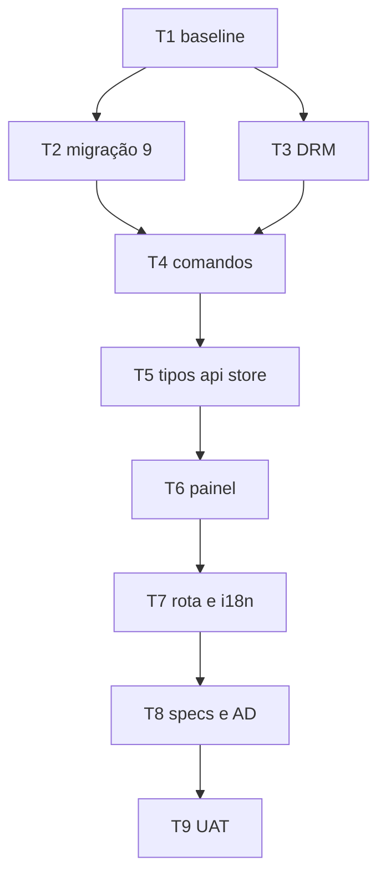

# Biblioteca de livros — Tasks

**Spec:** `.specs/features/book-library/spec.md`
**Design:** `.specs/features/book-library/design.md`
**Status:** planejado (2026-09-04). **Nenhuma task executada. Nenhum arquivo de código criado ou alterado.**

---

## Test Coverage Matrix

Segue a matriz de `.specs/codebase/TESTING.md`: função pura em Rust é teste obrigatório; comando Tauri que só orquestra I/O não tem runner de integração e portanto não é testado; componente React depende de a suíte Vitest existir na árvore.

| Requisito | Tipo de prova | Onde |
| --- | --- | --- |
| LIB-01 | manual (UAT) — seletor nativo é UI do SO | T9 |
| LIB-02 | unit — colisão de nome resolvida com sufixo | T4 |
| LIB-03 | unit — classificação por extensão | T3 |
| LIB-04 | manual (UAT) — depende do estado de configuração | T9 |
| LIB-05 | unit — PalmDB com o campo de criptografia em 0, 1 e 2 | T3 |
| LIB-06 | unit — zip EPUB com e sem `META-INF/encryption.xml` | T3 |
| LIB-07 | unit — `INSERT` + `SELECT` contra banco em memória migrado | T2, T4 |
| LIB-08 | unit — após importar, `SELECT COUNT(*) FROM documents` é 0 | T4 |
| LIB-09 | unit — ordenação por `imported_at DESC` | T4 |
| LIB-10 | unit — remoção com arquivo ausente não erra | T4 |
| LIB-11 | manual (UAT) — abre o explorador do SO | T9 |
| LIB-12 | manual (UAT) — caminho visível na tela | T9 |

**Cobertura que esta feature não tem, dito com todas as letras:** os quatro comandos Tauri em si (`import_books`, `list_books`, `delete_book`, `library_path`) não são exercitados por teste automatizado — não há runner de integração Tauri neste projeto. O que é testado são as funções puras que eles chamam e o SQL contra um banco em memória. A prova de que o comando está corretamente ligado é a T9, clicando.

---

## Gate Check Commands

```bash
cd src-tauri && cargo test --lib      # baseline HEAD a medir na T1; cada task não pode reduzir
cd src-tauri && cargo check --lib     # sem warnings novos
npm run build                          # tsc + Vite limpos
npm test                               # SÓ se a suíte Vitest existir na árvore restaurada (ver T1)
npm run test:scripts                   # não aplicável: nenhuma task mexe em scripts/
```

O `AGENTS.md` registra `cargo test --lib` em **181 passando / 0 falhas / 16 ignorados** e `npm test` em **63 em 8 arquivos**, medidos em 2026-07-28. Esses números **não** foram confirmados nesta sessão e o `HEAD` não contém o código que os produziria. A T1 mede o baseline real e é ele que vale.

---

## Execution Plan



**Fase 1 — backend (T1–T4).** Nada aparece na tela; o critério é o `cargo test`.
**Fase 2 — frontend (T5–T7).** A aba muda de dono; o critério é o `npm run build` e a tela abrindo.
**Fase 3 — documentação e verificação (T8–T9).** Fecha a revogação nas specs antigas e prova o que só clicando se prova.

São 9 tasks — acima do lote de ~8, então a execução deve começar pela oferta de sub-agents (um lote por fase), com o Verifier obrigatório no fim.

---

## Task Breakdown

### T1: Restaurar a árvore e medir o baseline real

**O quê:** restaurar `src/`, `src-tauri/`, `scripts/`, `public/` (`git checkout -- .`, sem tocar nos arquivos `M` de documentação). Depois: conferir se `src-tauri/src/types_export.rs` existe, se `package.json` tem script `test`, e rodar os gates para anotar os números.
**Onde:** working tree (nenhum arquivo de código editado)
**Tests:** none — é uma medição, não uma mudança de comportamento
**Gate:** `cd src-tauri && cargo test --lib` e `npm run build` executados, com a saída colada no log deste arquivo
**Done when:** está escrito aqui (a) o baseline de testes medido, (b) se `src/types.ts` é gerado ou escrito à mão nesta árvore, (c) se `npm test` existe
**Por que primeiro:** 124 arquivos de código estão apagados no working tree. Sem isso, toda task seguinte edita um arquivo que não existe, e o baseline citado no `AGENTS.md` não pode ser confirmado.

### T2: Migração 9 — tabela `books`

**O quê:** `MIGRATION_9_BOOKS` com o `CREATE TABLE` do design, entrada `(9, MIGRATION_9_BOOKS)` no fim de `MIGRATIONS`. **Conferir na lista que 9 está livre** antes de escrever — duas migrações com o mesmo número não colidem em compilação, a segunda simplesmente nunca roda.
**Onde:** `src-tauri/src/db.rs`
**Depends on:** T1
**Tests:** unit — banco migrado do zero chega em `user_version = 9`; banco parado na 8 sobe para 9 mantendo as linhas de `chats`, `messages` e `documents` (LIB-07)
**Gate:** `cargo test --lib` no baseline da T1 + os testes novos

### T3: Detecção de formato e de DRM

**O quê:** as funções puras: `is_supported_book(path)` para as 5 extensões, `has_drm(path)` despachando PalmDB (bytes 12..14 do registro 0, `u16` BE ≠ 0) e EPUB (`META-INF/encryption.xml` no zip, com o crate `zip` que já está no `Cargo.toml`).
**Onde:** `src-tauri/src/library_commands.rs`
**Depends on:** T1
**Tests:** unit — PalmDB sintético com o campo em 0 (passa), 1 e 2 (recusa); zip EPUB com e sem `encryption.xml`; extensão `.docx` e `.kfx` recusadas; arquivo ilegível vira erro de leitura, não "sem DRM" (LIB-03, LIB-05, LIB-06)
**Gate:** `cargo test --lib` verde
**Nota:** o caso perigoso é o inverso do óbvio — um arquivo que **não** dá para inspecionar não pode ser tratado como "sem DRM"; o teste precisa fixar isso.

### T4: Os quatro comandos

**O quê:** `import_books`, `list_books`, `delete_book`, `library_path`; o helper `library_dir()` com `create_dir_all` (LIB-11.3); `unique_destination` no molde do que já existe em `document_commands.rs`; registro em `lib.rs`.
**Onde:** `src-tauri/src/library_commands.rs` (e a linha de `mod`/`invoke_handler` em `src-tauri/src/lib.rs`)
**Depends on:** T2, T3
**Tests:** unit contra banco em memória migrado — insere, lista em `imported_at DESC`, remove com arquivo ausente sem erro, e um teste que afirma `SELECT COUNT(*) FROM documents = 0` depois de importar (LIB-02, LIB-07, LIB-08, LIB-09, LIB-10)
**Gate:** `cargo test --lib` verde, `cargo check --lib` sem warnings novos

### T5: Tipos, wrapper de `invoke` e store

**O quê:** `BookRecord` e `ImportBooksResult` em `src/types.ts` — **gerados ou à mão conforme o que a T1 apurou**; `libraryApi.ts` com os 4 wrappers; `libraryStore.ts` no molde do `documentsStore` **sem** o listener de `document-status`.
**Onde:** `src/lib/libraryApi.ts` (mais `src/types.ts` e `src/store/libraryStore.ts`)
**Depends on:** T4
**Tests:** none no `HEAD` — não há runner de frontend nele. **Se a T1 achar a suíte Vitest**, então um teste do store é obrigatório: importar com uma seleção parcialmente recusada mantém os aceitos e expõe os recusados
**Gate:** `npm run build` limpo

### T6: Painel da Biblioteca

**O quê:** `LibraryPanel.tsx` (botão importar com o filtro dos 5 formatos, botão abrir pasta chamando `openPath(library_path())`, caminho absoluto visível, lista, recusados nomeados) e `BookRow.tsx` (nome, formato, tamanho, remover).
**Onde:** `src/components/Library/LibraryPanel.tsx` (mais `src/components/Library/BookRow.tsx`)
**Depends on:** T5
**Tests:** none no `HEAD`; se houver Vitest, um teste de que a lista vazia mostra o estado vazio e que o caminho aparece na tela (LIB-12)
**Gate:** `npm run build` limpo

### T7: Rota, sidebar e i18n

**O quê:** `ActiveView` `"documents"` → `"library"`; `App.tsx` renderiza `LibraryPanel`; `DocumentsSection` vira `LibrarySection` com contagem total; bloco `library.*` em `en.json` e `pt.json`.
**Onde:** `src/store/uiStore.ts` (mais `src/App.tsx`, `src/components/Sidebar/LibrarySection.tsx`, `src/components/Sidebar/Sidebar.tsx`, `src/i18n/locales/en.json`, `src/i18n/locales/pt.json`)
**Depends on:** T6
**Tests:** none — i18n tem gate próprio de paridade de chaves
**Gate:** `npm run build` limpo **e** `en.json`/`pt.json` com exatamente o mesmo conjunto de chaves

### T8: Fechar a revogação nas specs antigas

**O quê:** anotar em `documents-rag/spec.md` que a UI de importação para RAG foi revogada (por qual spec e por qual AD), sem apagar os requisitos; registrar a **AD-052** em `STATE.md` com o pivô, o trade-off e o **gatilho escrito** da remoção do chat/RAG; abrir o **M10** no `ROADMAP.md`; atualizar a rastreabilidade de `book-library/spec.md` com o que ficou verificado.
**Onde:** `.specs/project/STATE.md` (mais `.specs/features/documents-rag/spec.md`, `.specs/project/ROADMAP.md`, `.specs/features/book-library/spec.md`)
**Depends on:** T7
**Tests:** none — documentação
**Gate:** `grep` mostrando que nenhuma spec ainda descreve a aba Documentos como base de RAG acessível pela UI

### T9: UAT — o que só clicando se prova

**O quê:** abrir o app (`npm run tauri dev`) e exercitar: seletor filtrado (LIB-01); importação sem pasta-base configurada (LIB-04); botão abrir pasta com a pasta vazia (LIB-11); caminho na tela (LIB-12); uma seleção misturando válido, extensão inválida e — **se houver um arquivo Kindle real com DRM à mão** — um protegido.
**Onde:** nenhum arquivo (verificação)
**Depends on:** T8
**Tests:** none — é UAT manual
**Gate:** cada critério acima registrado com o que **aconteceu**, e os que não puderam ser exercitados listados como não verificados, com o motivo
**Nota:** se não houver arquivo com DRM real disponível, LIB-05 e LIB-06 ficam provados **só** por teste unitário com arquivo sintético. Isso precisa estar escrito, não presumido.

---

## Execution Log

Vazio. Nenhuma task foi executada.
