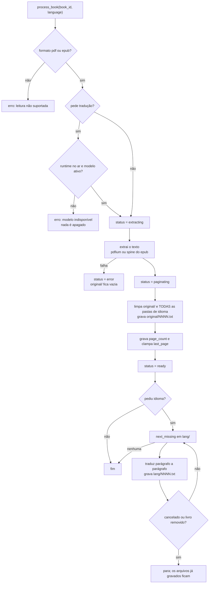

# Leitor de livros — Design

**Spec:** `.specs/features/book-reader/spec.md`
**Status:** planejado em 2026-09-05. **Nenhum arquivo de código foi criado ou alterado.** Todas as citações de arquivo e linha abaixo foram lidas do working tree nesta sessão; nenhuma foi executada.

---

## O que já existe e é reusado, degrau a degrau

A escada foi percorrida antes de escrever qualquer coisa nova. O que já está na árvore e resolve:

| Precisa de | O que já existe | Degrau |
| --- | --- | --- |
| Extrair texto de PDF | `rag::parsing::extract_text` → `extract_pdf` via pdfium, com `rejoin_hyphenated_words` que conserta palavras quebradas na linha (medido contra o Código Civil do usuário, L-003) | reuso |
| Abrir EPUB | `zip = "2"` já é dependência (`src-tauri/Cargo.toml:38`), usada hoje pela detecção de DRM em `library_commands::epub_has_drm` | reuso de dependência |
| Cancelar um trabalho longo | `chat::cancellation::CancellationRegistry` — `HashMap<String, CancellationToken>`, registra por id e o token é um `AtomicBool` | reuso direto, chaveado por `book_id` |
| Emitir progresso para a UI | Padrão `app.emit("document-status", …)` de `rag::pipeline` (`pipeline.rs:65`), com o store do frontend escutando por `listen` | mesmo padrão, evento novo |
| Não ressuscitar linha apagada no meio do trabalho | `rag::pipeline::still_exists` — cada estágio confere se a linha ainda existe antes de gastar CPU | mesmo padrão |
| Falar com o modelo | `providers::llama_server::LlamaServerClient::stream_chat` (`llama_server.rs:87`) | reuso, a resposta é acumulada em vez de streamada para a tela |
| Saber qual modelo está ativo | `runtime_commands::get_active_model` (`runtime_commands.rs:500`) | reuso |
| Trocar o modelo de tradução | `runtime_commands::set_active_model` + `list_installed_models` — a tela de Runtime já faz exatamente isso | reuso, chamado de outra tela |
| Marcar página para retraduzir | O próprio checkpoint: a **ausência do arquivo** já é "falta traduzir" | zero esquema, e funciona até quando quem apaga é o usuário pelo explorador |
| Remover em cascata | `PRAGMA foreign_keys = ON` já está no `open` | reuso — a FK faz a HIST-08 |

**O que é escrito do zero:** a extração de EPUB (spine + XHTML→texto), a paginação, o laço de tradução, os comandos do leitor, o painel de leitura e a lista lateral de leituras. Nada mais.

**Nenhuma dependência nova é adicionada.** Em particular, não entra crate de HTML: o XHTML de um EPUB é convertido a texto por remoção de tags com um passo linear, no mesmo espírito de `rejoin_hyphenated_words`. Se a T3 medir que isso não sobrevive a um EPUB real, a decisão de trazer um parser volta à mesa **com a medição na mão**, não antes.

---

## As duas decisões que dirigem o resto

### A página é a unidade

A `reading-history` estava bloqueada porque "posição" não tinha significado. Esta feature define: **posição é o índice da página**, base 1 no disco (`0001.txt`), base 0 na API.

Isso decide de uma vez:

1. **A retomada da tradução.** "Qual a próxima página a traduzir" é "qual o menor N em `1..=page_count` sem `<lang>/NNNN.txt`". O checkpoint não precisa de estrutura própria porque **a existência do arquivo já é o checkpoint**.
2. **O reprocessamento seletivo.** Marcar a página 2 para refazer é apagar `pt/0002.txt` — inclusive se quem apagar for o usuário, pelo explorador.
3. **O que acontece ao reprocessar o livro.** As páginas são regeradas e a posição é **clampada** ao novo total. Ela nunca desliza em silêncio, que é o modo de falha que a `reading-history` nomeia como o único a evitar.

A alternativa — offset de caractere sobre o texto inteiro — foi descartada porque a paginação existiria de qualquer jeito (a tela mostra páginas), e aí haveria **duas** fontes de verdade para a mesma coisa.

### O texto mora no disco, não no banco

Instrução do usuário em 2026-09-05: *"salve em pastas diferentes… mas dentro da pasta que está o livro"*. O layout, confirmado com ele:

```
<base_path>/library/
    O Guia do Mochileiro/            <- pasta do livro (books.folder)
        O Guia do Mochileiro.epub    <- o arquivo importado (books.filename)
        original/
            0001.txt
            0002.txt
        pt/
            0001.txt
        en/
            0001.txt
```

**Um arquivo por página, e não um por idioma** — também confirmado. É o que torna "reprocessar a página 2" um `remove_file` em vez de reescrever o livro inteiro, e é o que permite ao usuário abrir `pt/0047.txt` num editor e corrigir a tradução à mão. A LIB-11 já põe um botão que abre essa pasta no explorador; agora ela contém algo que vale a pena abrir.

**O que isso remove do plano anterior:**

- a tabela `book_pages` **não existe mais** — a migração 10 deixa de criar tabela e vira só colunas em `books`;
- a coluna `translated_text` e todo o esquema de tradução some junto;
- o estado `translating` sai da máquina de estados: traduzir virou trabalho **por idioma**, e o andamento de cada um é contado do disco.

**O que isso custa, e está aceito:** o disco não é transacional. Um `INSERT` de 300 páginas era uma transação; 300 arquivos não são. A mitigação é a ordem — os arquivos são escritos **antes** de `page_count` ser gravado, então uma interrupção deixa arquivos a mais, nunca um `page_count` maior que a realidade. E arquivos a mais são apagados pela própria regeração, que começa limpando `original/`.

**Segunda fonte de verdade, evitada de propósito:** quantas páginas cada idioma tem **não** é guardado no banco. É um `read_dir`. Guardar seria criar um número que o usuário pode contrariar apagando um arquivo — e ele pode, porque a pasta é dele.

### O livro passa a morar em pasta própria

Isto **revoga o LIB-02 como está escrito** (`book-library`, já implementado): hoje o import copia para `library/<arquivo>`. Passa a copiar para `library/<pasta>/<arquivo>`.

Não havia alternativa que preservasse o LIB-02: um diretório e um arquivo com o mesmo nome **não coexistem** no mesmo filesystem, então "arquivo na raiz e pasta homônima ao lado" é impossível.

**O nome da pasta é guardado, não derivado.** Coluna nova `books.folder`. Derivar do `filename` parece mais barato até `a.pdf` e `a.epub` quererem a mesma pasta; guardar elimina a regra de derivação e o bug que ela esconde. A desambiguação reusa o mesmo `unique_destination` que a M10.1 já usa para nomes de arquivo.

**Bibliotecas existentes são migradas no boot**, uma vez, e a migração é idempotente: para cada linha com `folder` nulo, cria a pasta, move o arquivo, grava `folder`. Falha ao mover **não** perde nada — a linha fica como estava e o erro é registrado. Não é uma migração SQL; é código, e por isso ela é uma task própria.

⚠️ **Isto mexe nos arquivos do usuário.** A regra do `AGENTS.md` vale inteira: ensaiar contra uma **cópia** de uma biblioteca real, nunca contra a do usuário.

## Esquema — migração 10

⚠️ **Conferir na lista de `MIGRATIONS` em `db.rs` que a 10 está livre antes de escrever.** Hoje a lista termina em `(9, MIGRATION_9_BOOKS)` (`db.rs:194`) — lido nesta sessão. Duas migrações com o mesmo número **não falham em compilação**: a segunda simplesmente nunca roda, porque o `user_version` já passou dela. Este erro já aconteceu neste repositório.

Com o texto no disco, a migração encolheu para colunas:

```sql
-- MIGRATION_10_BOOK_READER
ALTER TABLE books ADD COLUMN folder           TEXT;
ALTER TABLE books ADD COLUMN status           TEXT    NOT NULL DEFAULT 'imported';
ALTER TABLE books ADD COLUMN error_message    TEXT;
ALTER TABLE books ADD COLUMN page_count       INTEGER NOT NULL DEFAULT 0;
ALTER TABLE books ADD COLUMN reading_language TEXT;
ALTER TABLE books ADD COLUMN last_page        INTEGER;
ALTER TABLE books ADD COLUMN last_opened_at   TEXT;
```

**Nenhuma tabela nova.** `book_pages` foi projetada e descartada na mesma sessão, quando o usuário pediu arquivos em pastas.

`folder` nasce **nulo** de propósito: nulo é o sinal de "esta linha ainda está no layout antigo", e é o que a migração de layout procura. Depois que ela roda, nulo não ocorre mais.

Por que `ALTER TABLE` e não recriar: os livros já importados pela M10.1 têm de sobreviver. `CREATE TABLE IF NOT EXISTS` sozinho **não** migra banco existente — é no-op silencioso, e é por isso que coluna nova exige entrada nova na lista.

`last_page` e `last_opened_at` são `NULL` até a primeira abertura. É isso que separa "importado" de "lido": o histórico da lateral é `WHERE last_opened_at IS NOT NULL`, e um livro importado e nunca aberto **não** aparece nele.

**Remover um livro** apaga a linha e a **pasta inteira** (`remove_dir_all`), com todos os idiomas — READ-18/HIST-08. Como não há mais tabela de páginas, não há FK a cascatear: quem apaga é o código, e o teste é sobre o disco.

## Estados do livro

```
imported ──processar──> extracting ──> paginating ──> ready
                              │
                              └────── erro ──────> error
```

`status` é `TEXT` com `imported`, `extracting`, `paginating`, `ready`, `error`. Mesmo formato de `DocumentStatus` (`pipeline.rs:14`), incluindo `#[serde(rename_all = "snake_case")]`, para não inventar convenção nova na mesma base.

**`translating` não está aqui, e a ausência é a decisão.** Traduzir deixou de ser estado do livro quando virou trabalho **por idioma**: um livro pode estar pronto em português e pela metade em inglês. O andamento de cada idioma é derivado — arquivos em `<lang>/` sobre `page_count` — e não precisa de coluna nem de estado.

Um app fechado no meio de `extracting` volta para `imported` no boot: não há meia extração válida. Um app fechado no meio de uma tradução simplesmente deixa menos arquivos em `<lang>/`, e a retomada continua do primeiro que falta.

## Componentes

### Backend

| Arquivo | O que muda |
| --- | --- |
| `src-tauri/src/db.rs` | `MIGRATION_10_BOOK_READER` (só `ALTER TABLE`) + entrada `(10, …)`. **Conferir o número na lista antes** |
| `src-tauri/src/reader/mod.rs` *(novo)* | `mod epub; mod pagination; mod storage; mod translate;` |
| `src-tauri/src/reader/storage.rs` *(novo)* | O dono do layout em disco, e o **único** lugar que monta caminho: `book_dir`, `lang_dir`, `page_file(dir, n)` (`{:04}.txt`), `write_pages`, `read_page`, `translated_pages(&Path) -> BTreeSet<u32>`, `next_missing`, `remove_lang`, `migrate_legacy_layout`. Funções puras sobre `&Path`, testáveis contra pasta temporária sem `AppHandle` |
| `src-tauri/src/reader/epub.rs` *(novo)* | `extract_epub_text(&Path) -> Result<String, ParseError>`: abre o zip, lê `META-INF/container.xml`, acha o `.opf`, lê o `spine`, resolve cada `idref` no `manifest`, concatena os XHTML **na ordem do spine**, cada um passado por `xhtml_to_text`. Testável contra um zip montado pelo crate `zip` — o mesmo truque dos testes de DRM de `library_commands` |
| `src-tauri/src/reader/pagination.rs` *(novo)* | `split_paragraphs(&str) -> Vec<&str>` (usada pela paginação **e** pela tradução — uma definição só) e `paginate(&str) -> Vec<String>`: orçamento fixo de caracteres, quebra na última fronteira de parágrafo antes do teto; parágrafo maior que o teto quebra na última fronteira de frase; frase maior que o teto quebra no teto. Pura e determinística — READ-10 |
| `src-tauri/src/reader/translate.rs` *(novo)* | O prompt de tradução **de um parágrafo**, o remontador de página e a constante `DEFAULT_TRANSLATION_MODEL` (valor decidido na T1). Reusa `split_paragraphs`. O laço vive no comando, porque precisa do `AppHandle` |
| `src-tauri/src/reader_commands.rs` *(novo)* | `process_book`, `cancel_processing`, `retranslate_pages`, `add_language`, `remove_language`, `set_reading_language`, `open_book`, `save_reading_position`, `get_book_page`, `list_book_languages`, `list_reading_history`. O laço de tradução é extraído para uma função que `process_book` e `retranslate_pages` compartilham |
| `src-tauri/src/library_commands.rs` | **`import_books` passa a criar a pasta do livro e copiar para dentro dela** — é a revogação do LIB-02. `BookRecord` ganha `folder`, `status`, `page_count`, `reading_language`, `last_page`, `last_opened_at`, `error_message`; `select_books` e `delete_book` acompanham (`remove_dir_all` da pasta). **Mudança de struct que cruza a fronteira** — ver o aviso no fim |
| `src-tauri/src/rag/parsing.rs` | Uma linha: `extract_pdf` vira `pub(crate)`, para o leitor chamar sem duplicar o conserto de hífen. Nada mais |
| `src-tauri/src/lib.rs` | `mod reader; mod reader_commands;`, as linhas do `invoke_handler`, e a chamada de `migrate_legacy_layout` no setup — ao lado de onde `requeue_unfinished_documents` já é chamada (`lib.rs:111`) |

**Por que um módulo `reader/` e não pendurar em `rag/`:** o `rag/` é o que a AD-052 marcou como revogado. Pôr o leitor lá dentro amarraria a feature nova ao código que vai sair. A única coisa que atravessa é `extract_pdf`, e ela atravessa como chamada, não como morada.

**Por que `storage.rs` é o único que monta caminho:** com o texto em disco, "onde fica a página 47 em português" passa a ser uma pergunta feita de cinco lugares diferentes. Cinco respostas divergem; uma não. É o mesmo motivo pelo qual `split_paragraphs` tem uma definição só.

### O layout em disco

```
<base_path>/library/
    <folder>/                    <- books.folder
        <filename>               <- books.filename, o arquivo importado
        original/0001.txt …      <- texto extraído, paginado
        pt/0001.txt …            <- uma pasta por idioma
        en/0001.txt …
```

Regras que o `storage.rs` garante:

- **Nome do arquivo de página:** `{:04}.txt`, base 1. Zero-padding para que a ordenação alfabética do explorador seja a ordem de leitura — sem isso, `10.txt` viria antes de `2.txt` na tela do usuário, e a pasta é dele.
- **A existência do arquivo é o checkpoint.** `next_missing(lang_dir, page_count)` é o menor N em `1..=page_count` sem arquivo. Não há coluna de estado, não há fila.
- **O usuário apagar um arquivo é uma operação suportada**, não um erro: aquela página volta a ser "não traduzida" e é refeita no próximo reprocessamento (READ-31.9).
- **Ordem de escrita:** os arquivos de `original/` são gravados **antes** de `page_count` ir para o banco. Uma interrupção deixa arquivos a mais, nunca um `page_count` maior que a realidade — e a regeração começa limpando `original/`.

### Fluxo de `process_book`



**`ready` acontece antes da tradução**, não depois: o livro já é legível no original assim que a paginação termina, e cada página traduzida que chega vai aparecendo. Esperar o fim da tradução para liberar a leitura seria segurar horas de livro pronto.

**Re-extrair apaga todas as pastas de idioma**, e o painel avisa antes com a contagem por idioma. A repaginação muda os índices, e um `pt/0047.txt` preso a um índice que mudou apontaria para o trecho errado — pior que apagar, porque parece certo.

### Eventos

Um evento novo, `book-status`, no formato do `document-status` que o frontend já sabe escutar:

```rust
pub struct BookStatusEvent {
    pub id: String,
    pub status: BookStatus,
    /// `None` fora de uma tradução. Presente, é o idioma que está sendo
    /// traduzido - um livro pode estar pronto em pt e a meio caminho em en,
    /// e uma barra só para os dois mentiria sobre ambos.
    pub language: Option<String>,
    pub done: u32,
    pub total: u32,
    pub error_message: Option<String>,
}
```

### Tradução — quem traduz, e com qual modelo

**Quem:** o sidecar llama.cpp que o app já sobe. Instrução direta do usuário, e ela fecha a porta para tradutor dedicado (Argos Translate, CTranslate2, API de nuvem): seria um segundo motor, um segundo download e um segundo ciclo de vida para o que o motor já embarcado faz. O caminho é `LlamaServerClient::stream_chat` (`llama_server.rs:87`), com a resposta acumulada em vez de streamada para a tela. Nenhuma chamada de rede em runtime — READ-20.

**Com qual modelo:** um **default designado em código**. Isto é código novo, e o design registra por quê: **hoje não existe default nenhum**. `grep -rn "DEFAULT_MODEL\|default_model" src-tauri/src/` não devolve **nada** fora do campo `default_quant` do catálogo — medido nesta sessão. O que o `ROADMAP.md` chama de "modelo padrão: Phi-3.5 Mini" é curadoria escrita em prosa no M7, nunca um valor que o programa leia. `models::catalog::CURATED_MODELS` tem **6 entradas**, todas Q4_K_M, de 1,54 B a 8,03 B.

```rust
// src-tauri/src/reader/translate.rs
/// The curated entry translation falls back to when no model is active.
/// Chosen by measurement in T1, not by reputation - see the design's
/// measurement table for the page, the candidates and the numbers.
pub const DEFAULT_TRANSLATION_MODEL: &str = "<id preenchido pela T1>";
```

**A regra de seleção, em uma linha:** há modelo ativo → traduz com ele; não há → o diálogo nomeia o `DEFAULT_TRANSLATION_MODEL` e oferece o download.

Por que **não** forçar sempre o default: `set_active_model` "aponta o runtime para outro arquivo e o reinicia" (`runtime_commands.rs:506-509`). Um modelo dedicado a tradução custaria dois reinícios de sidecar por livro e um segundo slot de modelo no esquema, para uma diferença que ninguém mediu. Como o chat está sendo revogado, o app converge para **um** modelo — e o default designado é o valor inicial dele, não um segundo.

**O download é reuso puro** (degrau 2): `runtime_commands::download_model` já baixa entrada curada com progresso, e `runtime::model::validate_gguf_url` já valida a URL. O diálogo de processamento chama o que existe. **Zero código novo de download.**

**T1 escolhe o vencedor, e escolhe medindo.** Nomear um modelo agora seria afirmar qualidade de tradução sem número — e a L-003 registra o custo exato disso: um extrator ficou um dia inteiro como "limitação aceita" porque ninguém rodou uma segunda implementação no mesmo insumo. A T1 roda **a mesma página real** nos candidatos viáveis e compara qualidade e tokens/s.

### Tradução — o laço, e por que a unidade é o parágrafo

**Dois laços aninhados, com unidades diferentes de propósito:**

```
para cada página sem arquivo em <lang>/, na ordem:   <- unidade de GRAVAÇÃO e checkpoint
    para cada parágrafo da página, na ordem:         <- unidade de REQUISIÇÃO
        stream_chat acumulado -> texto do parágrafo
    junta os parágrafos -> grava <lang>/NNNN.txt
```

**Por que o parágrafo, e não a página** (instrução direta do usuário em 2026-09-05): uma página são ~2.500 caracteres, e um modelo pequeno recebendo isso de uma vez **se perde** — resume em vez de traduzir, trunca no meio, ou passa a comentar o texto. O parágrafo é a maior unidade que ainda carrega sentido completo e a menor que não quebra frase.

**Por que a página continua sendo o checkpoint:** salvar por parágrafo exigiria um arquivo por parágrafo — milhares por livro, e a pasta deixaria de ser legível por gente — para poupar, no pior caso, **uma página** de retrabalho: alguns parágrafos, dezenas de segundos. A perda é deliberada e está escrita como edge case.

**As duas decisões compõem, e isso não é sorte.** `paginate()` já quebra em **fronteira de parágrafo** (READ-10). Logo, uma página é um número inteiro de parágrafos, e traduzir por parágrafo dentro de uma página **nunca corta um parágrafo ao meio**. A única exceção é o parágrafo maior que uma página inteira, que a própria paginação já quebra em fronteira de frase — e a tradução herda esses pedaços, sem lógica própria para o caso.

**Reuso, degrau 2:** `split_paragraphs(&str) -> Vec<&str>` mora em `reader/pagination.rs`, porque `paginate()` **já precisa** dela para achar as fronteiras. `translate.rs` chama a mesma função. Uma definição de "o que é um parágrafo", não duas — duas divergiriam, e a que divergisse cortaria parágrafo ao meio exatamente no caso que esta seção existe para impedir.

```
system: "You are a translator. Translate the user's text to <idioma>.
         Output only the translation, no commentary, no explanation.
         The text is a single paragraph: reply with a single paragraph."
user:   <texto de UM parágrafo>
```

O modelo não precisa saber o idioma de origem — pedir o destino basta. Isso evita um detector de idioma que seria código novo para resolver o que o próprio modelo já resolve.

**Parágrafo que volta vazio é falha da página, nunca omissão silenciosa.** Gravar a página sem ele produziria um livro com buraco que ninguém nota até ler — e aí a culpa cai no tradutor, não no bug. Mesma forma da recusa de DRM da `book-library`, que separa "limpo" de "não consegui inspecionar" em vez de juntar os dois no lado otimista.

**O cancelamento é conferido entre parágrafos**, não só entre páginas — senão cancelar numa página longa esperaria todos os parágrafos dela. `still_exists` continua sendo conferido entre páginas, pelo mesmo motivo que o pipeline de documentos o confere: um livro removido no meio não pode recriar a pasta que acabou de ser apagada. A página interrompida no meio **não é gravada** — o arquivo só nasce quando todos os parágrafos dela voltaram, o que faz "o arquivo existe" significar "a página está completa".

**O que este design NÃO tenta:** paralelizar. O sidecar é um processo só e o `llama-server` serve uma geração por vez; disparar parágrafos em paralelo só criaria fila em outro lugar, com mais código.

⚠️ **O que muda no custo, e a T1 mede:** o total de tokens de saída é o mesmo, mas o número de requisições sobe de uma por página para uma por parágrafo. Se o custo fixo por requisição do `llama-server` for relevante, a estimativa da READ-07 muda — e por isso a T1 mede **no nível de parágrafo**, que é como o produto vai rodar, e não no de página.

### Edição do livro — o reprocessamento seletivo sai de graça

O usuário pediu (2026-09-05) um painel para trocar idioma, trocar modelo e **reprocessar páginas específicas**, porque a tradução de uma página pode sair errada e refazer o livro inteiro custaria horas.

**Com o texto em disco, a parte cara desaparece.** O laço retoma pela pergunta *"qual a próxima página sem arquivo em `<lang>/`?"*. Logo, **marcar uma página para refazer é apagar o arquivo dela**:

```rust
std::fs::remove_file(lang_dir.join(format!("{:04}.txt", page)))?;
```

e o laço que já existe faz o resto. Nenhuma coluna de estado, nenhuma fila, nenhuma transação. E, de brinde, **o usuário pode fazer o mesmo pelo explorador** — apagar `pt/0047.txt` marca aquela página para refazer, sem o app precisar saber que foi ele.

**Um comando novo, e ele é fino:**

```rust
#[tauri::command]
pub async fn retranslate_pages(
    app: AppHandle,
    book_id: String,
    language: String,
    pages: Option<Vec<u32>>,   // None = todas as do idioma
) -> Result<(), String>
```

`language` é parâmetro, não estado: retraduzir é sempre *de um idioma*, e um livro tem vários. `None` cobre "refazer este idioma inteiro" e `Some(vec![3])` cobre "esta página saiu ruim". Depois de apagar, ele chama **o mesmo laço** de `process_book`, extraído para uma função compartilhada — duas cópias divergiriam, e a que divergisse traduziria de um jeito no caminho novo e de outro no antigo.

**O que reprocessar página NÃO faz: re-extrair.** Re-extrair mudaria a paginação, e com ela **todos** os índices — a posição salva e as pastas de todos os idiomas iriam junto. Extração ruim se conserta reprocessando o livro (READ-13), que já existe, já apaga as pastas de idioma e já clampa a posição.

**Trocar o idioma de leitura não apaga nada.** É um `UPDATE books SET reading_language = ?`, e o leitor passa a ler de outra pasta. A versão anterior deste design fazia essa troca **limpar todas as traduções**, porque só cabia uma; o usuário vetou, e com uma pasta por idioma o problema deixa de existir em vez de ser mitigado.

**Remover um idioma** é `remove_dir_all` da pasta dele, com a contagem de páginas dita antes (READ-29). Se o idioma removido for o que está sendo lido, `reading_language` volta ao original — senão o leitor apontaria para uma pasta que não existe mais.

**Troca de modelo: nenhum conceito novo.** `set_active_model` e `list_installed_models` já existem e são o que a tela de Runtime usa; o painel chama os dois. Isso **encolhe** o plano anterior: `DEFAULT_TRANSLATION_MODEL` deixa de ser "o modelo usado quando não há ativo" e passa a ter um papel só — **o sugerido para download quando nenhum está instalado**.

⚠️ `set_active_model` **reinicia o sidecar** (`runtime_commands.rs:506-509`). O painel avisa antes de aplicar; sem o aviso, trocar o modelo pareceria travar o app.

**O que este design NÃO guarda: qual modelo traduziu cada página.** Teria de ser por página, porque uma página pode ser retraduzida com outro modelo. O fluxo descrito pelo usuário não precisa: ele lê, vê que a página ficou ruim, e manda reprocessar. Proveniência entra quando a pergunta for "quais páginas estão velhas", que não é a pergunta de hoje.

### Frontend

| Arquivo | O que muda |
| --- | --- |
| `src/types.ts` | `BookRecord` ganha `folder`, `status`, `error_message`, `page_count`, `reading_language`, `last_page`, `last_opened_at`; mais `BookStatus`, `BookStatusEvent`, `BookLanguage` (código + páginas prontas), `ReadingEntry`. **Escrito à mão, sem gate — conferir campo a campo** (AD-054) |
| `src/lib/readerApi.ts` *(novo)* | Wrappers de `invoke` dos comandos do leitor |
| `src/store/readerStore.ts` *(novo)* | Livro aberto, página corrente, texto da página, `listen("book-status")`. A gravação da posição é **debounced**: virar cinco páginas rápido não pode virar cinco escritas |
| `src/components/Reader/ReaderPanel.tsx` *(novo)* | Uma página por vez, anterior/próxima, `x de y`, setas do teclado, e o **seletor de idioma** no cabeçalho — ter vários idiomas sem como alternar não serviria para nada, então o seletor é parte da READ-28, não escopo extra |
| `src/components/Library/BookRow.tsx` | Estado do livro, botão Processar / Ler, progresso, e o rótulo de formato não suportado (READ-03) |
| `src/components/Library/ProcessDialog.tsx` *(novo)* | Escolha do idioma, com "não traduzir" pré-selecionado, e a estimativa quando um idioma é escolhido |
| `src/components/Library/BookEditPanel.tsx` *(novo)* | Lista de idiomas do livro com páginas prontas por idioma (acrescentar / remover), modelo (instalados + aviso de reinício), lista de páginas com seleção, botões de retraduzir a seleção e de reprocessar o livro. É a READ-24 a READ-30 |
| `src/components/Sidebar/ReadingList.tsx` *(novo)* | Substitui o `ChatList` na `Sidebar.tsx` |
| `src/components/Sidebar/Sidebar.tsx` | Troca o import: `ChatList` sai, `ReadingList` entra |
| `src/store/uiStore.ts` | `ActiveView` ganha `"reader"`. **O padrão deixa de ser `"chat"`** |
| `src/App.tsx` | Rota do `ReaderPanel`; o `ChatPanel` deixa de ter caminho |
| `src/i18n/locales/{en,pt}.json` | Bloco `reader.*` e as chaves novas de `library.*`. **Paridade obrigatória** — 158/158 hoje |

**O `ChatPanel.tsx` e os arquivos de chat ficam na árvore, órfãos de rota.** É o mesmo estado em que `DocumentsPanel.tsx` já está desde a T7 da `book-library`, e é o que a AD-052 item 4 manda. ⚠️ **Atenção ao que derrubou a `DocumentsSection.tsx`:** quando `ActiveView` perdeu `"documents"`, o `tsc` falhou (`TS2367`/`TS2345`) num arquivo que **ninguém importava**. Se algum arquivo de chat comparar `activeView === "chat"`, ele vai quebrar o `npm run build` do mesmo jeito, e a T11 tem de tratar isso — apagando o arquivo, se for o caso, e registrando por quê.

---

## Onde o design pode estar errado, e o que mede isso

| Suposição não medida | O que a mede | Se der errado |
| --- | --- | --- |
| ~~Algum modelo do catálogo traduz prosa de forma utilizável~~ | **T1 — MEDIDO em 2026-09-06: sim.** Os 3 candidatos testados traduzem; nenhum comentou, alucinou ou truncou | Regra de parada **não disparou**. A T6 pode ser construída |
| ~~Qual dos 6 candidatos vira o `DEFAULT_TRANSLATION_MODEL`~~ | **T1 — MEDIDO: `Qwen2.5-7B-Instruct-Q4_K_M`** (`gguf-qwen2.5-7b`), por qualidade na mesma página, não por reputação | Escrito na tabela abaixo com o número que o elegeu |
| ~~A tradução de um livro inteiro leva tempo tolerável~~ | **T1 — MEDIDO: 12,53 s por página de 2.161 caracteres → ~63 min para 300 páginas** com o vencedor | É a estimativa da READ-07. A feature não cai; ela fica honesta sobre o custo |
| Remoção de tags sobrevive a um EPUB real | **T3**, com um EPUB de verdade além dos sintéticos | Volta a decisão de trazer um parser de HTML, com a medição na mão |
| O orçamento de caracteres por página dá uma página confortável de ler | **T13**, olhando a tela | Constante ajustada; é um número, não uma refatoração |
| Uma pasta com centenas de arquivos de 2,5 KB não incomoda o filesystem nem o explorador | **T13**, abrindo a pasta de um livro real | Se incomodar, o caminho é agrupar em subpastas por centena — muda só o `storage.rs`, que é o único que monta caminho |
| A migração de layout move uma biblioteca real sem perder arquivo | **T17**, contra uma **cópia** de biblioteca real | Regra do `AGENTS.md`: nunca ensaiar migração destrutiva contra os dados do usuário |
| ~~O custo fixo por requisição não domina, agora que há uma por parágrafo~~ | **T1 — MEDIDO: 210 ms por requisição** no vencedor (174 ms descontando o aquecimento da primeira), **5,0% do tempo de parede da página** | Não domina. A unidade continua sendo o parágrafo, agora por medição e não só por instrução |
| Uma lista de páginas com seleção continua usável num livro de 500 páginas | **T13**, olhando a tela | Se não for, o caminho é filtrar/paginar a lista — UI, não esquema. A seleção por índice não muda |
| `extract_pdf` produz texto utilizável em livro (e não só em documento jurídico) | **T13**, com um PDF de livro real | Já há cicatriz aqui: a L-003 registra que um extrator destruía 51,3% do corpus e isso passou um dia inteiro como "limitação aceita" |

---

## Tabela de medições da T1 (2026-09-06)

### Baseline dos gates

Os quatro números foram remedidos com a árvore parada, e **os quatro batem com o `AGENTS.md`** — nenhuma correção foi necessária, só a data.

| Comando | Resultado medido |
| --- | --- |
| `cd src-tauri && cargo test --lib` | **195 passando / 0 falhas / 15 ignorados**, em 7,14 s |
| `cd src-tauri && cargo check --lib` | exit 0, **zero warnings** (`Finished dev profile in 8,86 s`) |
| `npm run build` | exit 0, 1.859 módulos, 6,12 s, bundle `index-C5uO1JD5.js` (315,80 kB) |
| `npm run test:scripts` | **49 passando / 0 falhas**, 143,8 ms |

### Viabilidade da tradução

**Insumo:** `t1-page-en.txt` (anexo nesta pasta) — Moby-Dick, capítulo 1, Project Gutenberg #2701. **2.161 caracteres em 3 parágrafos**, cortados na fronteira de parágrafo como a T4 vai cortar. **Uma requisição por parágrafo**, com o prompt de tradução deste design, idioma alvo `Portuguese`, resposta acumulada.

**Como foi produzido:** o mesmo binário e os mesmos argumentos que `runtime::process::build_args` monta — `llama-server.exe` Vulkan de `%LOCALAPPDATA%\ReadMe\resources\llama\vulkan\`, com `-m <gguf> --host 127.0.0.1 --port <livre> -ngl -1` e **sem `-c`** (é exatamente a linha `embedded_runtime` desta máquina: `backend=vulkan`, `gpu_layers=-1`, `context_length=NULL`) — e o mesmo corpo que `providers::openai_stream::stream_chat_completions` envia para `/v1/chat/completions`: `stream: true`, `max_tokens: 2048` (que é `answer_token_budget(None)`). O laço de medição é um script Node que viveu **só no scratchpad** e não entrou no repositório.

⚠️ **O que isto NÃO exercitou:** `npm run tauri dev` **não rodou**, nenhum `invoke` foi disparado e `LlamaServerClient::stream_chat` **não foi chamado** — o código de tradução ainda não existe (é a T6). O que foi exercitado é o servidor e o protocolo, com a mesma configuração; a ponte Rust é suposição até a T6.

**Máquina:** Windows 11, 12 núcleos lógicos, 63,8 GB de RAM, NVIDIA RTX 3060 12 GB. Todos os 6 candidatos do catálogo cabem nela.

| Candidato | (a) Tempo de parede, página inteira | (b) Tokens/s (geração / parede) | (c) Saída utilizável? | (d) Custo fixo por requisição | 300 páginas |
| --- | --- | --- | --- | --- | --- |
| Qwen2.5 1.5B Q4_K_M *(o único instalado)* | **6,03 s** (640 tokens) | **162,9** / 106,2 | **Não.** Traduz sem comentar nem truncar, mas erra sentido a cada frase: *"Call me Ishmael"* → *"Respondo a chamada de Ishmael"*, *"coffin warehouses"* → *"casas de cremes"*, *"the Battery"* → *"batalhão"* | 699 ms (**80 ms** sem a 1ª requisição, que carrega o aquecimento) | ~30 min |
| Llama 3.2 3B Q4_K_M | **6,46 s** (661 tokens) | **110,4** / 102,3 | **Não.** Mesmo padrão: traduz limpo, mas troca o nome do narrador — *"Chame-me Miqueias"* — e produz *"meus depressões"*, *"methodicamente"* | 158 ms (**156 ms** sem a 1ª) | ~32 min |
| **Qwen2.5 7B Q4_K_M — VENCEDOR** | **12,53 s** (671 tokens) | **56,4** / 53,5 | **Sim.** *"Chamo-me Ishmael"*, *"depósitos de caixões"*, prosa corrida e legível. Erros existem e são menores (*November* → *"outubro"*, *landsmen* → *"terraços"*, um marcador de nota `[1]` vazado) | 210 ms (**174 ms** sem a 1ª) | **~63 min** |
| Phi-3.5 Mini 3.8B / Mistral 7B v0.3 / Llama 3.1 8B | **não medidos** | — | — | — | — |

As três traduções completas estão em **`t1-translations.md`**, nesta pasta, para que o veredito de qualidade seja auditável em vez de assertivo.

**Por que 3 dos 6 e não os 6:** a T1 manda começar pelos instalados e **baixar um candidato a mais só se nenhum instalado servir**. O instalado (1.5B) não serviu, então um foi baixado (3B) — e ele também não serviu, o que justificou o terceiro (7B), que serviu. Os outros três continuam sem medição, e o custo de fechar essa lacuna é ~12 GB de download. **A escolha do default vale sobre 3 candidatos medidos, não sobre 6** — dito aqui para ninguém ler esta tabela como uma varredura completa do catálogo.

### `DEFAULT_TRANSLATION_MODEL` = `gguf-qwen2.5-7b`

O `id` do catálogo (`models::catalog::CURATED_MODELS`), não o nome do arquivo — é o `id` que o download conhece. **Quem escreve a constante é a T6/T8**; a T1 só a nomeia.

Não houve empate: o 7B foi eleito por **qualidade na mesma página**, e pagou 2,1× o tempo do 3B por isso. A regra de desempate por velocidade não se aplicou porque não houve empate — e a diferença de 30 min contra 63 min num livro de 300 páginas é o preço de um narrador que se chama Ishmael e não Miqueias.

### A estimativa da READ-07

Com o vencedor, **uma requisição por parágrafo**:

- **12,53 s por página** de 2.161 caracteres em 3 parágrafos → **5,8 ms por caractere de entrada**;
- **300 páginas ≈ 3.760 s ≈ 63 min**, contando **900 requisições** (3 por página);
- desse total, o custo fixo são **189 s (~3,1 min, 5,0%)** — a unidade parágrafo custa tempo, mas não domina;
- a carga do modelo (**8,7 s**) é paga uma vez por sessão do sidecar e não entra no laço.

⚠️ **A extrapolação é linear a partir de uma única página.** Uma página com 10 parágrafos curtos paga 10 × 174 ms de custo fixo em vez de 3 × 174 ms; uma página densa gera mais tokens. O número honesto é *"cerca de uma hora para 300 páginas nesta máquina"*, e a tela da READ-07 deve dizer isso com essa granularidade, não com um relógio ao segundo.

---

## Ordem de execução

`T1` mede antes de tudo, e a `T6` (tradução) é a única que depende do resultado dela. Toda a fatia de leitura — extração, paginação, leitor, histórico — **não depende da tradução** e pode ser construída em paralelo à decisão sobre ela. Isso é deliberado: se a medição for ruim, o que sobra ainda é um leitor funcionando, e não um milestone parado.
