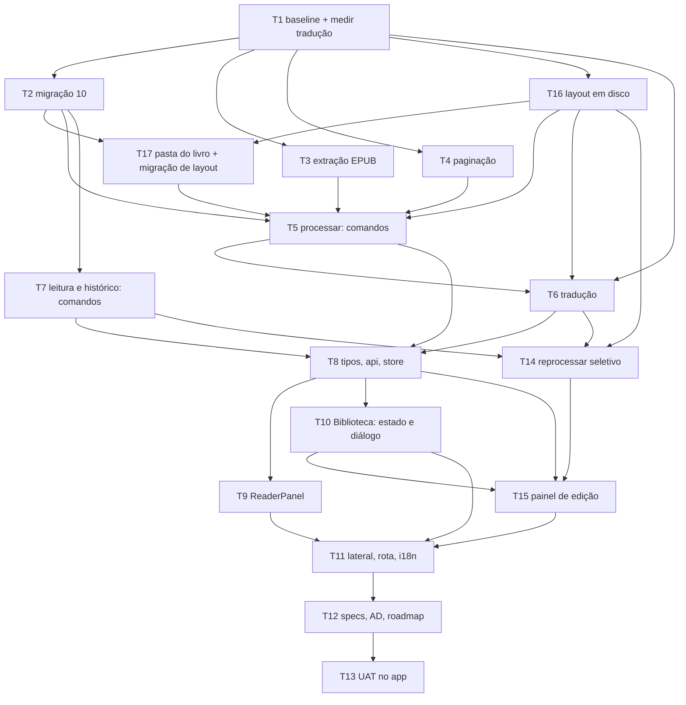

# Leitor de livros — Tasks

**Spec:** `.specs/features/book-reader/spec.md`
**Design:** `.specs/features/book-reader/design.md`
**Status:** planejado em 2026-09-05. **T1–T12 e T14–T17 executadas em 2026-09-06 — 16 de 17. A única aberta é a T13 (UAT), e ela é a que responde se o app lê um livro: `npm run tauri dev` NÃO rodou uma única vez, nenhum `invoke` foi disparado e nenhum pixel foi visto.** Histórico: **T1–T7, T16 e T17 executadas em 2026-09-06** — a T1 é medição (AD-055), as outras escreveram código: `src-tauri/src/reader/` novo (`epub.rs`, `pagination.rs`, `storage.rs`, `translate.rs`), `src-tauri/src/reader_commands.rs` novo, e `db.rs`, `lib.rs`, `library_commands.rs` e `rag/parsing.rs` alterados. A **T17 ficou com meio gate aberto**: o ensaio da migração de layout contra uma cópia de biblioteca real **não rodou** (`READER_LEGACY_LIBRARY` indefinida). **As demais tasks continuam abertas, e nenhum arquivo do frontend foi tocado.**

---

## Test Coverage Matrix

Segue a matriz de `.specs/codebase/TESTING.md`: função pura em Rust é teste obrigatório; comando Tauri que só orquestra I/O **não tem runner de integração neste projeto** e portanto não é testado automaticamente; componente React **não tem suíte** nesta árvore (`npm test` sai com *"No test files found"*, exit 1 — medido em 2026-09-05).

| Requisito | Tipo de prova | Onde |
| --- | --- | --- |
| READ-01 | manual (UAT) — renderização | T13 |
| READ-02 | unit — quais formatos são processáveis | T5 |
| READ-03 | unit (backend) + manual (rótulo na tela) | T5, T13 |
| READ-04 | manual (UAT) | T13 |
| READ-05 | manual (UAT) — progresso na tela | T13 |
| READ-06 | manual (UAT) — diálogo | T13 |
| READ-07 | manual (UAT) — estimativa visível; o **número** vem da T1 | T1, T13 |
| READ-08 | unit — reuso de `extract_pdf`; texto real só na UAT | T5, T13 |
| READ-09 | unit — EPUB sintético com spine fora da ordem do zip | T3 |
| READ-10 | unit — determinismo, fronteira de parágrafo, parágrafo gigante | T4 |
| READ-11 | unit — falha de extração deixa `original/` vazia e `page_count = 0` | T5 |
| READ-12 | unit — um arquivo `<lang>/NNNN.txt` por página; a **qualidade** é T1/T13 | T6 |
| READ-13 | unit — reprocessar substitui páginas e clampa `last_page` | T5 |
| READ-14 | unit — `next_untranslated` pula o que já saiu | T6 |
| READ-15 | manual (UAT) — teclado e limites | T13 |
| READ-16 | unit (SQL) + manual | T7, T13 |
| READ-17 | unit (SQL) + manual | T7, T13 |
| READ-18 | unit — remover o livro apaga a pasta inteira, com todos os idiomas | T16, T5 |
| READ-19 | documental | T12 |
| READ-20 | unit — o caminho de tradução só conhece o cliente local; medição na T1 | T1, T6 |
| READ-21 | unit — seleção do modelo; a **escolha** do default é medição da T1 | T1, T6, T13 |
| READ-22 | unit — o tradutor recebe um parágrafo por vez, nunca a página | T6 |
| READ-23 | unit — remontagem preserva as quebras de parágrafo | T6 |
| READ-24 | manual (UAT) — o painel | T13 |
| READ-25 | manual (UAT) — troca de modelo reusa `set_active_model` | T13 |
| READ-26 | unit — só os arquivos escolhidos somem; `page_count` intacto | T14 |
| READ-27 | unit — trocar o idioma de leitura não apaga arquivo nenhum | T14 |
| READ-28 | unit — `pt/` e `en/` coexistem na mesma pasta de livro | T16, T14 |
| READ-29 | unit — remover idioma apaga só aquela pasta, com contagem antes | T14 |
| READ-30 | unit — progresso e retradução recebem o idioma como parâmetro | T6, T14 |
| READ-31 | unit — layout, nome `{:04}.txt`, arquivo ausente = não traduzida | T16 |
| READ-32 | unit + ensaio contra **cópia** de biblioteca real | T17 — unit **feito** (7 testes, 227/0/16); ensaio contra cópia real **NÃO RODOU** (`READER_LEGACY_LIBRARY` indefinida) |
| HIST-01 | manual — a lateral não lista chats | T11, T13 |
| HIST-02 | unit — `ORDER BY last_opened_at DESC` | T7 |
| HIST-03 | manual — estado vazio | T13 |
| HIST-04 | unit — `open_book` grava `last_opened_at` | T7 |
| HIST-05 | unit — `save_reading_position` | T7 |
| HIST-06 | unit — reabrir devolve `last_page` | T7 |
| HIST-07 | unit — `last_page IS NULL` abre em 0 | T7 |
| HIST-08 | unit — mesma prova do READ-18: a pasta some junto | T16, T5 |

**Cobertura que esta feature não vai ter, dito com todas as letras:**

- **Os seis comandos Tauri não são exercitados por teste.** Não há runner de integração Tauri. O que é testado são as funções puras e o SQL contra banco em memória. A prova de que o comando está ligado é a T13, clicando.
- **Nenhum componente React é testado.** A infraestrutura de Vitest está configurada e **os arquivos que ela exige não existem** (`src/test/setup.ts` e dois dobles). Construí-los é a feature `frontend-testing`, não uma linha desta.
- **A qualidade da tradução não é testável automaticamente.** Nenhum teste desta feature afirma que a tradução é boa. O que a T1 e a T13 produzem é uma **medição** com a página real ao lado, e é a única evidência que vai existir.
- **`src/types.ts` não tem gate** (AD-054). A conferência campo a campo da T8 é humana.

---

## Gate Check Commands

```bash
cd src-tauri && cargo test --lib      # baseline a medir na T1; nenhuma task pode reduzir
cd src-tauri && cargo check --lib     # sem warnings novos
npm run build                          # tsc + Vite limpos
npm test                               # NÃO aplicável: zero testes nesta árvore (exit 1 esperado)
npm run test:scripts                   # NÃO aplicável: nenhuma task mexe em scripts/
```

O `AGENTS.md` registra `cargo test --lib` em **195 passando / 0 falhas / 15 ignorados** e `npm run test:scripts` em **49**, medidos em 2026-09-05. A T1 **remede** — pela regra do próprio `AGENTS.md`, baseline defasado não detecta perda, que é para o que ele existe.

**Paridade de i18n:** `en.json` e `pt.json` estão em **158/158** chaves. Toda task que acrescentar chave acrescenta nos dois e reconfere.

---

## Execution Plan



**Fase 1** (T1) · **Fase 2** (T2, T3, T4, T16 — paralelizáveis) · **Fase 3** (T17, T5, T6, T7, T14) · **Fase 4** (T8, T9, T10, T15, T11) · **Fase 5** (T12, T13).

São 17 tasks. Pelo critério do `tlc-spec-driven`, isso passa de um lote (~8) e a execução **deve oferecer subagents** antes de começar, com validação adversarial por um agente diferente do que implementou.

---

## Task Breakdown

### T1: Baseline medido e viabilidade da tradução — ✅ FEITA (2026-09-06)

**Depends on:** —
**Files:** `.specs/features/book-reader/design.md` (a tabela de medições), `.specs/project/STATE.md` (AD)

Duas medições, nesta ordem:

1. **Baseline.** Rodar `cargo test --lib`, `cargo check --lib`, `npm run build` e `npm run test:scripts` e anotar os números reais. Se divergirem do `AGENTS.md`, o `AGENTS.md` é corrigido aqui.
2. **Viabilidade da tradução, e escolha do modelo default.** Com o app rodando (`npm run tauri dev`), mandar **a mesma página real de livro em inglês** (~2.500 caracteres) para o `llama-server` **parágrafo a parágrafo, uma requisição por parágrafo** — que é como o produto vai rodar — com o prompt de tradução do design, **em cada candidato do catálogo que couber na máquina**, e medir por candidato: (a) tempo de parede, (b) tokens por segundo, (c) se a saída é **tradução utilizável** ou comentário / alucinação / truncamento / respondeu em inglês, (d) o **custo fixo por requisição** — a diferença entre o tempo total e a soma do tempo de geração.

   Candidatos em `models::catalog::CURATED_MODELS` (6 entradas, todas Q4_K_M): Qwen2.5 1.5B, Llama 3.2 3B, Phi-3.5 Mini 3.8B, Mistral 7B v0.3, Qwen2.5 7B, Llama 3.1 8B. **Começar pelos que já estão instalados**; baixar um candidato a mais só se nenhum instalado servir — são ~2 a 5 GB cada.

   ⚠️ **Não presumir pela reputação do modelo.** A L-003 registra o preço exato disso nesta base: um extrator ficou um dia inteiro como "limitação aceita" porque ninguém rodou uma segunda implementação no mesmo insumo. Aqui a segunda implementação é o segundo modelo, e ela custa minutos.

   O vencedor vira o valor de `DEFAULT_TRANSLATION_MODEL` — **READ-21**. Se dois empatarem em qualidade, ganha o mais rápido; a tradução é um laço de centenas de páginas e tokens/s é a diferença entre minutos e horas.

**Tests:** nenhum teste novo — esta task mede.
**Gate:** os quatro números do baseline e, **por candidato testado**, as três medições da tradução, escritos na tabela de medições do design com o comando que os produziu e **a página usada em anexo**. **Estimativa para 300 páginas extrapolada do vencedor, contando uma requisição por parágrafo** — não por página. `DEFAULT_TRANSLATION_MODEL` nomeado.
**Success:** existe um número onde antes havia suposição, e o modelo default foi escolhido por esse número e não por reputação.

**Resultado medido (2026-09-06):** baseline nos quatro gates **bate com o `AGENTS.md`** — `cargo test --lib` 195/0/15, `cargo check --lib` sem warnings, `npm run build` exit 0, `npm run test:scripts` 49; nenhuma correção necessária, só a data. Tradução medida em **3 dos 6 candidatos** (1.5B instalado, 3B e 7B baixados): **a regra de parada não disparou** — os três traduzem sem comentar nem truncar — e o vencedor por qualidade é **`gguf-qwen2.5-7b`** (12,53 s por página de 2.161 caracteres, 56,4 tok/s, custo fixo 174 ms por requisição = 5,0% do tempo da página). **READ-07: ~63 min para 300 páginas, 900 requisições.** Tabela completa em `design.md`, página em `t1-page-en.txt`, traduções em `t1-translations.md`. **Não exercitado:** `npm run tauri dev` não rodou, nenhum `invoke` foi disparado, `stream_chat` não foi chamado, e Phi-3.5 Mini / Mistral 7B / Llama 3.1 8B não foram medidos.

⛔ **Regra de parada, escrita antes de medir:** se **nenhum** candidato produzir saída utilizável (todos comentam em vez de traduzir, alucinam ou truncam), **a T6 não é construída** — parar, relatar ao usuário com a página medida ao lado, e esperar decisão. Toda a fatia de leitura (T2–T5, T7–T13) segue independente disso. Se a saída for utilizável mas lenta, **a feature não cai**: o número medido vira a estimativa da READ-07.

---

### T2: Migração 10: as colunas de `books` — ✅ FEITA (2026-09-06)

**Depends on:** T1
**Files:** `src-tauri/src/db.rs`

`MIGRATION_10_BOOK_READER` conforme o design. **Só `ALTER TABLE`, nenhuma tabela nova** — o texto mora em disco, e a `book_pages` que uma versão anterior deste plano previa foi descartada quando o usuário pediu pastas por idioma.

```sql
ALTER TABLE books ADD COLUMN folder           TEXT;
ALTER TABLE books ADD COLUMN status           TEXT    NOT NULL DEFAULT 'imported';
ALTER TABLE books ADD COLUMN error_message    TEXT;
ALTER TABLE books ADD COLUMN page_count       INTEGER NOT NULL DEFAULT 0;
ALTER TABLE books ADD COLUMN reading_language TEXT;
ALTER TABLE books ADD COLUMN last_page        INTEGER;
ALTER TABLE books ADD COLUMN last_opened_at   TEXT;
```

**Conferir na lista que a 10 está livre antes de escrever.** Duas migrações com o mesmo número não falham em compilação — a segunda nunca roda. Este erro já aconteceu aqui.

**Tests:** unit, em `#[cfg(test)] mod tests` no fim do próprio `db.rs`, como os das migrações 8 e 9 —
- `book_reader_is_migration_ten` — a posição na lista é 10
- `a_fresh_database_gets_the_reader_columns_at_version_ten`
- `a_database_stopped_at_nine_upgrades_to_ten_keeping_its_books` — insere um livro na v9, migra, e a linha continua lá com as colunas novas nos defaults
- `folder_starts_null_so_the_layout_migration_can_find_old_rows` — `folder` nulo é o sinal de "ainda no layout antigo", e a T17 depende disso

**Gate:** `cargo test --lib` ≥ baseline da T1 + 4.
**Success:** um banco parado na 9 chega na 10 sem perder livro, e toda linha antiga tem `folder` nulo.

**Resultado medido (2026-09-06):** a lista terminava em `(9, MIGRATION_9_BOOKS)` — **conferido no código, a 10 estava livre**; `MIGRATION_10_BOOK_READER` entrou como `(10, …)`, só `ALTER TABLE`, nenhuma tabela nova. `cargo test --lib` em **199 passando / 0 falhas / 15 ignorados** (baseline 195 + os 4 testes desta task, todos nomeados na saída de `cargo test --lib db::`), e `cargo check --lib` exit 0 **sem warning**. Dois testes da migração 9 precisaram de ajuste porque presumiam que 9 era a última versão: `a_fresh_database_gets_the_books_table_at_version_nine` → `a_fresh_database_gets_the_books_table` (afirma agora que as 5 colunas da 9 continuam sendo o **prefixo** da tabela, em vez da lista inteira) e o `assert` de versão de `a_database_stopped_at_eight_upgrades_to_nine_keeping_its_rows` passou a comparar com `MIGRATIONS.last()`. Nenhum teste foi removido nem enfraquecido — a contagem sobe 195 → 199. **Não exercitado:** nada rodou contra um banco real (`db::real_database` continua `#[ignore]`, ninguém o disparou), o app não foi aberto, nenhum comando Tauri lê ou escreve estas colunas ainda, e o enum `BookStatus` **não** foi escrito — é de outra task.

---

### T3: Extração de texto de EPUB — ✅ FEITA (2026-09-06)

**Depends on:** T1
**Files:** `src-tauri/src/reader/mod.rs` *(novo)*, `src-tauri/src/reader/epub.rs` *(novo)*

`extract_epub_text`: `META-INF/container.xml` → caminho do `.opf` → `manifest` + `spine` → concatenar os XHTML **na ordem do spine**, cada um por `xhtml_to_text`.

Sem dependência nova: `zip` já está na árvore, o XML é lido pelo mesmo tipo de varredura linear.

**Tests:** unit, contra EPUBs sintéticos montados pelo crate `zip`, como os testes de DRM de `library_commands` já fazem —
- `chapters_come_out_in_spine_order_not_zip_order` — **o teste central da READ-09**: o zip guarda `c.xhtml`, `a.xhtml`, `b.xhtml` e o spine pede `b, a, c`; a saída é `b, a, c`
- `tags_are_stripped_and_paragraphs_survive`
- `an_epub_without_container_xml_is_an_error` — nunca cai para a ordem do zip
- `an_opf_without_a_spine_is_an_error`
- `entities_are_decoded` — `&amp;`, `&lt;`, `&#8217;` viram os caracteres

**Gate:** `cargo test --lib` ≥ T2 + 5.
**Success:** um EPUB cujo spine contraria a ordem alfabética sai na ordem certa.

⚠️ **Não verificado por estes testes:** nenhum EPUB **real** passou por aqui. Todos os fixtures são sintéticos, e o Crítico do council registrou o risco concreto — XHTML malformado, CSS, entidades exóticas. A T13 usa um EPUB de verdade, e é lá que isso é medido.

**Resultado medido (2026-09-06):** `src-tauri/src/reader/mod.rs` e `src-tauri/src/reader/epub.rs` criados, **nenhuma dependência nova** (`zip = "2"` conferido no `Cargo.toml`, XML lido por varredura linear, sem crate de HTML). O `mod.rs` declara **só `pub mod epub;`** — `pagination`, `storage` e `translate` ficam para T4/T16/T6. `lib.rs` ganhou `pub mod reader;` (`pub` porque nada chama a função até a T5; privado viraria dead code). `cargo test --lib` em **204 passando / 0 falhas / 15 ignorados** em 7,08 s (199 da T2 + os 5 testes desta task, todos nomeados na saída), e `cargo check --lib` exit 0 **sem warning** depois de `touch` nos três arquivos para forçar recompilação. Nenhum teste foi removido nem enfraquecido.

**Um bug real que os testes pegaram:** a primeira versão devolvia o `<title>` do `<head>` como parágrafo — os dois testes de conteúdo falharam com `"t\n\nprimeiro no zip…"`. O `<head>` passou a ser pulado inteiro, junto com `<style>` e `<script>`; o **teste não foi afrouxado**.

**Não exercitado:** nenhum EPUB **real** foi aberto — os cinco fixtures são zips sintéticos montados pelo próprio teste em `std::env::temp_dir()`. Href **percent-encoded** (`a%20b.xhtml`) não é decodificado: cai no erro de entrada ausente, e está marcado com um comentário `ponytail:` no código. Nada chama `extract_epub_text` ainda — não há comando Tauri, nem paginação, nem gravação em disco (T4/T5/T16), e portanto a **outra metade da READ-11** ("não deixa páginas parciais") continua sem prova.

---

### T4: Paginação determinística — ✅ FEITA (2026-09-06)

**Depends on:** T1
**Files:** `src-tauri/src/reader/pagination.rs` *(novo)*

`split_paragraphs(&str) -> Vec<&str>` e `paginate(&str) -> Vec<String>`. A paginação usa orçamento fixo de caracteres, quebra na última fronteira de parágrafo antes do teto; parágrafo maior que o teto quebra na última fronteira de frase; frase maior que o teto quebra no teto.

`split_paragraphs` mora **aqui e não em `translate.rs`**: a paginação já precisa das fronteiras, e a tradução (T6) chama a mesma função. Duas definições de "parágrafo" divergiriam, e a que divergisse cortaria parágrafo ao meio — que é exatamente o que a READ-22 existe para impedir.

**Tests:**
- `the_same_text_paginates_the_same_way_twice` — **READ-10**, o determinismo é requisito, não detalhe
- `pages_break_on_paragraph_boundaries`
- `a_paragraph_larger_than_a_page_falls_back_to_sentence_boundaries`
- `a_sentence_larger_than_a_page_is_cut_at_the_budget_and_loses_nothing` — a concatenação das páginas devolve o texto de entrada
- `an_empty_text_produces_no_pages`
- `split_paragraphs_agrees_with_the_page_boundaries_paginate_chose` — a prova de que as duas decisões compõem: cada página é um número inteiro de parágrafos, exceto quando um parágrafo sozinho excede o teto

**Gate:** `cargo test --lib` ≥ T3 + 6.
**Success:** nenhum caractere se perde entre a entrada e a concatenação das páginas, e nenhuma página corta um parágrafo que caberia inteiro.

**Resultado medido (2026-09-06):** `src-tauri/src/reader/pagination.rs` criado; `reader/mod.rs` ganhou `pub mod pagination;` e o marcador virou `// SPEC: book-reader (READ-09, READ-10)`. **Nenhuma dependência nova** — só `std`. `cargo test --lib` em **210 passando / 0 falhas / 15 ignorados** em 7,09 s (204 da T3 + os 6 testes desta task), e os seis foram reconferidos nomeadamente por `cargo test --lib reader::pagination` → `6 passed; 0 failed; 219 filtered out`. `cargo check --lib` exit 0 **sem warning nenhum**, depois de `touch` em `lib.rs`, `reader/mod.rs` e `reader/pagination.rs` para forçar recompilação (a saída foi `Checking tauri-app`, não cache). Nenhum teste foi removido nem enfraquecido.

**A invariante escolhida, e por quê:** as páginas são **fatias literais** da entrada, com o separador de parágrafo incluído no fim da página que termina. Logo `paginate(t).concat() == t` **exatamente**, que é a leitura literal do Success ("nenhum caractere se perde"). A alternativa — páginas já aparadas, rejuntadas com `"

"` — perde a exatidão justamente no caso da frase gigante, onde o corte não cai numa fronteira de parágrafo e o `join` inventaria dois caracteres que não existiam. Custo aceito: uma página pode terminar em linha em branco, e quem exibe/grava apara.

**O orçamento é constante, não configuração:** `pub const PAGE_BUDGET_CHARS: usize = 2_500`, contado em **caracteres** (via `char_indices`), não em bytes — "ação" ocupa 4 de página, não 6. Ajustar é a T13, olhando a tela.

**Não exercitado / limites conhecidos:**
- **`the_same_text_paginates_the_same_way_twice` não prova determinismo entre execuções**, e isso está escrito dentro do próprio teste: duas chamadas no mesmo processo sempre concordam se a função não tiver estado. O que ele trava é que `paginate` continue sem estado e sem ordem vinda de `HashMap`/`HashSet` (cuja iteração o Rust aleatoriza por processo). Determinismo entre versões do extrator continua sendo o que a READ-13 clampa, não o que este teste cobre.
- **Nenhum texto de livro real foi paginado.** Todos os fixtures são strings montadas pelo próprio teste; nada de disco foi tocado. Texto de PDF real (pdfium, com indentação e hifenização) e de EPUB real só passam por aqui na T13.
- **Fronteira de frase é heurística ASCII**: `.`, `!`, `?`, `…` seguidos de espaço. `"3.14"` e `"art. 5"` foram considerados (o espaço obrigatório é o que os protege), mas abreviação com espaço (`"Dr. Silva"`) **quebra frase indevidamente**. Isso só afeta o caso raro do parágrafo maior que uma página inteira, e nunca perde caractere.
- **Ninguém chama `paginate` ainda** — não há comando Tauri nem gravação em disco (T5/T16). A READ-10 está verificada como **função pura**, não ponta a ponta.

---

### T16: Layout em disco — `reader/storage.rs` — ✅ FEITA (2026-09-06)

**Depends on:** T1
**Files:** `src-tauri/src/reader/mod.rs` *(novo)*, `src-tauri/src/reader/storage.rs` *(novo)*

O dono do layout, e o **único** lugar do código que monta caminho de página. `book_dir`, `lang_dir`, `page_file` (`{:04}.txt`), `write_pages`, `read_page`, `translated_pages`, `next_missing`, `remove_lang`, `remove_book_dir`.

Funções puras sobre `&Path` — testáveis contra pasta temporária, sem `AppHandle`, o que é o que faltou na `book-library` e deixou a LIB-04/LIB-11 sem prova nenhuma.

**Por que centralizar:** com o texto em disco, "onde fica a página 47 em português" passa a ser perguntado de cinco lugares. Cinco respostas divergem; uma não. Mesmo motivo do `split_paragraphs`.

**Tests:** unit, contra pasta temporária —
- `page_files_are_zero_padded_so_the_explorer_sorts_them_in_reading_order` — **READ-31**: `0010.txt` vem depois de `0002.txt` na ordenação alfabética, que é a que o usuário vê
- `next_missing_finds_the_first_gap_not_the_first_absent_at_the_end` — a retomada tem de achar o buraco no meio, não só o fim
- `next_missing_returns_none_when_the_language_is_complete`
- `a_file_deleted_by_hand_makes_that_page_pending_again` — **READ-31.9**: apagar `pt/0003.txt` por fora faz `next_missing` devolver 3
- `two_language_folders_coexist_in_the_same_book_folder` — **READ-28**
- `remove_lang_deletes_one_folder_and_leaves_the_others` — **READ-29**
- `remove_book_dir_takes_every_language_with_it` — **READ-18/HIST-08**
- `write_pages_clears_the_folder_first_so_a_shorter_reprocess_leaves_no_leftovers` — reprocessar de 10 para 5 páginas não pode deixar `0006..0010` órfãos

**Gate:** `cargo test --lib` ≥ T1 baseline + 8.
**Success:** o layout do design existe e é exercitado; nenhuma outra parte do código precisa saber como um caminho é montado.

**Resultado medido (2026-09-06):** `src-tauri/src/reader/storage.rs` criado com as nove funções pedidas; `reader/mod.rs` ganhou `pub mod storage;` e o marcador virou `// SPEC: book-reader (READ-09, READ-10, READ-18, READ-28, READ-29, READ-31)`. **Nenhuma dependência nova** — só `std`. `cargo test --lib` em **220 passando / 0 falhas / 15 ignorados** em 7,08 s (210 da T4 + os 10 testes desta task), e os dez foram reconferidos nomeadamente por `cargo test --lib reader::storage` → `10 passed; 0 failed; 225 filtered out`. `cargo check --lib` exit 0 **sem warning nenhum**, depois de `touch` em `lib.rs`, `reader/mod.rs` e `reader/storage.rs` para forçar recompilação (a saída foi `Checking tauri-app`, não cache). Nenhum teste foi removido nem enfraquecido.

**Duas decisões tomadas aqui, com teste cada uma:**

1. **`write_pages` apara o fim de cada página antes de gravar** (`trim_end`), respondendo o que a T4 deixou em aberto. O separador de parágrafo que a `paginate` prende no fim da página é propriedade da divisão, não texto para o leitor ver nem para o usuário editar à mão; aparar uma vez na escrita é mais barato que aparar em toda leitura, e faz o arquivo em disco **ser** a página. Custo aceito e dito no código: reler todas as páginas e concatenar **não** remonta mais o texto extraído byte a byte. Teste: `write_pages_trims_the_page_separator_paginate_leaves_at_the_end`.
2. **`book_dir` e `lang_dir` devolvem `io::Result<PathBuf>`** e recusam nome que não seja um componente de caminho comum (vazio, `.`, `..`, com separador). Não é defensividade genérica: `books.folder` é NULL até a T17 rodar e o idioma vem da UI, então um nome vazio faria `lang_dir` devolver a própria pasta do livro — e `write_pages` e `remove_lang` chamam `remove_dir_all` no que recebem, ou seja, apagariam o livro inteiro (ou, no caso da pasta, a `library/`). Teste: `an_empty_or_escaping_name_is_refused_instead_of_deleting_the_parent_folder`.

**Não exercitado / limites conhecidos:**
- **Nada chama `storage` ainda.** Não há comando Tauri, nem `AppHandle`, nem `base_path` real: todos os dez testes rodam contra pasta própria sob `std::env::temp_dir()`, criada e apagada pelo teste. **Nenhum arquivo da biblioteca real do usuário foi tocado**, e nenhum teste aceita caminho vindo de configuração ou de variável de ambiente. Ponta a ponta é T5/T7/T13.
- **READ-18/HIST-08 fica só na metade do disco.** `remove_book_dir_takes_every_language_with_it` prova que a pasta some com todos os idiomas e o arquivo importado, e que o livro vizinho fica de pé; **apagar a linha de `books` é a T7** e não é exercitado aqui.
- **READ-29 fica só na metade do disco.** A "contagem antes de aplicar" é UI (T15). O que este teste prova é que a contagem está **disponível** antes de apagar (`translated_pages` chamada antes do `remove_lang`), não que alguma tela a mostre.
- **`migrate_legacy_layout` NÃO foi escrita** — o `design.md` a lista na mesma linha do `storage.rs`, mas ela é da T17, que é quem a nomeia. `reader/mod.rs` também **não** declara `translate` (T6): declarar módulo que não existe não compila.
- **Nenhum `write_page` de página única.** A T6 grava página a página e não pode usar `write_pages`, que limpa a pasta; ela monta o caminho por `storage::page_file` e chama `fs::write` — o caminho continua saindo de um lugar só. Se a T6 preferir a função, ela cabe em duas linhas.
- **Concorrência não é tratada.** Duas escritas simultâneas na mesma pasta de idioma não são coordenadas por nada aqui; o design já diz que o laço de tradução é sequencial e o sidecar serve uma geração por vez.

---

### T17: O livro ganha pasta própria, e as bibliotecas antigas são migradas — ⚠️ FEITA COM MEIO GATE ABERTO (2026-09-06)

**Depends on:** T2, T16
**Files:** `src-tauri/src/library_commands.rs`, `src-tauri/src/reader/storage.rs`, `src-tauri/src/lib.rs`, `.specs/features/book-library/spec.md`

Duas metades, e a segunda é a que exige cuidado.

**(a) O import passa a criar a pasta.** `import_books` copia para `library/<folder>/<filename>` e grava `folder`. A desambiguação reusa `unique_destination`, que a M10.1 já tem. **Isto revoga o LIB-02 como está escrito** — anotar na spec da `book-library`, requisito a requisito, sem apagar (regra 4 de `.claude/rules/spec-driven-changes.md`).

**(b) `migrate_legacy_layout`, chamada no setup**, ao lado de onde `requeue_unfinished_documents` já é chamada (`lib.rs:111`). Para cada linha com `folder` nulo: cria a pasta, move o arquivo, grava `folder`. Idempotente por construção — depois de gravar, a linha não é mais candidata.

⚠️ **Isto mexe nos arquivos do usuário.** A regra do `AGENTS.md` vale inteira: **ensaiar contra uma cópia** de uma biblioteca real, migrar a cópia, apagar. A biblioteca do usuário nunca é aberta para escrita por um teste.

**Tests:** unit, contra pasta temporária + banco em memória —
- `importing_puts_the_file_inside_a_folder_of_its_own` — **READ-32.1**
- `two_books_that_would_share_a_folder_name_get_a_suffix` — **READ-32.2**: `a.pdf` e `a.epub` não disputam a pasta `a`
- `the_layout_migration_moves_a_loose_file_into_its_folder_and_records_it` — **READ-32.3**
- `running_the_layout_migration_twice_moves_nothing_the_second_time` — **READ-32.4**, idempotência
- `a_file_that_cannot_be_moved_keeps_its_row_and_its_file` — **READ-32.5**: nada se perde, e o erro é registrado
- `a_row_whose_file_is_already_gone_is_skipped_without_failing_the_boot` — uma biblioteca meio apagada não pode impedir o app de abrir

**Gate:** `cargo test --lib` ≥ T16 + 6; `cargo check --lib` sem warnings; **e o ensaio contra a cópia de biblioteca real registrado com o número de arquivos antes e depois.**
**Success:** uma biblioteca no layout antigo abre migrada, e abrir de novo não move nada.

**Resultado medido (2026-09-06):**

`cargo test --lib` em **227 passando / 0 falhas / 16 ignorados** em 7,10 s — 220 da T16 + **7 testes novos**, e o 16º `#[ignore]` é o ensaio contra biblioteca real. Os sete foram reconferidos nomeadamente por `cargo test --lib library_commands` → `22 passed; 0 failed; 1 ignored; 220 filtered out`. `cargo check --lib` exit 0 **sem warning nenhum**, depois de `touch` em `library_commands.rs` e `lib.rs` (a saída foi `Checking tauri-app`, não cache). **Nenhuma dependência nova.**

| Arquivo | O que mudou |
| --- | --- |
| `src-tauri/src/library_commands.rs` | `folder_for` (nome da pasta via `unique_destination` + guarda do `storage::book_dir`); `import_all` cria `library/<pasta>/` e copia para dentro, e o `INSERT` grava `folder`; `remove_book` apaga a **pasta** quando `folder` existe e cai no arquivo solto quando é NULL; `migrate_layout(conn, dir) -> usize` e o invólucro de boot `migrate_legacy_layout(app)`. Marcador `SPEC:` **acrescentado**: `book-reader (READ-32)`. `use tauri::Manager` para o `app.state::<DbState>()` |
| `src-tauri/src/lib.rs` | `library_commands::migrate_legacy_layout(app.handle())` no `setup`, logo depois de `requeue_unfinished_documents`. Marcador: `book-reader (READ-09, READ-32)` |
| `src-tauri/src/reader/storage.rs` | **Não foi tocado.** Ver a decisão abaixo |
| `.specs/features/book-library/spec.md` | LIB-02 **anotado, não apagado**, nos dois lugares: critério 2 da story "Importar livro" e a linha da tabela de rastreabilidade |
| `.specs/features/book-library/design.md` | duas linhas: a tabela de comandos e o diagrama de fluxo do import |
| `.specs/features/book-reader/spec.md` | linha READ-32 da rastreabilidade + a linha de Out of Scope que prometia a anotação |

**Decisões tomadas aqui:**

1. **`migrate_layout` mora em `library_commands.rs`, não em `storage.rs`**, contra o que o `design.md` lista. Motivo escrito no código: ela precisa de uma `Connection`, e `storage.rs` é deliberadamente feito de funções puras sobre `&Path`, exercitáveis sem banco e sem `AppHandle`. A centralização que a T16 comprou continua valendo: quem monta caminho é `storage::book_dir`, chamado por `folder_for`.
2. **`BookRecord` NÃO ganhou `folder`.** A pasta é gravada e lida só no SQL. Acrescentar campo a uma struct que cruza a fronteira Rust↔TS é a T8, e a AD-054 diz que **nada avisaria** de uma divergência. Os testes leem a pasta direto da linha (`folder_of`). Consequência: `src/types.ts` **não foi tocado** e `npm run build` não se aplica a esta task.
3. **`remove_book` passou a apagar a pasta** — três linhas além da letra da T17, e a razão está no código: com o arquivo dentro da pasta, apagar só `library/<arquivo>` deixaria a pasta inteira órfã no disco, sem nenhuma linha para achá-la. Nenhuma outra task lista `library_commands.rs` nos seus arquivos, então o conserto não tinha dono. Coberto por `removing_a_book_deletes_its_folder_and_everything_in_it`; os dois testes antigos de remoção (linha com `folder` NULL) continuam passando sem alteração.
4. **Dois testes existentes foram atualizados, nenhum apagado nem enfraquecido.** `a_second_book_with_the_same_name_gets_a_suffix_instead_of_overwriting` afirmava o layout revogado; agora afirma o novo (`livro/livro.pdf` = `b"primeiro"`, `livro (2)/livro.pdf` = `b"segundo"`) e defende exatamente o mesmo critério de antes — os bytes do primeiro sobrevivem. `a_mixed_selection_keeps_the_valid_files_and_names_the_refused_ones` passou a checar `bom/bom.epub` e a ausência das pastas `protegido/` e `texto/`.

**⛔ O que NÃO foi verificado — metade do gate segue ABERTA:**

- **O ensaio contra cópia de biblioteca real NÃO RODOU.** O teste existe, está no repositório, é repetível e lê o caminho de `READER_LEGACY_LIBRARY` (segundo formato de `#[ignore]` do `AGENTS.md`, como `db::real_database`): `migrate_legacy_layout_against_a_real_library_copy`. A variável **não estava definida** nesta sessão e a biblioteca do usuário **não foi procurada, lida nem copiada**. Logo **não há número de arquivos antes e depois** — o gate pede um e ele não existe. Para fechar:
  ```
  READER_LEGACY_LIBRARY=<caminho da CÓPIA> cargo test --lib migrate_legacy_layout_against_a_real_library_copy -- --ignored --nocapture
  ```
- **`migrate_legacy_layout` nunca rodou no boot de verdade.** Não há runner de integração Tauri: `library_dir(app)` e `app.state::<DbState>()` só existem com o app rodando. O que foi exercitado é `migrate_layout(conn, dir)`, contra banco em memória e pasta temporária. O "Success" da task ("uma biblioteca no layout antigo abre migrada") é **T13/UAT**.
- **`import_books` (o comando) continua sem ter rodado nunca**, como já dizia a rastreabilidade da `book-library`. O que rodou foi `import_all`.
- **A falha de mover é injetada, não real.** `a_file_that_cannot_be_moved_keeps_its_row_and_its_file` provoca o erro com um `filename` que carrega separador de caminho; permissão negada e arquivo em uso não são reproduzíveis de forma portátil. Isso está escrito **dentro do teste**, para ninguém o ler como prova do que ele não prova.
- **A AD da revogação do LIB-02 NÃO foi registrada em `STATE.md`** — a numeração é serializada e isso é da **T12**. As duas specs anotadas dizem "AD a registrar pela T12". `ROADMAP.md` não foi tocado: o escopo do milestone não mudou, só o layout em disco.
- **`.specs/features/book-library/validation.md` contém um `VERIFIED` para o LIB-02 no layout antigo.** É registro datado de uma execução passada e foi deixado como está; se o critério for "nenhum documento pode induzir a erro sobre o app hoje", ele precisa de uma nota — fica para a T12.

---

### T5: Processar: extrair, paginar, persistir — ✅ FEITA (2026-09-06)

**Depends on:** T2, T3, T4, T16, T17
**Files:** `src-tauri/src/reader_commands.rs` *(novo)*, `src-tauri/src/library_commands.rs`, `src-tauri/src/rag/parsing.rs` (uma linha: `extract_pdf` vira `pub(crate)`), `src-tauri/src/lib.rs`

Comandos `process_book` e `cancel_processing`; `BookRecord` e `select_books` ganham os seis campos; evento `book-status`.

A parte testável é separada do `#[tauri::command]`, exatamente como `import_all` já é em `library_commands.rs`: uma função que recebe `&Connection` e um `&Path` e faz o trabalho.

**Tests:** unit, contra banco em memória migrado + pasta temporária —
- `only_pdf_and_epub_can_be_processed` — **READ-02/READ-03**: `mobi`, `azw`, `azw3` recusam com a mensagem de formato não suportado
- `a_processed_book_fills_original_and_records_page_count` — os arquivos existem **e** o número bate
- `extraction_failure_leaves_original_empty_and_page_count_zero` — **READ-11**: `status = 'error'` com mensagem e nenhum `.txt` gravado
- `reprocessing_wipes_every_language_folder_before_regenerating` — **READ-13**: `pt/` e `en/` somem, porque os índices mudaram
- `removing_a_book_removes_its_whole_folder` — **READ-18/HIST-08**, sobre o disco, não sobre FK
- `reprocessing_into_fewer_pages_clamps_the_saved_position` — `last_page = 40` num livro que passa a ter 10 páginas vira `9`, nunca `40`
- `reprocessing_into_more_pages_keeps_the_saved_position` — o edge case oposto: a posição não pula para o novo fim
- `processing_a_book_writes_nothing_to_documents` — herda a prova de "sem RAG" da LIB-08

**Gate:** `cargo test --lib` ≥ T4 + 7; `cargo check --lib` sem warnings.
**Success:** um PDF vira N páginas na tabela, e um reprocessamento não deixa página órfã nem posição apontando para o vazio.

**Resultado medido (2026-09-06):** `cargo test --lib` em **238 passando / 0 falhas / 16 ignorados** em 7,11 s — 227 da T17 + os **11** testes desta task, todos nomeados na saída (`cargo test --lib 2>&1 | grep reader_commands::`). `cargo check --lib` exit 0 **sem warning**, depois de `touch` nos quatro arquivos para forçar recompilação. Nenhum teste foi removido nem enfraquecido; os 16 `#[ignore]` continuam intactos, `migrate_legacy_layout_against_a_real_library_copy` incluído (não foi rodado nem desmarcado).

| Arquivo | O que mudou |
| --- | --- |
| `src-tauri/src/reader_commands.rs` *(novo)* | `BookStatus` (mesmo formato de `DocumentStatus`, `#[serde(rename_all = "snake_case")]`), `BookStatusEvent`, `set_status` (grava a linha **e** emite no mesmo lugar), `book_paths` (recusa formato antes de qualquer escrita), `extract` (pdf → `rag::parsing::extract_pdf`, epub → `reader::epub::extract_epub_text`), `wipe_languages`, `process_into_pages` (a parte testável, `&Connection` + `&Path`), `reset_interrupted`/`reset_interrupted_processing`, e os comandos `process_book`/`cancel_processing`. Marcador: `book-reader (READ-02, READ-03, READ-08, READ-11, READ-13)` |
| `src-tauri/src/library_commands.rs` | `BookRecord` ganhou **7** campos (não 6 — a migração 10 cria 7 colunas), `row_to_book` e o `SELECT` de `select_books` acompanham, `import_all` os preenche com o que o `INSERT` já grava. `library_dir` e `remove_book` viraram `pub(crate)` (chamados por `reader_commands` e pelo teste de READ-18). Marcador **acrescentado**: `READ-13, READ-18` |
| `src-tauri/src/rag/parsing.rs` | Uma linha, como o design manda: `extract_pdf` virou `pub(crate)`, com o porquê no doc-comment. Ganhou marcador (não tinha nenhum): `documents-rag (DOC-04), book-reader (READ-08)` |
| `src-tauri/src/lib.rs` | `mod reader_commands;`, as duas linhas do `invoke_handler` e `reset_interrupted_processing` no `setup`, ao lado de `migrate_legacy_layout`. Marcador: `READ-02, READ-11, READ-13` acrescentados |

**Os 7 campos novos de `BookRecord`, com o tipo Rust — a T8 confere um a um** (`src/types.ts` é escrito à mão e **nada** avisa se divergir, AD-054; nomes em `snake_case` dos dois lados):

| Campo | Tipo Rust | Coluna |
| --- | --- | --- |
| `folder` | `Option<String>` | `folder TEXT` |
| `status` | `String` | `status TEXT NOT NULL DEFAULT 'imported'` |
| `error_message` | `Option<String>` | `error_message TEXT` |
| `page_count` | `u32` | `page_count INTEGER NOT NULL DEFAULT 0` |
| `reading_language` | `Option<String>` | `reading_language TEXT` |
| `last_page` | `Option<u32>` | `last_page INTEGER` |
| `last_opened_at` | `Option<String>` | `last_opened_at TEXT` |

`status` é `String` e **não** `BookStatus`, pelo mesmo motivo que `DocumentRecord.status` é: sai direto da linha. Os valores possíveis são os de `BookStatus`: `imported`, `extracting`, `paginating`, `ready`, `error`. `last_page` é **índice base 0** — num livro de 10 páginas o máximo é `9`, que é o que o clamp grava.

**Decisões desta task (mereceriam AD; a numeração é da T12):**
- **`process_book` não recebe `language`.** A T5 para em `ready` e a T6 é dona do laço; um parâmetro aceito e ignorado leria como "tradução ligada" para quem chamasse. A T6 acrescenta o parâmetro junto com o laço.
- **`cancel_processing` existe e tem um checkpoint só**, entre a extração e a primeira escrita: extração é uma chamada bloqueante e a paginação é rápida em memória. As checagens por parágrafo são da T6. Cancelar volta o livro para `imported` e devolve `Err("processamento cancelado")`.
- **`reset_interrupted` no boot** (`extracting`/`paginating` → `imported`). O design exige o comportamento e nenhuma task o reivindicava; sem ele um app fechado no meio deixa o livro preso num status sem saída.
- **Falha de extração não zera `page_count` nem apaga nada:** a limpeza só roda depois que há texto novo para substituir as páginas. Num reprocessamento que falha, as páginas antigas e o `page_count` continuam verdadeiros — que é a ordem de escrita que o design pede.

**O que NÃO foi exercitado:**
- **Nenhum comando Tauri rodou.** Não há runner de integração: `process_book`, `cancel_processing` e `reset_interrupted_processing` precisam de `AppHandle`/`State<DbState>`. O que rodou foi `process_into_pages` e `reset_interrupted`.
- **Nenhum PDF passou por aqui.** `extract_pdf` só está ligada — a biblioteca pdfium é resolvida por `AppHandle` (`rag::pdfium::ensure_for`), fora do alcance de um teste unitário. Todos os fixtures são **EPUBs sintéticos** montados pelo `zip` no próprio teste. A READ-08 continua sem prova de texto real: é a T13.
- **O evento `book-status` nunca chegou ao frontend.** `the_status_sequence_is_announced_in_order` exercita a *closure*, não o `app.emit`, e diz isso dentro do teste.
- **Nenhum arquivo da biblioteca real foi tocado:** cada teste cria a própria pasta sob `std::env::temp_dir()`, e nenhum caminho vem de configuração nem de variável de ambiente.
- **`src/types.ts` não foi tocado** — é a T8, com a tabela acima.

---

### T6: Tradução página a página, retomável — ✅ FEITA (2026-09-06)

**Depends on:** T5, T16, **e o resultado da T1**
**Files:** `src-tauri/src/reader/translate.rs` *(novo)*, `src-tauri/src/reader_commands.rs`

⛔ **Não iniciar se a T1 tiver medido saída inutilizável.** Nesse caso, parar e relatar.

Dois laços aninhados, com unidades diferentes: a página é a unidade de **gravação e checkpoint**; o parágrafo é a unidade de **requisição** (**READ-22**, instrução do usuário). Para cada página sem arquivo em `<lang>/`, na ordem: lê `original/NNNN.txt` → `split_paragraphs` (reusada da T4) → um `stream_chat` acumulado **por parágrafo** → junta preservando as quebras (**READ-23**) → grava `<lang>/NNNN.txt`.

O idioma é **parâmetro** do laço, não estado do livro (**READ-30**): um livro pode estar pronto em `pt` e pela metade em `en`, e as duas coisas são verdade ao mesmo tempo.

Cancelamento é conferido **entre parágrafos**, senão cancelar numa página longa esperaria todos eles; `still_exists` é conferido entre páginas. Página interrompida no meio **não é gravada**. Reuso de `CancellationRegistry` chaveado por `book_id`.

`DEFAULT_TRANSLATION_MODEL` recebe o vencedor da T1. A regra de seleção é uma linha: há modelo ativo (`get_active_model`) → usa ele; não há → o erro nomeia o default e a UI oferece o download por `download_model`, que **já existe com progresso** — nenhum código de download é escrito (READ-21).

**Tests:** unit, com o laço exercitado **sem** modelo — o que se prova é a seleção e a persistência, não a saída do LLM —
- `next_untranslated_returns_the_lowest_page_without_a_translation` — **READ-14**
- `next_untranslated_returns_none_when_every_page_is_done`
- `a_translated_page_leaves_the_original_file_untouched` — `original/NNNN.txt` é byte a byte o mesmo depois de traduzir
- `pages_translated_before_a_cancel_are_not_lost`
- `asking_for_no_translation_never_touches_the_model` — **READ-12.1**
- `the_default_translation_model_is_a_curated_catalog_id` — **READ-21**: a constante casa com um `id` de `CURATED_MODELS`, senão a oferta de download aponta para o nada
- `translation_without_an_active_model_names_the_default_instead_of_failing_blank` — a mensagem carrega o nome do modelo
- `each_request_carries_exactly_one_paragraph` — **READ-22**: com um duble de tradutor que registra o que recebeu, uma página de 4 parágrafos produz **4** chamadas, e nenhuma delas contém `\n\n`
- `the_page_is_reassembled_with_its_paragraph_breaks` — **READ-23**: 3 parágrafos traduzidos voltam como 3 parágrafos, não como um bloco
- `an_empty_paragraph_translation_fails_the_page_instead_of_dropping_it` — a página não é gravada com buraco
- `a_cancel_mid_page_leaves_the_page_untranslated` — nada de meia página no banco

**Gate:** `cargo test --lib` ≥ T5 + 9.
**Success:** interromper e reprocessar no mesmo idioma recomeça na primeira página pendente.

⚠️ **Não verificado por estes testes:** que a tradução seja **boa**. Nenhuma asserção aqui olha a qualidade da saída do modelo — não há como, sem o modelo no ar. Isso é T1 e T13, e é medição, não teste.

**Resultado medido (2026-09-06):** `cargo test --lib` em **249 passando / 0 falhas / 16 ignorados** (7,10 s) — T5 estava em 238, e os **11** testes desta task entraram inteiros (`cargo test --lib reader::translate` lista os 11 pelo nome, todos ok). `cargo check --lib` exit 0 **sem warning**, rodado depois de `touch` nos três arquivos; o único warning do perfil `test` é `linker_messages` do MSVC, pré-existente e não vindo de código. Nenhum teste foi removido, enfraquecido ou renomeado, e os 16 `#[ignore]` continuam intactos (`migrate_legacy_layout_against_a_real_library_copy` não foi rodado nem desmarcado).

`DEFAULT_TRANSLATION_MODEL = "gguf-qwen2.5-7b"` — **conferido contra `CURATED_MODELS` antes de escrever** (linha 88 de `models/catalog.rs`) e travado pelo teste. A AD-055 acertou o id.

**Duas escolhas fora do que o design dizia, ambas registradas aqui porque mudam onde o código mora:**

1. **O laço mora em `translate.rs`, não no comando.** O design dizia "o laço vive no comando, porque precisa do `AppHandle`". Ele não precisa: com o tradutor injetado como *closure* — `FnMut(String) -> impl Future<Output = Result<String, String>>` — e o `still_exists`/progresso como uma segunda closure `FnMut(u32) -> bool`, `translate_book` roda contra pasta temporária, sem Tauri. É a **única** forma de os 9 testes de laço existirem neste projeto, que não tem runner de integração Tauri. **Nenhum trait foi criado**: a base não usa trait para um implementador só, e um `Translator` com uma implementação seria a abstração que o `AGENTS.md` manda não escrever.
2. **Tradução que falha não muda o status do livro.** O livro fica `ready` (o `original/` é legível), as páginas que saíram ficam no disco, e o erro sobe como rejeição do `invoke`. Marcar `error` esconderia um livro perfeitamente legível atrás de um problema de tradução. O fluxo do design não previa esse ramo.

**Assinatura final, da qual T8 e T10 dependem:**

```rust
#[tauri::command]
pub async fn process_book(
    app: AppHandle,
    book_id: String,          // invoke: bookId
    language: Option<String>, // invoke: language — None = "não traduzir"
) -> Result<u32, String>      // page_count
```

**Não exercitado:** `process_book` **nunca rodou** (sem runner de integração Tauri), `translate_paragraph` **nunca foi chamado** — nenhum teste sobe o `llama-server` nem toca a rede —, o evento `book-status` com `language` nunca chegou ao frontend, e **a qualidade da tradução continua sem prova**: é T13. `npm run build` não se aplica (`src/types.ts` é T8) e `npm test` continua saindo com *"No test files found"*.

---

### T7: Leitura e histórico: comandos — ✅ FEITA (2026-09-06)

**Depends on:** T2
**Files:** `src-tauri/src/reader_commands.rs`, `src-tauri/src/lib.rs`

`open_book` (grava `last_opened_at`, devolve a posição), `save_reading_position`, `get_book_page`, `list_reading_history`.

**Tests:**
- `opening_a_book_records_the_moment_it_was_opened` — HIST-04
- `a_book_never_opened_starts_at_the_first_page` — HIST-07: `last_page IS NULL` → 0
- `reopening_a_book_returns_the_saved_page` — HIST-06/READ-16
- `saving_a_position_persists_it` — HIST-05/READ-17
- `the_history_lists_the_most_recently_opened_first` — HIST-02
- `an_imported_book_never_opened_is_not_in_the_history` — `WHERE last_opened_at IS NOT NULL`
- `a_position_beyond_the_page_count_is_clamped_on_open` — READ-16 contra livro reprocessado

**Gate:** `cargo test --lib` ≥ T6 + 7 (ou ≥ T5 + 7, se a T6 tiver sido barrada pela T1).
**Success:** o SQL do histórico responde na ordem certa e nunca devolve página inexistente.

**Resultado medido (2026-09-06):** `cargo test --lib` em **257 passando / 0 falhas / 16 ignorados** (7,11 s) — T6 estava em 249, e entraram **8** testes: os 7 da lista acima mais `a_page_without_a_translation_yet_comes_back_as_the_original`, que cobre a decisão do `get_book_page` descrita abaixo. `cargo check --lib` exit 0 **sem warning nenhum**, rodado depois de `touch` em `reader_commands.rs` e `lib.rs` (senão vinha de cache). Nenhum teste foi removido, enfraquecido ou renomeado, e os 16 `#[ignore]` continuam intactos — `migrate_legacy_layout_against_a_real_library_copy` não foi rodado nem desmarcado.

Dois testes falharam na primeira execução por **fixture pequeno demais** (6 parágrafos de 1.000 caracteres cabem em 2 páginas, e eles pedem posição 4): o fixture subiu para 18 parágrafos, **as asserções não foram afrouxadas**.

**A decisão que a task mandava tomar — página pedida num idioma que ainda não foi traduzido:** `get_book_page` devolve o texto do `original/` **e diz que é o original**, no campo `language` do retorno. Cair para o original em silêncio entregaria inglês fazendo o usuário crer que é a tradução; falhar seco deixaria o leitor em branco durante uma tradução que está funcionando — e metade traduzido é o estado **normal** desta feature, não uma exceção (READ-12 grava página a página com o livro já legível). Quem rotula isso na tela é a T9, e **nada aqui prova que a tela o faz**.

**Assinaturas finais, das quais T8, T9 e T11 dependem** (`src/types.ts` é à mão e sem gate — AD-054; os parâmetros vão camelCase no `invoke` e chegam snake_case):

```rust
#[tauri::command] pub fn open_book(db: State<DbState>, book_id: String) -> Result<u32, String>;
// devolve a posição base 0, já clampada em page_count - 1

#[tauri::command] pub fn save_reading_position(db: State<DbState>, book_id: String, page: u32) -> Result<(), String>;

#[tauri::command] pub fn get_book_page(app: AppHandle, db: State<DbState>, book_id: String,
                                       page: u32,                 // base 0
                                       language: Option<String>)  // None ou "original" = texto extraído
                                       -> Result<BookPage, String>;

#[tauri::command] pub fn list_reading_history(db: State<DbState>) -> Result<Vec<ReadingEntry>, String>;

pub struct BookPage    { page: u32, page_count: u32, language: String, text: String }
pub struct ReadingEntry { id: String, filename: String, page_count: u32,
                          last_page: u32, last_opened_at: String }
```

**Bases:** a posição (`last_page`, `page` dos comandos, `BookPage.page`) é **base 0**; os arquivos `{:04}.txt` são **base 1**. A conversão acontece uma vez, dentro de `page_text`, e o frontend só conhece a base 0.

**Não exercitado:** **nenhum dos quatro comandos rodou** — não há runner de integração Tauri neste projeto, então o que os testes exercitam são `open_position`, `save_position`, `page_text` e `reading_history` contra banco em memória migrado e pasta temporária. Que `last_opened_at` seja o instante certo é fé no relógio do sistema: o teste só prova que a coluna deixou de ser nula e que o valor relê como RFC 3339. A ordenação do histórico é provada com timestamps escritos à mão (duas aberturas na mesma execução podem colidir, como a `book-library` já registrou). `npm run build` não se aplica (`src/types.ts` é T8) e `npm test` continua saindo com *"No test files found"*.

---

### T8: Tipos, api e store — ✅ FEITA (2026-09-06)

**Depends on:** T5, T6, T7
**Files:** `src/types.ts`, `src/lib/readerApi.ts` *(novo)*, `src/store/readerStore.ts` *(novo)*, `src/store/libraryStore.ts`

`BookRecord` ganha os seis campos; `BookPage`, `BookStatus`, `BookStatusEvent`, `ReadingEntry`. `readerStore` com `listen("book-status")` e gravação de posição **debounced**.

⚠️ **`src/types.ts` é escrito à mão e não há gate sobre ele** (AD-054). Uma divergência de tipo deixa `cargo check` **e** `npm run build` os dois limpos. **Conferir campo a campo, um a um, contra as structs Rust**, e escrever no log da task quais foram conferidos. Lembrar: campos que cruzam a fronteira são `snake_case` dos dois lados; a exceção são os **parâmetros** de `invoke()`, que vão camelCase.

**Tests:** nenhum — não há suíte de frontend nesta árvore.
**Gate:** `npm run build` exit 0.
**Success:** a lista de campos conferidos está escrita, nominalmente.

**Resultado medido (2026-09-06):** `npm run build` **exit 0** — `tsc` limpo e `vite build` em 5,50 s, 1.860 módulos, `dist/assets/index-gLEOXGOx.js` 316,91 kB. `cargo test --lib` remedido em **265 passando / 0 falhas / 16 ignorados**: nenhum arquivo Rust foi tocado. `npm test` continua saindo com *"No test files found"* (exit 1) — esperado, não há suíte de frontend. Nenhum arquivo órfão quebrou o `tsc` (a armadilha do `DocumentsSection.tsx` não se repetiu: esta task não mexe em `ActiveView`).

**A task dizia "os seis campos"; são SETE.** A tabela abaixo lista os sete de `BookRecord`, conferidos **abrindo `library_commands.rs:97-116`**, não a partir do briefing.

**Conferência campo a campo (todas as structs foram lidas no `.rs`, uma a uma):**

`BookRecord` — `src-tauri/src/library_commands.rs:97-116` → `src/types.ts`

| Campo (igual dos dois lados) | Tipo Rust | Tipo TS | Bateu |
| --- | --- | --- | --- |
| `id` | `String` | `string` | ✅ (já existia) |
| `filename` | `String` | `string` | ✅ (já existia) |
| `format` | `String` | `string` | ✅ (já existia) |
| `size_bytes` | `u64` | `number` | ✅ (já existia) |
| `imported_at` | `String` | `string` | ✅ (já existia) |
| `folder` | `Option<String>` | `string \| null` | ✅ **novo** |
| `status` | `String` | `BookStatus` | ✅ **novo** — estreitado para a união, mesmo precedente de `DocumentRecord.status`, que também é `String` no Rust (`document_commands.rs:25`) e `DocumentStatus` no TS |
| `error_message` | `Option<String>` | `string \| null` | ✅ **novo** |
| `page_count` | `u32` | `number` | ✅ **novo** |
| `reading_language` | `Option<String>` | `string \| null` | ✅ **novo** |
| `last_page` | `Option<u32>` | `number \| null` | ✅ **novo** — `null` explícito, **não** `number` puro |
| `last_opened_at` | `Option<String>` | `string \| null` | ✅ **novo** |

`BookStatus` — `reader_commands.rs:33-42`, `#[serde(rename_all = "snake_case")]`: `Imported \| Extracting \| Paginating \| Ready \| Error` → `"imported" \| "extracting" \| "paginating" \| "ready" \| "error"`. ✅ Cinco valores, **sem `translating`** (confirmado no enum: a variante não existe).

`BookStatusEvent` — `reader_commands.rs:55-66`

| Campo | Tipo Rust | Tipo TS | Bateu |
| --- | --- | --- | --- |
| `id` | `String` | `string` | ✅ |
| `status` | `BookStatus` | `BookStatus` | ✅ |
| `language` | `Option<String>` | `string \| null` | ✅ |
| `done` | `u32` | `number` | ✅ |
| `total` | `u32` | `number` | ✅ |
| `error_message` | `Option<String>` | `string \| null` | ✅ |

`BookPage` — `reader_commands.rs:445-457`

| Campo | Tipo Rust | Tipo TS | Bateu |
| --- | --- | --- | --- |
| `page` | `u32` (base 0) | `number` | ✅ |
| `page_count` | `u32` | `number` | ✅ |
| `language` | `String` (nunca `Option`) | `string` | ✅ |
| `text` | `String` | `string` | ✅ |

`ReadingEntry` — `reader_commands.rs:458-468`

| Campo | Tipo Rust | Tipo TS | Bateu |
| --- | --- | --- | --- |
| `id` | `String` | `string` | ✅ |
| `filename` | `String` | `string` | ✅ |
| `page_count` | `u32` | `number` | ✅ |
| `last_page` | `u32` (**não** `Option`, já clampado) | `number` | ✅ |
| `last_opened_at` | `String` (**não** `Option`, o SQL filtra os nulos) | `string` | ✅ |

`BookLanguage` — `reader_commands.rs:650-658`

| Campo | Tipo Rust | Tipo TS | Bateu |
| --- | --- | --- | --- |
| `language` | `String` | `string` | ✅ |
| `pages` | `u32` | `number` | ✅ |
| `reading` | `bool` | `boolean` | ✅ |

**Convenção de `Option<T>` escolhida: `T | null`, nunca `T?`** — é o que `src/types.ts` já faz em `error_message`, `skipped_version`, `context_length`, `gpu_layers`. Consistente com a árvore, e obriga o consumidor a tratar o nulo.

**Os 11 comandos, conferidos contra as assinaturas em `reader_commands.rs` e contra o registro em `lib.rs:174-184`** (todos registrados no `invoke_handler`): `process_book` (`-> u32`), `cancel_processing` (`-> ()`), `open_book` (`-> u32`), `save_reading_position` (`-> ()`), `get_book_page` (`-> BookPage`), `list_reading_history` (`-> Vec<ReadingEntry>`), `retranslate_pages` (`-> ()`), `add_language` (`-> ()`), `remove_language` (`-> u32`), `set_reading_language` (`-> ()`), `list_book_languages` (`-> Vec<BookLanguage>`). Parâmetros no `invoke` vão **camelCase** (`bookId`), os demais já são de uma palavra (`page`, `language`, `pages`).

**Decisões desta task:**
1. **Dois listeners de `book-status`, um por store.** O `libraryStore` atualiza a linha da lista (espelho exato do `document-status` do `documentsStore`) e guarda `progress[id]` com o evento inteiro; o `readerStore` só reage ao livro aberto. A alternativa — um listener só, importando um store no outro — economizaria seis linhas e criaria um risco de registro: o listener só existe se o módulo for importado, e cada store é importado por telas diferentes.
2. **`closeBook` faz *flush* da posição em vez de cancelar o debounce.** O timer pendente é justamente a última virada de página; cancelá-lo perderia o dado que o READ-17 existe para guardar.
3. **`getBookPage` recebe o idioma explicitamente.** `page_text` com `None` lê o `original/` — ele **não** consulta `reading_language` (lido em `reader_commands.rs:554`). Quem carrega o idioma de leitura é o store.
4. `readerApi` expõe os 11 comandos, inclusive os de idioma que só a T15 consome: são uma linha cada e a T15 depende da T8.

**Não exercitado:** **nada rodou contra o app**. `npm run build` prova que o TS compila, e **compilar não prova que os campos batem** — não há gate comparando `src/types.ts` com o Rust (AD-054); a prova é a conferência manual acima, campo a campo, com os arquivos `.rs` abertos. Nenhum comando Tauri foi invocado pelo frontend, nenhum evento `book-status` chegou a um listener de verdade, o debounce nunca disparou e nenhuma posição foi gravada por esta rota. O `readerStore` **ainda não é importado por nenhum componente** (T9/T10), então o seu `listen` nem chega a ser registrado no app de hoje. Tudo isso é T9/T10/T13.

---

### T9: `ReaderPanel` — ✅ FEITA (2026-09-06), **exceto a rota** (é T11)

**Depends on:** T8
**Files:** `src/components/Reader/ReaderPanel.tsx` *(novo)*

Uma página por vez, anterior/próxima, `x de y`, setas do teclado, limites desabilitados nas pontas. Exibe a página do idioma corrente quando o arquivo existe, e a de `original/` quando não (**READ-28.3/28.4**).

Mais o **seletor de idioma** no cabeçalho: ter vários idiomas sem como alternar não serviria para nada, então ele é parte da READ-28, não escopo extra. Alternar mantém a página corrente (**READ-28.8**), que é de graça porque o índice é o mesmo em todos os idiomas.

**Tests:** nenhum — sem suíte de frontend. Fica registrado como lacuna, não como cobertura.
**Gate:** `npm run build` exit 0.
**Success:** o componente compila e está roteado. **Que ele renderize é T13.**

**Feito:** `src/components/Reader/ReaderPanel.tsx` (novo, 110 linhas), marcador `// SPEC: book-reader (READ-12, READ-15, READ-16, READ-17, READ-28)`. Único arquivo criado ou alterado por esta task no código.

**Gate medido (2026-09-06):** `npm run build` **exit 0** — 1.860 módulos transformados, 2,75 s. O contador de módulos **não subiu** porque o Vite só empacota o que é alcançável e o `ReaderPanel` ainda não tem rota; quem o compila é o `tsc`, e isso foi conferido, não presumido: `npx tsc --noEmit --listFilesOnly` lista `D:/read-me/src/components/Reader/ReaderPanel.tsx` (o `tsconfig.json` tem `"include": ["src"]`). `cargo test --lib` remedido em **265 / 0 / 16** — nenhum arquivo Rust foi tocado. `npm test` continua saindo com *"No test files found"* (exit 1): **lacuna conhecida**, não cobertura.

**A metade do Success que esta task NÃO fecha: a rota.** O `ActiveView` do `uiStore` tem hoje `"chat" | "settings" | "runtime" | "library"` — sem `"reader"` — e a rota no `App.tsx` são explicitamente da **T11** na tabela de componentes do design. Como o design registra que mexer em `ActiveView` já quebrou o `tsc` num arquivo órfão (`TS2367`/`TS2345`, quando `"documents"` saiu), a task parou na fronteira em vez de invadir a T11. **O componente existe e compila; ninguém o monta.** Enquanto isso, o `readerStore` continua sem ser importado por nenhum módulo alcançável, então o `listen("book-status")` dele **segue sem se registrar no app** — o que a T8 relatou continua verdade até a T11.

**Decisões desta task:**
1. **O painel não recebe props: lê o `readerStore`.** Quem chama `openBook` é a lista lateral (T11) ou a linha da Biblioteca (T10). Um prop `bookId` obrigaria o painel a decidir *quando* abrir, duplicando a decisão em dois donos.
2. **Nenhum `listen` no componente**, logo nada a desmontar. O listener do `readerStore` é de módulo, registrado uma vez no import — o mesmo padrão do `document-status` no `documentsStore`. O único assinante que o componente cria é o `keydown` em `window`, e o `useEffect` o remove no cleanup.
3. **As setas são ignoradas quando o foco está no `<select>` de idioma** (`event.target instanceof HTMLSelectElement`): lá elas trocam a opção, e roubá-las viraria a página em vez do idioma.
4. **A conversão base 0 → base 1 acontece só no `x de y`.** Nenhum índice é deslocado antes de ir para o `readerApi`.
5. **A queda para o original é rotulada na tela** (faixa âmbar com `AlertTriangle`) quando `pageLanguage !== language` — a T7 decidiu que o silêncio entregaria inglês fazendo o usuário crer que é tradução; esta é a ponta dessa decisão. **Que a faixa apareça é T13.**
6. **A lista de idiomas é estado local do componente** (`useState` + `listBookLanguages` no mount), não do store: o `readerStore` é da T8 e não a expõe. Se a T15 precisar da mesma lista, aí ela sobe para o store.

**i18n: esta task não tocou `en.json`/`pt.json`** (bloco `reader.*` é T11) e a paridade continua **158/158**. O componente chama seis chaves que **ainda não existem**, e até a T11 criá-las o i18next mostra a própria chave na tela: `reader.noBookOpen`, `reader.language`, `reader.previousPage`, `reader.nextPage`, `reader.pageOf` (interpola `{{page}}` e `{{count}}`) e `reader.showingOriginal` (interpola `{{language}}`).

**Não exercitado:** **nada rodou contra o app.** Nenhum pixel foi visto na tela, nenhum `invoke` foi disparado, nenhuma tecla foi pressionada, nenhum idioma foi trocado e o `<select>` nunca foi aberto. Não há suíte de frontend, e o componente não está montado em lugar nenhum — a única evidência é que o `tsc` o compila. **Tudo o que é comportamento aqui é T13.**

---

### T10: Biblioteca: estado, botão e diálogo de idioma — ✅ FEITA (2026-09-06)

**Depends on:** T8
**Files:** `src/components/Library/BookRow.tsx`, `src/components/Library/ProcessDialog.tsx` *(novo)*, `src/components/Library/LibraryPanel.tsx`

READ-01 a READ-07 na tela: estado por linha, Processar/Ler conforme o estado, progresso durante a tradução, rótulo de "leitura não suportada" em MOBI/AZW/AZW3 **sem botão**, diálogo de idioma com "não traduzir" pré-selecionado e a estimativa medida na T1.

Mais o caminho do modelo (**READ-21**): quando um idioma é escolhido e não há modelo ativo, o diálogo **nomeia** o modelo default de tradução e oferece baixá-lo, reusando o card de download que a tela de Runtime já tem. Cancelar o download deixa o livro como estava, nunca em `error`.

A linha de um livro processado ganha também a **ação de editar**, que abre o painel da T15.

**Tests:** nenhum — sem suíte de frontend.
**Gate:** `npm run build` exit 0.
**Success:** compila e está roteado.

**Feito:** `BookRow.tsx` (+149 linhas), `LibraryPanel.tsx` (+50) e `ProcessDialog.tsx` (novo, 154 linhas), mais 34 chaves de i18n. Marcadores `SPEC:` nos três, listando `book-library` e `book-reader`.

⚠️ **Esta task foi encontrada já escrita no working tree, sem registro nenhum aqui, e a entrada acima foi escrita depois — lendo o código, não um relatório.** O cabeçalho deste arquivo dizia *"nenhum arquivo do frontend foi tocado"* quando quatro já existiam. É exatamente o defeito que o `AGENTS.md` combate: documentação afirmando o que não é verdade. Se algo do que a T10 fez não está descrito aqui, é porque não estava visível no código.

**O que o código faz, conferido lendo:** `isReady = status === "ready" && page_count > 0` decide entre **Processar** e **Ler**+editar; os três formatos PalmDB não ganham botão nenhum (READ-03); a barra de progresso vem do evento `book-status` guardado em `libraryStore.progress[id]`, com `done/total` absolutos; o `ProcessDialog` usa `<dialog>.showModal()` (Escape e foco preso nativos, zero biblioteca), deixa "não traduzir" pré-marcado e mostra a estimativa da T1 (12,5 s/página) só quando um idioma é escolhido; sem modelo ativo ele **nomeia** `gguf-qwen2.5-7b` e monta o `ModelDownloadCard` da tela de Runtime, com o botão de iniciar desabilitado.

**Gate medido (2026-09-06):** `npm run build` **exit 0** — `tsc` limpo, 1.861 módulos, 2,86 s. `cargo test --lib` remedido em **265 passando / 0 falhas / 16 ignorados** (7,12 s): **nenhum arquivo Rust foi tocado**. `npm test` continua saindo com *"No test files found"* (exit 1) — **lacuna conhecida, não cobertura**.

**Não exercitado:** **nada rodou contra o app.** Nenhum livro foi processado, nenhum diálogo foi aberto, nenhuma barra andou, nenhum download foi oferecido de verdade. A constante `DEFAULT_TRANSLATION_MODEL` é cópia à mão do Rust **sem gate** (AD-054): renomear o id do catálogo lá deixa esta string apontando para o nada com os dois gates limpos.

---

### T14: Reprocessar seletivo e troca de idioma — ✅ FEITA (2026-09-06)

**Depends on:** T6, T7, T16
**Files:** `src-tauri/src/reader_commands.rs`, `src-tauri/src/reader/translate.rs`, `src-tauri/src/lib.rs`

Comandos `retranslate_pages(book_id, language, pages: Option<Vec<u32>>)`, `add_language`, `remove_language`, `set_reading_language` e `list_book_languages`.

O laço de tradução da T6 é **extraído para uma função compartilhada** por `process_book` e `retranslate_pages` — duas cópias divergiriam, e a que divergisse traduziria de um jeito no caminho novo e de outro no antigo.

Marcar página para refazer é **apagar o arquivo dela**, porque o checkpoint de retomada **já é** "a próxima página sem arquivo". Nenhuma coluna de estado, nenhuma fila, nenhuma transação — e funciona igual quando quem apaga é o usuário pelo explorador (**READ-31.9**).

**Tests:** unit, contra banco em memória migrado —
- `retranslating_one_page_deletes_only_that_file` — **READ-26**: num livro de 10 páginas, só `pt/0004.txt` some; os outros 9 continuam lá
- `retranslating_pages_never_changes_page_count_or_the_original_files` — **READ-26**: `page_count` continua 10 e os 10 `original/*.txt` são byte a byte os mesmos
- `retranslating_one_language_leaves_the_other_untouched` — **READ-28**: apagar tudo de `pt/` não encosta em `en/`
- `retranslating_a_page_that_was_never_translated_is_a_successful_no_op`
- `changing_the_reading_language_deletes_nothing` — **READ-27**, o inverso do que a versão anterior deste plano fazia
- `removing_a_language_deletes_only_its_folder_and_reports_the_count_first` — **READ-29**
- `removing_the_language_being_read_falls_back_to_the_original` — senão o leitor apontaria para pasta inexistente
- `listing_languages_counts_pages_from_disk_not_from_the_database` — **READ-30**: apagar um arquivo por fora muda a contagem

**Gate:** `cargo test --lib` ≥ T7 + 8; `cargo check --lib` sem warnings.
**Success:** reprocessar a página 4 de `pt` mexe em `pt/0004.txt` e em mais nada — provado por asserção sobre os outros 9 arquivos e sobre `en/`, não por inspeção.

**Resultado medido (2026-09-06):** `cargo test --lib` em **265 passando / 0 falhas / 16 ignorados** (7,11 s) — T7 estava em 257, e entraram os **8** testes da lista acima, com os nomes exatos pedidos. `cargo check --lib` exit 0 **sem warning nenhum**, rodado depois de `touch` em `reader_commands.rs` e `lib.rs` (senão vinha de cache). Nenhum teste foi removido, enfraquecido ou renomeado, e os 16 `#[ignore]` continuam intactos — `migrate_legacy_layout_against_a_real_library_copy` não foi rodado, desmarcado nem apagado. **Nenhuma dependência nova.**

Um teste falhou na primeira execução por **fixture incompleto**: `translated_book` criava a pasta e as páginas mas não gravava o arquivo importado, e a asserção "o `.epub` sobreviveu ao `remove_language`" caiu. O fixture passou a gravar o arquivo; **a asserção não foi afrouxada**.

**A extração que a task pedia já estava metade feita:** `translate::translate_book` (T6) **é** a função compartilhada do laço, com o tradutor e o progresso injetados por closure, e não precisou de mudança nenhuma — `reader/translate.rs` **não foi tocado nesta task**. O que ainda estava duplicável era a **cola** que só um `AppHandle` fornece (cliente, future por parágrafo, evento `book-status`): ela saiu de dentro de `process_book` para `translate_language(&app, book_dir, book_id, language, model, page_count, cancelled)`, agora chamada pelos dois caminhos.

**A decisão que a task mandava tomar — a base de `pages`:** **base 0**, igual a `BookPage.page` e a `save_reading_position`. Pedir `[3]` apaga `pt/0004.txt`, e o `+ 1` acontece **uma vez**, dentro de `mark_for_retranslation`. Uma página `>= page_count` é **recusada com erro**, em vez de apagar nada em silêncio: é o único jeito barato de um erro de base na T15 se anunciar.

**O que este backend NÃO faz:** não re-extrai e não repagina (READ-13 já é `process_book`); não guarda qual modelo traduziu cada página; e `original/` é recusado por `mark_for_retranslation` e por `remove_book_language` — apagá-lo deixaria a linha dizendo `ready` sobre um livro sem texto, e `language` vem do frontend.

**Não exercitado:** nenhum comando Tauri rodou (não há runner de integração neste projeto), nenhum modelo traduziu uma linha, o app não foi aberto e nenhum evento `book-status` chegou ao frontend. Os 8 testes exercitam **o que apaga e o que conta**, contra banco em memória migrado e pasta temporária sob `std::env::temp_dir()`; a cola entre eles e o laço foi conferida **por leitura**.

**Assinaturas finais, das quais T8 e T15 dependem** (`src/types.ts` é à mão e sem gate — AD-054; os parâmetros vão camelCase no `invoke` e chegam snake_case):

```rust
#[tauri::command] pub async fn retranslate_pages(app: AppHandle, book_id: String, language: String,
                                                 pages: Option<Vec<u32>>) -> Result<(), String>;
// pages: BASE 0 (bookId/language/pages no invoke). None = o idioma inteiro.
// Apaga os arquivos e roda o mesmo laço de process_book. Cancela por
// cancel_processing(book_id) — mesma chave, nenhum comando novo.

#[tauri::command] pub async fn add_language(app: AppHandle, book_id: String,
                                            language: String) -> Result<(), String>;
// = retranslate_pages(.., Some(vec![])): não apaga nada e traduz o que falta.

#[tauri::command] pub fn remove_language(app: AppHandle, db: State<DbState>, book_id: String,
                                         language: String) -> Result<u32, String>;
// devolve quantas páginas traduzidas foram perdidas (READ-29). `original` é erro.

#[tauri::command] pub fn set_reading_language(db: State<DbState>, book_id: String,
                                              language: Option<String>) -> Result<(), String>;
// None ou "original" gravam NULL. NÃO apaga arquivo nenhum (READ-27).

#[tauri::command] pub fn list_book_languages(app: AppHandle, db: State<DbState>,
                                             book_id: String) -> Result<Vec<BookLanguage>, String>;

pub struct BookLanguage {
    pub language: String,  // "original" ou o nome da pasta
    pub pages: u32,        // contado do DISCO, nunca da linha
    pub reading: bool,     // qual está em leitura — evita um sexto comando
}
```

---

### T15: Painel de edição do livro — ✅ FEITA (2026-09-06)

**Depends on:** T8, T10, T14
**Files:** `src/components/Library/BookEditPanel.tsx` *(novo)*, `src/lib/readerApi.ts`, `src/store/readerStore.ts`

READ-24 a READ-27 na tela: idioma, modelo e lista de páginas com seleção.

- **Modelo:** lista os instalados por `list_installed_models` e aplica com `set_active_model` — **os dois já existem**, nenhum comando novo. Avisa que o runtime reinicia antes de aplicar. Sem nenhum instalado, nomeia o `DEFAULT_TRANSLATION_MODEL` e oferece o download.
- **Idiomas:** lista os que o livro tem, com páginas prontas em cada um (contado do disco). Acrescentar um idioma inicia a tradução; remover pede confirmação mostrando a contagem que será perdida (**READ-29**). Trocar o idioma de leitura **não apaga nada** (**READ-27**).
- **Páginas:** seleção múltipla, botão de retraduzir a seleção, botão separado de reprocessar o livro inteiro (o `process_book` da T5, que re-extrai e repagina).
- Progresso e cancelamento reusam o evento `book-status` da T5.

**Tests:** nenhum — não há suíte de frontend nesta árvore. Fica registrado como lacuna, não como cobertura.
**Gate:** `npm run build` exit 0.
**Success:** compila e está roteado. **Que funcione é T13.**

**Feito:** `src/components/Library/BookEditPanel.tsx` (novo, 3 seções), montado pela `LibraryPanel` **embaixo da linha do próprio livro**, mais 16 chaves de i18n (`library.edit*`) nos dois idiomas. Marcador `// SPEC: book-reader (READ-24, READ-25, READ-26, READ-27, READ-29, READ-30)`.

**Gate medido (2026-09-06):** `npm run build` **exit 0** — `tsc` limpo, 1.861 módulos, 2,86 s. `cargo test --lib` remedido em **265 passando / 0 falhas / 16 ignorados** (7,12 s): **nenhum arquivo Rust foi tocado**. `npm test` continua saindo com *"No test files found"* (exit 1) — **lacuna conhecida, não cobertura**. **i18n em paridade 204/204** neste ponto da run (206/206 depois da T11), conferida por varredura das duas árvores de chaves, e **zero chaves literais usadas no código sem existir no `en.json`**.

**Decisões desta task:**
1. **Nada subiu para o `readerStore` nem para o `readerApi`.** A task listava os dois como arquivos a mexer; a lista de idiomas continua estado local do componente (a mesma escolha da T9, decisão 6) e os 11 comandos já estavam todos expostos desde a T8. Mexer neles seria escrever código para nada.
2. **`DEFAULT_TRANSLATION_MODEL` e `TRANSLATION_LANGUAGES` passaram a ser `export` do `ProcessDialog`.** A constante já é cópia à mão do Rust e sem gate (AD-054); uma **terceira** cópia dobraria a chance de a oferta de download apontar para o nada.
3. **`window.confirm` para a remoção de idioma**, com a contagem **dentro da pergunta**. É o caminho que o `UpdateBanner` desta base já usa, e a contagem vem de `list_book_languages`, contada do disco. Um diálogo próprio seria mais bonito e não diria nada a mais.
4. **Toda mutação passa por um `run()` só**, que sempre recarrega a lista de idiomas **e** as linhas da Biblioteca. Esquecer uma das duas é o defeito óbvio deste painel, e centralizar é o que impede esquecer.
5. **O reprocessar-o-livro-inteiro é botão separado do retraduzir-a-seleção**, porque são coisas diferentes: um re-extrai e repagina (`process_book`), o outro toca só os `.txt` marcados (`retranslate_pages`, base 0).
6. **A grade de páginas é `page_count` botões num bloco rolável.** Num livro de 300 páginas são 300 botões de uma vez. `ponytail:` sem virtualização — se travar num livro grande, virtualizar a grade; medir antes.

**Não exercitado:** **nada rodou contra o app.** O painel nunca foi aberto, nenhum modelo foi trocado (o runtime nunca reiniciou por este caminho), nenhum idioma foi acrescentado nem removido, o `window.confirm` nunca apareceu, nenhuma página foi retraduzida e a grade nunca foi rolada. **Só `tsc` + `vite` passaram por este arquivo.**

---

### T11: A lateral vira histórico, rota e i18n — ✅ FEITA (2026-09-06)

**Depends on:** T9, T10, T15
**Files:** `src/components/Sidebar/ReadingList.tsx` *(novo)*, `src/components/Sidebar/Sidebar.tsx`, `src/store/uiStore.ts`, `src/App.tsx`, `src/i18n/locales/en.json`, `src/i18n/locales/pt.json`

`ChatList` sai da `Sidebar`, `ReadingList` entra. `ActiveView` ganha `"reader"` e o padrão deixa de ser `"chat"`. O `ChatPanel` perde a rota.

⚠️ **A armadilha medida na T7 da `book-library`:** mexer no `ActiveView` fez o `tsc` falhar (`TS2367`/`TS2345`) num arquivo que **ninguém importava**, e o build só passou depois de apagá-lo. Se algum arquivo de chat comparar contra `"chat"`, o mesmo vai acontecer. Se um arquivo precisar ser apagado, **registrar qual e por quê** — é deleção por obrigação do compilador, não por escolha, e a diferença importa para a AD-052.

**Tests:** nenhum — sem suíte de frontend.
**Gate:** `npm run build` exit 0; **paridade de i18n reconferida e o número escrito** (158 + as chaves novas, iguais nos dois arquivos).
**Success:** a lateral lista leituras; nenhuma lista de chats sobra na tela.

**Feito:** `src/components/Sidebar/ReadingList.tsx` (novo), `Sidebar.tsx` (troca do `ChatList`), `uiStore.ts` (união e padrão), `App.tsx` (rota) e 2 chaves de i18n (`reader.history`, `reader.historyEmpty`). As 6 chaves `reader.*` que a T9 usava **já existiam** — foram criadas junto com o bloco da T10, e a T9 as reportou como faltando porque naquele momento faltavam.

**Gate medido (2026-09-06):** `npm run build` **exit 0** — `tsc` limpo, **1.861 módulos** (contra 1.863 antes: dois arquivos a menos, ver abaixo), 2,86 s. **i18n 206/206**, sem divergência, conferida por varredura recursiva das duas árvores; **zero chaves literais usadas em `src/` sem existir no `en.json`**. `cargo test --lib` **265 / 0 / 16** — nenhum Rust tocado.

**A armadilha da T7 da `book-library` disparou de novo, e derrubou DOIS arquivos.** Tirar `"chat"` da união `ActiveView` fez o `tsc` falhar em todo arquivo que comparava contra ela. **Apagados por obrigação do compilador, não por escolha** — a diferença importa para a AD-052:
- `src/components/Sidebar/ChatList.tsx` — a lista que o `ReadingList` substitui; chamava `setActiveView("chat")` em dois pontos.
- `src/components/Documents/DocumentsPanel.tsx` — **órfão desde 2026-09-05** (ninguém o importava), com um botão de voltar chamando `setActiveView("chat")`. O design da `book-reader` previa que ele *"fica órfão, compilando"*: **a previsão errou**, e está corrigida na tabela de decisões da spec.

`DocumentRow.tsx` e `DocumentStatusBadge.tsx` ficaram órfãos com a saída do `DocumentsPanel` e **continuam no repositório**, compilando — apagá-los seria a remoção física da AD-052 item 4, cujo gatilho **não disparou** (exige a T13).

**Decisões desta task:**
1. **`"chat"` saiu da união, não ficou como membro sem tela.** Um membro que o app pode assumir e no qual não renderiza nada é um estado mentiroso; o padrão do `uiStore` virou `"reader"`.
2. **Os três botões de voltar** (`LibraryPanel`, `RuntimePanel`, `SettingsPanel`) passaram a apontar para `"reader"`. Sem isso o `tsc` cairia neles também — e o usuário voltaria para lugar nenhum.
3. **O idioma de leitura da lateral vem de `list_book_languages`**, não de uma coluna nova em `ReadingEntry`: `get_book_page` com `null` lê o `original/` (T8, decisão 3), então abrir um livro traduzido pelo histórico entregaria inglês. Custa **um `invoke` a mais por abertura** e zero mudança no Rust.

**Não exercitado:** **nada rodou contra o app.** A lateral nunca foi vista, nenhuma entrada foi clicada, o estado vazio (HIST-03) nunca apareceu, e **que a rota `reader` renderize o `ReaderPanel` é suposição sustentada só pelo `tsc`**. O bundle mudou de nome (`index-B8eSQxUq.js`), o que na M10.1 foi usado como sinal de que a rota ligou — aqui **não vale como prova**: os dois arquivos apagados mudariam o hash de qualquer jeito.

---

### T12: Specs, rastreabilidade e decisões — ✅ FEITA (2026-09-06)

**Depends on:** T11
**Files:** `.specs/features/book-reader/spec.md`, `.specs/features/reading-history/spec.md`, `.specs/features/book-library/spec.md`, `.specs/features/chat-messaging/spec.md`, `.specs/features/conversation-memory/spec.md`, `.specs/project/STATE.md`, `.specs/project/ROADMAP.md`, `AGENTS.md`

Sem código. O que a `.claude/rules/spec-driven-changes.md` item 4 exige quando uma spec nova revoga uma antiga:

1. `book-reader/spec.md`: cada READ-xx sai de `pending` para o que a evidência sustentar. **`Implemented` não é `Verified`** — só a T13 promove.
2. `reading-history/spec.md`: **remover o bloqueador**, registrar que a âncora de posição é o índice de página e por quê, e apontar cada HIST-xx para a task que o implementa.
3. `book-library/spec.md`: anotar que a linha agora carrega estado e ações de leitura.
4. `chat-messaging/spec.md` e `conversation-memory/spec.md`: marcar, **requisito a requisito e sem apagar nenhum**, o que perdeu a porta quando a lateral deixou de listar chats — o mesmo formato que a `documents-rag` já recebeu.
5. `STATE.md`: **AD-055**, com as escolhas do council, as duas em que ele foi rejeitado e por que, e a medição da T1.
6. `STATE.md`: **READ-19 — o gatilho da AD-052 item 4 disparou.** O leitor renderizou um livro ponta a ponta, então a remoção do código de chat e de RAG passa a ser devida na próxima sessão. Escrever isso como todo, com a lista dos órfãos.
7. `ROADMAP.md`: M10.2 de "⛔ NÃO PLANEJADO" para o estado real; o que ficou sem prova, dito.
8. `AGENTS.md`: **a próxima migração passa a ser a 11**, e o baseline de testes vira o medido. Esta linha já esteve errada antes e falha em silêncio.

**Tests:** nenhum.
**Gate:** `grep -rn "SPEC:" src/ src-tauri/src/` — todo arquivo criado ou editado leva o marcador `// SPEC: book-reader (READ-xx)`, e os que também implementam HIST listam as duas features.
**Success:** `.specs/` descreve o app de hoje. Nenhum requisito revogado apagado em silêncio.

**Feito, item a item do plano acima:**
1. `book-reader/spec.md`: READ-01, READ-04, READ-05, READ-06, READ-24 e READ-25 saíram de `pending | pending` para a evidência real; READ-07, READ-15, READ-26, READ-27, READ-28, READ-29 e READ-30 ganharam a cláusula da T11/T15. **Nenhum foi promovido a `Verified`** — todos dizem "só compila", porque é o que houve.
2. `reading-history/spec.md`: o aviso *"nenhuma linha de frontend foi escrita"* virou falso e foi corrigido; HIST-01 e HIST-03 saíram de `in tasks`; HIST-02, HIST-05 e HIST-06 ganharam a cláusula da T11.
3. `book-library/spec.md`: nota acima da rastreabilidade dizendo que `BookRow` e `LibraryPanel` passaram a implementar READ-xx também. **Nenhum LIB-xx foi revogado.**
4. `chat-messaging/spec.md` e `conversation-memory/spec.md`: banner de revogação no topo **e** a marca linha a linha em todos os CHAT-xx e MEM-xx, sem apagar nenhum — o mesmo formato que a `documents-rag` já tinha. A linha da `documents-rag` que dizia *"`DocumentsPanel.tsx` segue no repositório"* foi corrigida: ele foi apagado.
5. `STATE.md`: **AD-056**, com as cinco decisões da execução, os gates medidos e a lista do que não foi exercitado.
6. `STATE.md`, todos: **o gatilho da AD-052 item 4 NÃO disparou** — ele exige o leitor renderizar um livro ponta a ponta, e a T13 não rodou. O todo está escrito como *devido depois da T13*, com a lista dos órfãos. **Registrar o contrário teria sido a fraude que o `AGENTS.md` combate.**
7. `ROADMAP.md`: M10.2 de "⛔ NÃO PLANEJADO" para "⚙️ 16 de 17 tasks", com o aviso de que nada foi verificado clicando, a divergência das **gravuras** dita, e o histórico de leitura saindo de "sem tasks".
8. `AGENTS.md`: a próxima migração passa a ser a **11** (a lista termina na 10, `MIGRATION_10_BOOK_READER` — conferido em `db.rs`, não presumido) e o baseline de testes vira **265 / 0 / 16**.

**Gate medido:** `grep -rn "SPEC:" src/ src-tauri/src/` — **todos** os arquivos criados ou editados nesta run têm marcador: `BookEditPanel.tsx`, `ReadingList.tsx`, `LibraryPanel.tsx`, `Sidebar.tsx`, `App.tsx`, `uiStore.ts`. O `uiStore.ts` e o `Sidebar.tsx` listam duas features cada.

**Não exercitado:** esta task não roda código. O que ela pode errar é **descrever errado**, e a única defesa aplicada foi ler o código antes de escrever cada linha — em particular na T10, cuja entrada foi reconstruída a partir dos arquivos porque não havia relatório nenhum.

---

### T13: UAT: abrir o app e ler um livro

**Depends on:** T12
**Files:** nenhum (a menos que apareça defeito — e aí o conserto é **desta** task, não de uma nova)

`npm run tauri dev`, e então, com **arquivos reais**:

1. Importar um **PDF de livro real** e um **EPUB real**. Confirmar READ-01: nome e estado na lista.
2. Confirmar READ-03: importar um `.mobi` e ver o rótulo de não suportado, **sem** botão de processar.
3. Processar o PDF com "não traduzir". Medir o tempo. Confirmar READ-04 (total de páginas) e READ-11.
4. Processar o EPUB. **Conferir que o primeiro capítulo é o primeiro do spine** — é a validação real da T3, com arquivo de verdade.
5. Ler: uma página por vez, setas do teclado, limites nas pontas (READ-15).
6. **Fechar o app. Reabrir. Selecionar o livro na lateral.** Confirmar que ele abre na página onde parou (READ-16, HIST-06) e que a lateral não lista chat nenhum (HIST-01).
7. Se a T6 existir: processar um livro curto em inglês para português, **cancelar no meio**, reprocessar, e confirmar a retomada (READ-14) e a qualidade da tradução na tela (READ-12). **Medir o tempo real de um livro inteiro** e comparar com a estimativa que a T1 extrapolou; **ler dois ou três parágrafos traduzidos inteiros** e confirmar que o modelo traduziu em vez de resumir — é o defeito que a unidade de parágrafo existe para evitar, e só olho humano o pega — se a extrapolação errou, o número mostrado ao usuário está errado e isso é defeito, não detalhe.
8. Com o app sem modelo ativo, pedir tradução e confirmar que o diálogo **nomeia** o modelo default e oferece o download (READ-21).
9. **Abrir a pasta do livro no explorador** e confirmar o layout: o arquivo, `original/` e a pasta do idioma, com os `.txt` numerados em ordem de leitura (READ-31, READ-32).
10. Traduzir o **mesmo livro para um segundo idioma** e confirmar que as duas pastas coexistem, que o painel mostra as duas contagens separadas, e que alternar o idioma no leitor mantém a página corrente (READ-28, READ-30).
11. **Apagar um `.txt` de tradução pelo explorador**, mandar reprocessar, e confirmar que só aquela página foi refeita (READ-31.9).
12. **Abrir o painel de edição** de um livro traduzido (READ-24). Marcar **uma** página, reprocessar, e conferir **no disco** que só aquele arquivo mudou de data e que `page_count` não mexeu (READ-26).
13. No mesmo painel, **trocar o modelo** e confirmar que o aviso de reinício aparece e que o runtime volta (READ-25).
14. **Remover um idioma** e confirmar que a contagem é mostrada antes e que só aquela pasta some (READ-29).
15. Remover um livro processado e confirmar **no disco** que a pasta inteira sumiu, com todos os idiomas (READ-18).

**Tests:** nenhum automatizado — é UAT.
**Gate:** cada passo com o resultado **observado** escrito, e não o esperado. Um número onde couber número (tempo de processamento, páginas geradas, tamanho do banco).
**Success:** os READ-xx e HIST-xx exercitados sobem para `Verified`; **os que não foram exercitados ficam onde estão e isso é dito com todas as letras.**

⚠️ **Esta é a task que a `book-library` deixou aberta como T9 e que ainda não foi feita.** Se ela for pulada de novo, esta feature termina exatamente como a anterior: 100% `Implemented`, 0% `Verified`. A regra do `AGENTS.md` — "compila" não é "verificado" — é o que essa diferença registra.

---

## Definition of Done

1. Os 13 gates passaram e cada número foi **medido**, não copiado.
2. `.specs/` descreve o app de hoje: `reading-history` desbloqueada, `chat-messaging` e `conversation-memory` com a revogação anotada requisito a requisito, AD-055 escrita.
3. Todo arquivo tocado leva o marcador `// SPEC:` correto.
4. O relatório final diz **o que foi executado** e, na mesma frase, **o que não foi**.
