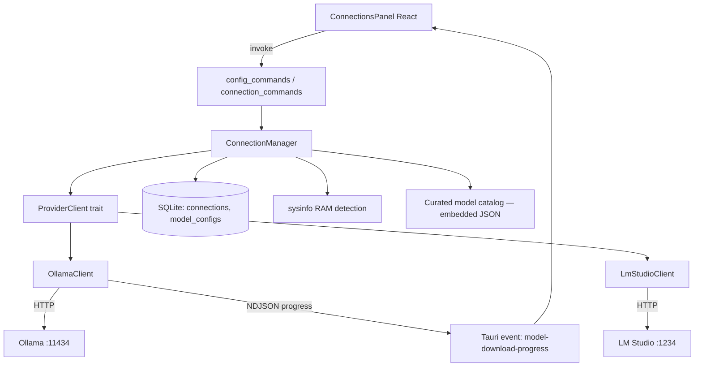

# Conexões & Modelos Design

**Spec**: `.specs/features/connections-models/spec.md`
**Status**: Draft

---

## Architecture Overview

Um `ProviderClient` trait abstrai as diferenças entre Ollama e LM Studio (ambos OpenAI-compatible para chat, mas com APIs próprias e incompatíveis entre si para listar/baixar/configurar modelos). O `ConnectionManager` guarda conexões habilitadas em SQLite e delega chamadas HTTP ao client concreto. Download emite progresso via evento Tauri (`model-download-progress`) consumido pelo frontend em tempo real — mesmo padrão de evento que o pipeline de documentos (M5) vai reusar.



---

## Code Reuse Analysis

### Existing Components to Leverage

| Component | Location | How to Use |
| --- | --- | --- |
| SQLite connection state | `src-tauri/src/db.rs` (`DbState`) | Adicionar migrações para `connections` e `model_configs` na mesma conexão já gerenciada |
| Config/base_path | `src-tauri/src/config.rs` | Nenhuma pasta nova necessária — conexões/modelos são metadados em SQLite, não arquivos |
| Padrão nav+painel da sidebar | `src/components/Sidebar/SettingsSection.tsx` + `src/store/uiStore.ts` (AD-014) | `ConnectionsSection` vira item de navegação; `ConnectionsPanel` reusa o mesmo `activeView` do `uiStore` (adicionar `"connections"` ao union type) |
| Tema/i18n | `src/lib/theme.ts`, `src/i18n/` | Todo texto novo entra como chave de tradução EN/PT; nenhuma cor hardcoded |

### Integration Points

| System | Integration Method |
| --- | --- |
| Ollama | HTTP REST: `GET /api/tags` (listar instalados), `POST /api/pull` (baixar, NDJSON stream), `POST /api/chat` com `options.num_ctx`/`options.num_gpu` (usado por M4, configurado aqui) |
| LM Studio | HTTP REST v1: `GET /api/v1/models` (listar), `POST /api/v1/models/download` (baixar), `POST /api/v1/models/load` com `contextLength`/`gpuOffload` |
| sysinfo (crate) | `sysinfo::System::new_all().total_memory()` para RAM total em bytes |

---

## Components

### `ProviderClient` (trait)

- **Purpose**: Interface comum para as operações que o app precisa de qualquer runtime local
- **Location**: `src-tauri/src/providers/mod.rs`
- **Interfaces**:
  - `async fn health_check(&self) -> Result<(), ProviderError>` — testa se o servidor responde
  - `async fn list_installed_models(&self) -> Result<Vec<InstalledModel>, ProviderError>`
  - `async fn pull_model(&self, identifier: &str, progress: Sender<PullProgress>) -> Result<(), ProviderError>`
  - `async fn configure_model(&self, model: &str, context_length: Option<u32>, gpu_offload: Option<GpuOffload>) -> Result<ConfigApplied, ProviderError>`
- **Dependencies**: `reqwest` (cliente HTTP async)
- **Reuses**: nenhum código existente — módulo novo

### `OllamaClient` / `LmStudioClient` (impl `ProviderClient`)

- **Purpose**: Implementação concreta por provedor, isolando as diferenças de payload/endpoint
- **Location**: `src-tauri/src/providers/ollama.rs`, `src-tauri/src/providers/lmstudio.rs`
- **Interfaces**: implementam o trait acima
- **Dependencies**: `reqwest`, `serde_json`
- **Reuses**: `ProviderClient` trait
- **Nota de honestidade técnica (CONN-13 AC3)**: `ConfigApplied` retorna quais campos o provedor realmente aceitou — LM Studio aplica `contextLength`/`gpuOffload` só no **load** do modelo (pode exigir descarregar e recarregar); Ollama aceita `num_ctx`/`num_gpu` por requisição sem reload. A UI mostra essa diferença ao usuário em vez de fingir paridade.

### `ConnectionManager`

- **Purpose**: Orquestra CRUD de conexões, detecção, e delega ao `ProviderClient` certo
- **Location**: `src-tauri/src/connections.rs`
- **Interfaces**:
  - `fn detect_known_connections() -> Vec<ConnectionCandidate>` — Ollama/LM Studio nas portas padrão
  - `async fn refresh_status(&self, conn: &Connection) -> ConnectionStatus`
  - `fn provider_for(&self, conn: &Connection) -> Box<dyn ProviderClient>`
- **Dependencies**: SQLite (`DbState`), providers
- **Reuses**: `DbState` (M1/M2)

### `ModelCatalog`

- **Purpose**: Lista curada (embutida, não uma API externa — nenhuma existe) de modelos populares com parâmetros conhecidos, para a experiência de "descobrir o que baixar"
- **Location**: `src-tauri/src/models/catalog.rs` (dados) + `src-tauri/src/models/memory_estimate.rs` (fórmula, pura/testável)
- **Interfaces**:
  - `fn curated_models() -> &'static [CuratedModel]`
  - `fn estimate_ram_gb(params_billions: f32, quant: Quant) -> f32` — `params × bytes_per_weight(quant) × 1.2`
- **Dependencies**: nenhuma (dados estáticos + função pura)
- **Reuses**: nada — mas é a peça que o TESTING.md pede unit test (lógica pura sem I/O)

**Transparência sobre a lista curada**: os tamanhos (`params_billions`) dos modelos na lista são fatos públicos conhecidos (ex.: Llama 3.1 8B, Qwen2.5 7B, Phi-3 mini ~3.8B) — não uma tabela de RAM medida em bancada. A RAM estimada é sempre rotulada como **estimativa** na UI (CONN-08/09), nunca como valor medido.

### `RamDetector`

- **Purpose**: Detecta RAM total do sistema
- **Location**: `src-tauri/src/system_info.rs`
- **Interfaces**: `fn total_ram_gb() -> f32`
- **Dependencies**: crate `sysinfo`
- **Reuses**: nada

### `ConnectionsPanel` (React)

- **Purpose**: UI com duas sub-abas: "Conexões" (status, habilitar, adicionar manual) e "Modelos" (instalados, para baixar filtrados por RAM, progresso, config de contexto/GPU)
- **Location**: `src/components/Connections/ConnectionsPanel.tsx` (+ subcomponentes `ConnectionsList.tsx`, `ModelsList.tsx`, `ModelDownloadCard.tsx`, `ModelConfigForm.tsx`)
- **Interfaces**: consome `connectionsStore` (Zustand) + `connectionsApi` (invoke wrappers)
- **Dependencies**: `useUiStore` (`activeView === "connections"`)
- **Reuses**: padrão visual de `SettingsPanel.tsx` (header com voltar, CSS vars de tema, i18n)

---

## Data Models

### SQLite — novas tabelas (mesma `readme.db` de M1/M2)

```sql
CREATE TABLE connections (
    id TEXT PRIMARY KEY,
    provider TEXT NOT NULL,        -- 'ollama' | 'lmstudio' | 'custom'
    base_url TEXT NOT NULL,
    enabled INTEGER NOT NULL DEFAULT 0,
    created_at TEXT NOT NULL
);

CREATE TABLE model_configs (
    id TEXT PRIMARY KEY,
    connection_id TEXT NOT NULL REFERENCES connections(id) ON DELETE CASCADE,
    model_name TEXT NOT NULL,
    context_length INTEGER,        -- NULL = usa default do provedor
    gpu_offload TEXT,              -- NULL = usa default; 'off' | 'max' | '0.5' etc
    is_active INTEGER NOT NULL DEFAULT 0,
    UNIQUE(connection_id, model_name)
);
CREATE INDEX idx_model_configs_connection ON model_configs(connection_id);
```

```typescript
interface Connection {
  id: string;
  provider: "ollama" | "lmstudio" | "custom";
  base_url: string;
  enabled: boolean;
  status: "available" | "unavailable" | "unknown"; // calculado em runtime, não persistido
}

interface ModelConfig {
  id: string;
  connection_id: string;
  model_name: string;
  context_length: number | null;
  gpu_offload: string | null;
  is_active: boolean;
}

interface CuratedModel {
  id: string;               // ex.: "llama3.1-8b"
  display_name: string;
  provider: "ollama" | "lmstudio";
  pull_identifier: string;  // nome pro /api/pull ou link HF
  params_billions: number;
  default_quant: string;    // ex.: "Q4_K_M"
  estimated_ram_gb: number; // calculado por estimate_ram_gb()
}
```

**Relationships**: `model_configs.connection_id` → `connections.id` (cascade delete). `chats` (M1) ganhará depois uma FK opcional para `model_configs.id` (definida no design de `chat-messaging`, não aqui, para não duplicar ownership de schema).

---

## Error Handling Strategy

| Error Scenario | Handling | User Impact |
| --- | --- | --- |
| Ollama/LM Studio não responde no health check | `ConnectionStatus::Unavailable`, sem exception propagada | Card mostra "indisponível" + botão de retry |
| Pull falha no meio (rede caiu) | Ollama resuma automaticamente na próxima tentativa; erro é reportado via evento com `status: "error"` | Barra de progresso vira estado de erro com botão "tentar novamente" |
| Modelo configurado não existe mais na conexão (foi removido externamente) | `list_installed_models` não o retorna mais; `model_configs.is_active` fica "órfão" | UI detecta e avisa "modelo não encontrado, escolha outro" |
| RAM detection falha (raro, mas `sysinfo` pode retornar 0 em ambientes exóticos) | Fallback: mostra todos os modelos sem filtro, com aviso "não foi possível detectar sua memória" | Nunca esconde tudo silenciosamente |

---

## Tech Decisions (only non-obvious ones)

| Decision | Choice | Rationale |
| --- | --- | --- |
| Abstração de provedor | `trait ProviderClient` com 2 impls | Ollama e LM Studio têm APIs de gestão de modelo incompatíveis; chat (M4) usa OpenAI-compatible pros dois, mas gestão de modelo não |
| Catálogo de download | Lista curada embutida no binário (JSON/const Rust), não uma chamada de API | Nenhum dos dois provedores expõe API pública de catálogo (confirmado via pesquisa) |
| Filtro de memória | Só RAM via `sysinfo`, fórmula `params × bytes/peso × 1.2` | Decisão do usuário — VRAM não é detectável de forma confiável entre fabricantes |
| Progresso de download | Evento Tauri (`emit`) em vez de polling do frontend | Mesmo padrão que M5 vai usar para progresso de indexação — consistência entre features |
| Escopo de "modelo ativo" | Por conexão (`model_configs.is_active`), mais um ponteiro opcional por chat definido em `chat-messaging` design | Evita decidir aqui algo que só faz sentido fechar quando M4 (consumidor) for desenhado |

---

## Open Question Carried to Tasks

Nenhuma — todas as decisões técnicas necessárias foram fechadas (pesquisa + decisão do usuário sobre RAM/VRAM).
