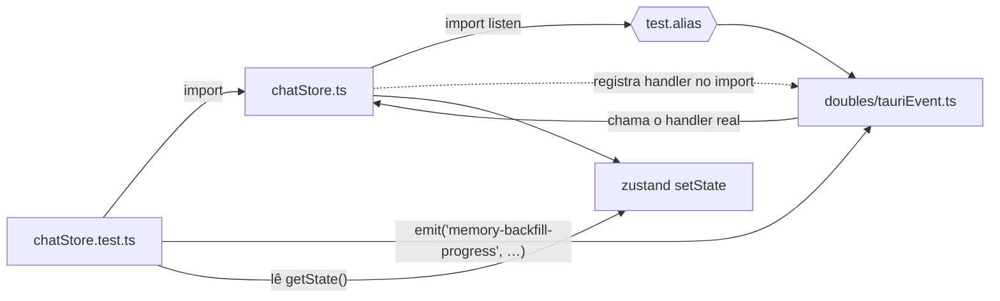

# Cobertura de teste no frontend — Design

**Spec:** `.specs/features/frontend-testing/spec.md`

---

## Escolha da stack — com a evidência, não com a expectativa

O candidato natural era o Vitest, porque o projeto já roda Vite 7. A compatibilidade foi **medida**,
não presumida:

| Fato | Como foi obtido |
| --- | --- |
| `vite` instalado: **7.3.6** | `node -e "require('./node_modules/vite/package.json').version"` |
| `vitest@latest` = **4.1.10**, peer `vite: "^6.0.0 \|\| ^7.0.0 \|\| ^8.0.0"` | `npm view vitest@latest version peerDependencies --json` |
| `@testing-library/react@latest` = **16.3.2**, peer `react: "^18.0.0 \|\| ^19.0.0"` (o projeto tem React **19.2.8**) | `npm view @testing-library/react@latest peerDependencies --json` |
| `jsdom@30` exige `node ^22.22.2 \|\| ^24.15.0 \|\| >=26`; a máquina roda **v24.12.0** | `npm install` emitiu `EBADENGINE` |
| `jsdom@29.1.1` exige `^20.19.0 \|\| ^22.13.0 \|\| >=24.0.0` — compatível | `npm view jsdom@^29.0.0 engines.node` |

**Resultado:** `vitest@4.1.10`, `jsdom@29.1.1`, `@testing-library/react@16.3.2`,
`@testing-library/dom@10.4.1`. A instalação final terminou com **0 vulnerabilidades e nenhum
`EBADENGINE`** — o pin do `jsdom` em `^29` existe por causa dessa medição, não por preferência.

**Por que não Jest:** exigiria uma segunda cadeia de transformação (babel/ts-jest) para o TSX, em
paralelo à que o Vite já faz. Vitest reusa o `@vitejs/plugin-react` que o projeto já tem instalado.

**Por que jsdom e não `environment: "node"`, mesmo começando pelos stores:** `src/i18n/index.ts` lê
`localStorage` **no import**, e `chatStore.ts` importa `../i18n`. Sem DOM, o primeiro teste de store
falha no import. Isso é medição: foi o motivo do ambiente, não uma escolha antecipada.

---

## O problema central: os listeners não têm porta de entrada

Os stores registram `listen(...)` **no escopo do módulo**, fora do `create()`:

```ts
listen<MemoryBackfillProgress>("memory-backfill-progress", (event) => { … });
```

Isso tem três consequências que decidem todo o desenho:

1. **Não há como chamar o handler pela API do store.** Ele só existe dentro da closure que o
   `listen` recebeu. A única forma de exercitá-lo é interceptar o próprio `listen`.
2. **O registro acontece no import.** Um `vi.mock` dentro de um teste corre o risco de chegar depois
   do import do store — o handler já teria sido entregue ao módulo real.
3. **Sem interceptação, o import quebra**: `@tauri-apps/api/event` sem IPC rejeita.

**Decisão: interceptar por resolução de módulo (`test.alias`), não por `vi.mock`.** O
`vitest.config.ts` aponta `@tauri-apps/api/event` e `@tauri-apps/api/core` para dublês em
`src/test/doubles/`. Como é resolução, vale desde a primeira linha do import — não há janela de
corrida. E como o dublê é um módulo normal, o teste importa **o mesmo módulo** e dispara os eventos
por ele.



### Onde a interceptação de comandos foi colocada, e por quê

Em `invoke`, **não** nos wrappers `*Api.ts`. Custa o mesmo e cobre uma coisa a mais: o nome do
comando e os **parâmetros camelCase** que o bridge do Tauri converte para `snake_case`. O
`AGENTS.md` registra que essa é uma das quebras que só aparecem em runtime — o teste
`callsTo("set_chat_use_memory")[0].args` fixa `{ chatId, enabled }` como contrato.

O dublê **rejeita** comando não stubado, em vez de resolver `undefined`. Resolver deixaria um store
seguir adiante com um valor que nunca recebeu, e o teste passaria pelo motivo errado — que é
exatamente o defeito da AD-046.

---

## Componentes do desenho

| Arquivo | Papel | Marcador |
| --- | --- | --- |
| `vitest.config.ts` | Ambiente jsdom, `include`, setup, e os dois aliases | infra, sem marcador |
| `src/test/doubles/tauriEvent.ts` | `listen` que guarda handlers; `emit` que os dispara | FTEST-03 |
| `src/test/doubles/tauriCore.ts` | `invoke` com stubs por comando e registro de chamadas | FTEST-03 |
| `src/test/setup.ts` | `cleanup()` do RTL + `resetCommands()` entre testes | FTEST-02, FTEST-03 |
| `src/store/*.test.ts` | Os stores | FTEST-05 … FTEST-22 |
| `src/lib/theme.test.ts` | Função pura | FTEST-20 |
| `src/components/Runtime/*.test.tsx` | Filtro `fits_ram` e percentual | FTEST-23, FTEST-24 |

**`vitest.config.ts` é separado do `vite.config.ts` de propósito:** aquele fixa a porta 1420 com
`strictPort` para o `tauri dev`. Carregá-lo faria a suíte depender de uma porta que ela nunca usa.

---

## Reset de estado entre testes

Zustand é um singleton de módulo: o estado vaza de um teste para o próximo. O padrão adotado é
capturar `{ ...useChatStore.getState() }` **uma vez, no topo do arquivo** (logo depois do import, com
o estado ainda intocado) e restaurar num `beforeEach`. `setState` faz merge, então as ações do store
sobrevivem — o snapshot só devolve os campos de dados.

O `resetCommands()` do `setup.ts` cobre o outro lado: um stub deixado por um teste anterior faria o
seguinte passar sem declarar de que backend ele depende.

---

## Como os tipos são construídos nos testes

`src/types.ts` está sendo **gerado** a partir das structs Rust (C-03). Um teste que escrevesse
`Chat` campo a campo passaria a quebrar em toda coluna nova do banco, sem nenhuma relação com a
lógica coberta.

Os testes usam fábricas locais com `as unknown as Chat`, listando **só os campos que o store lê**.
O trade-off é explícito: perde-se a checagem de que o objeto de teste é um `Chat` completo, ganha-se
independência de um arquivo que outro agente está reescrevendo agora.

---

## O que este desenho deliberadamente não faz

- **Não testa `App.tsx` nem a árvore inteira.** Renderizar o app exigiria stubar todos os comandos
  de boot; o retorno é baixo perto do custo.
- **Não usa snapshot.** Quebra em toda mudança de classe Tailwind e ensina a aceitar o diff sem ler.
- **Não mede cobertura percentual.** O gate desta spec é a mutação (FTEST-25), não um número.

---

## Open Questions

1. **Ligar `npm test` no `.github/workflows/ci.yml`.** Está fora dos arquivos que esta task pode
   tocar. Sem isso, a suíte só roda quando alguém a chama — fica registrado como pendência.
