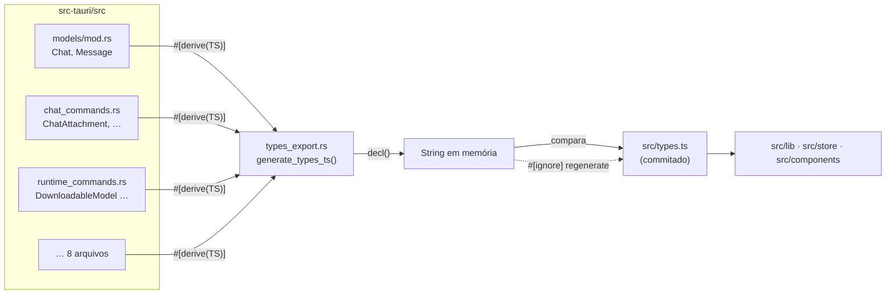

# Tipos gerados na fronteira Rust↔TS — Design

**Spec:** `.specs/features/generated-types/spec.md`
**Status:** Implementado

---

## Escolha da ferramenta

O C-03 sugeria dois candidatos: `ts-rs` ou `specta`/`tauri-specta`. A escolha
não foi por preferência — foram medidas três coisas que decidem sozinhas.

### Evidência 1 — versão publicada e alvo de Tauri

Consultado na API do crates.io em 2026-07-27:

```
$ curl -s https://crates.io/api/v1/crates/tauri-specta | jq '.crate | {max_version, max_stable_version}'
{ "max_version": "2.0.0-rc.25", "max_stable_version": "1.0.2" }

$ curl -s https://crates.io/api/v1/crates/specta | jq '.crate | {max_version, max_stable_version}'
{ "max_version": "2.0.0-rc.25", "max_stable_version": "1.0.5" }

$ curl -s https://crates.io/api/v1/crates/ts-rs | jq '.crate | {max_version, max_stable_version}'
{ "max_version": "12.0.1", "max_stable_version": "12.0.1" }
```

A linha estável do `tauri-specta` (1.0.2) declara `tauri ^1.2.4` em
`docs.rs/tauri-specta/latest` — **Tauri 1**, não 2. A linha compatível com o
Tauri 2 é a `2.0.0-rc.25`: vinte e cinco release candidates e nenhuma versão
estável. O `ts-rs` está em 12.0.1 estável.

Isso não desqualifica o `tauri-specta` por si só — o projeto já depende de
coisas novas — mas move o ônus da prova, e as duas evidências seguintes não o
levantam.

### Evidência 2 — `#[serde(flatten)]`, que é o caso que decide

`docs.rs/ts-rs/12.0.1` lista `flatten` **explicitamente** entre os atributos
serde honrados pela feature `serde-compat` (ligada por padrão), ao lado de
`rename`, `rename_all`, `tag`, `content`, `untagged`, `skip`,
`skip_serializing_if` e `default`.

A página do `specta` estável (1.0.5) **não menciona `flatten` em lugar nenhum**;
o roadmap da v2 (`hackmd.io/@oscartbeaumont/spectav2`) lista *runtime
flattening* como trabalho incompleto na branch principal.

`DownloadableModel` é exatamente um `#[serde(flatten)]`, e é o tipo que o C-03
aponta como o mais frágil. Uma ferramenta que não o honra não resolve o item —
resolveria o resto e deixaria de fora justo o caso difícil.

> **Ressalva honesta:** o comportamento do `specta` com `flatten` **não foi
> testado empiricamente** aqui. A evidência acima é documental. O `ts-rs`, esse
> sim, foi testado — a saída medida está mais abaixo.

### Evidência 3 — onde a geração roda

O gate padrão deste repositório é `cargo test --lib`. O `ts-rs` gera bindings
**por teste** (`#[ts(export)]` cria um `#[test]`), e expõe `TS::decl()` /
`TS::export_to_string()` para gerar em memória — o que permite um teste que
**compara** sem escrever, que é o formato que o TYPE-03 pede.

O `tauri-specta` exporta chamando `ts::export(...)` no `main()` sob
`#[cfg(debug_assertions)]` (o exemplo canônico da própria doc) ou num teste que
**escreve** o arquivo. Um teste que escreve não detecta divergência: ele a
apaga. Seria preciso construir o comparador por fora de qualquer jeito.

### Decisão

**`ts-rs` 12.** Estável, honra `flatten` por documentação e por medição, e a API
`TS::decl()` permite o comparador em memória que o gate exige. O `tauri-specta`
continua sendo a ferramenta certa para o *outro* problema — o nome do comando
como string — e essa porta fica aberta: nada aqui impede adotá-lo depois, porque
esta feature não toca em `*Api.ts`.

**Trade-off aceito:** `ts-rs` é dependência de compilação normal (não `dev`),
porque o `#[derive(TS)]` está nas structs da lib. Ele entra no binário de
release. Custo medido: ver `tasks.md`.

---

## Arquitetura



O ponto de projeto é a **assimetria entre os dois caminhos**:

- o caminho **normal** (`cargo test --lib`) só lê `src/types.ts` e compara —
  nunca escreve;
- o caminho de **regeneração** é um teste `#[ignore]`, disparado à mão.

Essa assimetria é o que faz o gate valer alguma coisa. Um gerador que escreve
durante o `cargo test` conserta a divergência sozinho e nunca falha: o arquivo
gerado passaria a ser uma cópia do estado atual, não uma verificação dele. É a
mesma armadilha do AD-041 — um teste que passa pelo motivo errado.

### Por que um módulo em vez de `#[ts(export)]`

O `#[ts(export)]` do `ts-rs` gera **um arquivo por tipo** num diretório
`bindings/`, com `import` entre eles. O projeto tem um `src/types.ts` único que
14 arquivos do frontend importam. Trocar isso por 25 arquivos seria mexer em
`src/store/**` e `src/components/**`, fora do escopo desta feature e com raio de
mudança muito maior que o problema.

Então: `#[derive(TS)]` **sem** `#[ts(export)]`, e um único módulo
(`types_export.rs`) que chama `TS::decl()` em ordem fixa e monta o arquivo. A
ordem fixa é o TYPE-09 — ela mora numa macro no código, não na ordem em que os
testes rodam (que é paralela e não determinística).

**Ajuste de API medido na implementação:** no `ts-rs` 12.0.1 a assinatura é
`TS::decl(cfg: &Config)`, não `TS::decl()` — o design tinha escrito a forma da
v11. O gerador passa `Config::default()`, deliberadamente **não**
`Config::from_env()`: o `from_env` lê `TS_RS_LARGE_INT`, `TS_RS_EXPORT_DIR` e
`TS_RS_IMPORT_EXTENSION`, e o gate compara bytes — o arquivo gerado não pode
depender de variável de ambiente do shell de quem rodou.

**O módulo é `#[cfg(test)]`.** Ele não tem papel em tempo de execução: o app
nunca o chama. Compilá-lo no binário de release só adicionaria código morto e
três warnings de `dead_code` em todo `cargo check`. Os `impl TS` gerados pelos
derives, esses sim, continuam no binário — é o trade-off já registrado acima.

### Os estreitamentos (TYPE-07)

O arquivo escrito à mão prometia mais do que o Rust entrega em quatro campos.
Auditados um a um:

| Campo | Rust | TS à mão | Decisão | Justificativa |
| --- | --- | --- | --- | --- |
| `DocumentRecord.status` | `String` | `DocumentStatus` | **Mantido**, via `#[ts(type = "DocumentStatus")]` | O único escritor é `rag::pipeline::set_status`, que grava `DocumentStatus::as_str()`. O enum existe em Rust e também é gerado, então o nome referenciado está no mesmo arquivo |
| `RuntimeStatus.backend` | `Option<String>` | `"vulkan" \| "cpu" \| null` | **Mantido**, via `#[ts(type = "Backend \| null")]` | O único escritor é `Backend::as_str()`. O enum `runtime::Backend` passou a derivar `TS` e é gerado — o estreitamento deixa de ser literal digitado |
| `ChatAttachment.status` | `String` | `ChatAttachmentStatus` = 4 literais | **Corrigido** | Ver abaixo |
| `Message.role` | `String` | `"user" \| "assistant" \| "system"` | **Mantido**, via `#[ts(type = …)]` | Os três valores são literais em `chat_commands::insert_message`; `MessageBubble` faz `role === "system"`, então a união é usada de fato |

**O caso `ChatAttachment.status` é o achado desta feature.** A união escrita à
mão era `"queued" | "injected_whole" | "ready" | "error"`. Mas
`chat::attachments::finish_attachment` **copia** o status da linha de
`documents` para `chat_attachments`:

```rust
"SELECT status, error_message FROM documents WHERE id = ?1"
…
"UPDATE chat_attachments SET status = ?1, error_message = ?2 WHERE id = ?3"
```

e essa linha passa por `parsing`, `chunking` e `embedding` antes de virar
`ready`. Os três valores podem chegar ao frontend e **não estavam na união** —
o tipo escrito à mão estava errado desde que o pipeline ganhou fases. Nenhum
componente quebrou porque os dois usos são `a.status === "error"` e
`a.status !== "error"`, que compilam contra qualquer união.

Gerado agora como `DocumentStatus | "injected_whole"`, que é o conjunto real. O
alias `ChatAttachmentStatus` some do `types.ts`; nada o importava (conferido por
`grep`: as duas únicas ocorrências eram a declaração e o uso no próprio campo).

### Inteiros de 64 bits (TYPE-08)

O `ts-rs` mapeia `u64`/`i64`/`usize` para `bigint` por padrão. Para este
projeto isso seria **errado**, não conservador: o IPC do Tauri serializa em
JSON, e `serde_json` escreve `u64` como número JSON — do outro lado chega um
`number` do JavaScript, nunca um `BigInt`. Um `size_bytes: bigint` mentiria
sobre o valor que o `documentsStore` recebe, e ainda quebraria a aritmética que
o `ModelDownloadCard` faz para calcular percentual.

Resolvido com `#[ts(type = "number")]` nos campos afetados, cada um com o
motivo escrito ao lado da struct. São nove campos, em seis structs:
`CuratedModelInfo.download_bytes`, `DocumentRecord.size_bytes`,
`InstalledModel.size_bytes`, `PullProgress.downloaded_bytes` e `.total_bytes`,
`DownloadProgress.downloaded` e `.total`, `MemoryBackfillProgress.done` e
`.total`.

**O atributo por campo não basta sozinho**, e isso é a lição do C-03 se
repetindo: ele depende de quem adiciona o *próximo* campo `u64` saber da regra.
Por isso existe `types_export::tests::no_bigint_reaches_the_frontend`, que falha
se a palavra `bigint` aparecer em qualquer lugar do arquivo gerado. É barato e
pega o caso que o atributo não cobre.

A alternativa considerada foi `Config::with_large_int("number")`, que resolveria
globalmente. Descartada porque apaga a documentação: o motivo pelo qual
`download_bytes` **precisa** ser `number` (o `ModelDownloadCard` faz aritmética
com ele) some de perto do campo e vira uma linha de configuração distante. Com o
atributo mais o teste, tem-se as duas coisas — o porquê no lugar certo e a rede
embaixo.

---

## Saída medida do `flatten`

> **Correção (2026-07-28).** Esta seção afirmava, com cara de medição, que a
> saída era a interseção `{ fits_ram: boolean } & CuratedModelInfo`. **Não é.**
> O texto foi escrito antes de o gerador existir; a saída abaixo é a primeira
> que saiu de fato do `ts-rs` 12.0.1, copiada do `src/types.ts` produzido pelo
> `cargo test --lib types_export -- --ignored`.

`DownloadableModel`, gerado pelo `ts-rs` 12.0.1 a partir da struct com
`#[serde(flatten)]`:

```ts
export type DownloadableModel = { fits_ram: boolean, id: string, display_name: string,
/**
 * The direct `.gguf` URL — there is no registry to pull by name (SELF-02).
 */
pull_identifier: string, params_billions: number, default_quant: string, estimated_ram_gb: number,
/**
 * Exact download size, checked against the server when the entry was added.
 */
download_bytes: number | null, };
```

O `ts-rs` **inlina** os campos do `CuratedModelInfo` no objeto, em vez de emitir
uma interseção. O que o TYPE-05 pede continua valendo, e por um caminho até mais
direto: os campos saem no mesmo nível de `fits_ram` e **ninguém transcreveu a
lista** — ela vem da struct em `models/catalog.rs`. A prova disso está no T6 do
`tasks.md`: renomear `estimated_ram_gb` lá derruba o gate exatamente nesta linha
do arquivo gerado.

**Efeito colateral registrado:** como o `ts-rs` inlina, os sete campos do
`CuratedModelInfo` aparecem duas vezes no arquivo — uma no `CuratedModelInfo`
próprio e outra dentro do `DownloadableModel`. É duplicação **gerada**, não
mantida à mão, então não reintroduz o problema do C-03: as duas cópias saem da
mesma struct e divergir é impossível.

---

## Alternativas descartadas

| Alternativa | Por que não |
| --- | --- |
| Manter à mão e escrever um teste que faz *parsing* das structs Rust | Reimplementar um parser de Rust para achar renames é mais frágil que o problema que resolve |
| `#[ts(export)]` com um arquivo por tipo | Obriga a mexer em 14 arquivos do frontend, fora do escopo |
| Gerar no `build.rs` | O `build.rs` não tem acesso aos tipos da própria crate (ele roda antes) |
| Gerar num binário separado (`cargo run --bin gen-types`) | Não roda no gate padrão; um gerador que ninguém roda é o problema original com passos a mais |
| `ts-rs` como feature opcional | O teste de divergência só rodaria com a feature ligada, e o gate padrão voltaria a não pegar nada |
