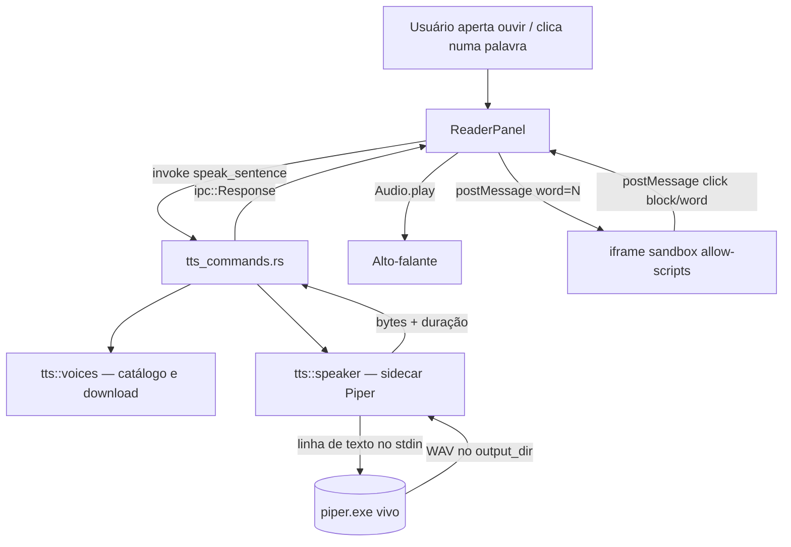

# Leitura em voz alta com marcação palavra a palavra — Design

**Spec:** `.specs/features/read-aloud/spec.md`
**Status:** Draft

---

## O spike veio antes do desenho

Nada aqui é suposição sobre o Piper. O binário arquivado (`rhasspy/piper` `2023.11.14-2`,
`piper_windows_amd64.zip`) foi baixado e executado nesta máquina em 2026-09-07, e é a medição que
escolheu a arquitetura:

| Medição | Valor |
| --- | --- |
| 1 frase, processo frio (start + carga do modelo + síntese) | **593 ms** |
| 5 frases, **um único** processo | **1.536 ms**, para 16,5 s de áudio |
| Custo marginal por frase, depois da primeira | ~**236 ms** |
| Razão síntese / tempo real | ~**10×** |
| Formato de saída | WAV 22.050 Hz, mono, 16 bits |
| `piper.exe` | 509.952 bytes |
| `onnxruntime.dll` que acompanha | 9.271.704 bytes |
| `libtashkeel_model.ort` (**árabe apenas**) | 10.261.536 bytes |
| Voz `pt_BR-faber-medium` | 63.201.294 bytes |

**Dois achados que decidem tudo:**

1. **O processo fica vivo lendo linhas do stdin.** Um processo consumiu as cinco frases e escreveu
   cinco WAVs com o modelo carregado **uma vez**. O `--help` confirma por outro caminho:
   `--json-input` é descrito como *"stdin input is lines of JSON **instead of plain text**"*, ou
   seja, linhas de texto é o padrão. Isso elimina o custo de recarga que a documentação do
   `piper1-gpl` chama de proibitivo, sem servidor HTTP nenhum.
2. **A duração da frase é exata e sai de graça.** WAV mono 16 bits a 22.050 Hz são 44.100 bytes por
   segundo: `dur = (bytes - 44) / 44100`. Conferido contra o cabeçalho de um arquivo real
   (91.296 bytes → 2,069 s). **Não é estimativa** — e é a âncora sobre a qual a marcação se apoia.

## Abordagens consideradas

| Abordagem | Por que não / por que sim |
| --- | --- |
| **A. Sidecar de vida longa alimentado por stdin** ⭐ | **Escolhida.** 236 ms por frase contra ~10× isso em áudio produzido: a síntese corre muito à frente da reprodução, e uma frase de antecipação basta. Reusa `runtime/process.rs`, o Job Object e o `CREATE_NO_WINDOW` que o llama-server já usa |
| B. Um processo por frase | Medida: **593 ms** de arranque contra **236 ms** de trabalho útil. Pagar 2,5× o custo da frase em carga de modelo, a cada frase, para não guardar um `Child` numa struct |
| **D. Shadow DOM no lugar do iframe** | **Levantada por mim e rejeitada pelo council.** Parecia mais barata — `<script>` via `innerHTML` não executa, e marcar vira DOM direto, sem ponte. Mas põe HTML de terceiro **na origem do próprio app**, onde `invoke` é alcançável, e não dispensa o sanitizador: `` e `<svg onload>` disparam do mesmo jeito. Ainda regride a fidelidade de CSS que criou o iframe (propriedades herdadas atravessam o *shadow boundary*, e `html`/`body`/`:root` param de casar). O iframe com `allow-scripts` ao menos mantém a **origem opaca** |
| C. Pré-sintetizar a página inteira antes de tocar | Uma página de 2.500 caracteres são ~20 frases: ~5 s até o primeiro som, e todo esse trabalho jogado fora quando o usuário vira a página no meio. A antecipação de uma frase entrega o mesmo sem a espera |

---

## Architecture Overview



O backend nunca toca a tela e o frontend nunca toca o Piper. Entre os dois passam **bytes de WAV e
um número de milissegundos** — o resto da marcação é aritmética no frontend, onde o relógio da
reprodução já existe.

---

## Code Reuse Analysis

| Componente | Local | Como é usado |
| --- | --- | --- |
| `runtime::process::spawn` / `RunningSidecar::kill` | `src-tauri/src/runtime/process.rs:113`, `:58` | O molde do processo filho. O Piper não é HTTP, então não reusa o health-check — reusa o **padrão** e o `configure_command` |
| `runtime::process::configure_command` | `runtime/process.rs:19` | `CREATE_NO_WINDOW`. Sem ele o `piper.exe` abre um console preto, exatamente o defeito que a SIDE-03 resolveu |
| `runtime::job::JobState::assign` | `runtime/job.rs:72` | Job Object no Windows. **Obrigatório**: o `AGENTS.md` manda não remover nenhuma das duas mortes (kill explícito + Job) |
| `runtime::bundled::find_file` / `resource_root` | `runtime/bundled.rs` | Achar `piper.exe` dentro de `resources/`, com a mensagem de "reinstale o ReadMe" que já existe |
| `runtime::download::download_with_progress` | `runtime/download.rs:22` | Baixar a voz com progresso, exatamente como um GGUF |
| `models::catalog` | `src-tauri/src/models/catalog.rs` | O molde do catálogo curado: id, nome, `download_bytes` com `content-length` conferido (AD-015) |
| `reader::html::split_blocks` / `visible_text` | `reader/html.rs` | O texto a falar sai do bloco, e o bloco já é a unidade da página (FID-05) |
| `reader::pagination::sentence_starts` | `reader/pagination.rs` | **A fronteira de frase já existe nesta base.** Uma segunda definição divergiria, e a que divergisse cortaria a frase no meio do áudio |
| `scripts/vendor.json` + `vendor-runtime.mjs` | `scripts/` | Uma entrada nova, com asset e bytes fixados (SELF-14/SELF-15) |
| `tauri::ipc::Response` | `reader_commands.rs` (`get_book_image`) | Bytes crus sem base64. O WAV vai pelo mesmo caminho que a imagem do livro |

### Integration Points

| Sistema | Como conecta |
| --- | --- |
| `BookPage` | Ganha nada. A frase é recortada no frontend a partir do que já chega |
| `app_config` | Guarda a voz escolhida por idioma e a velocidade (TTS-23, TTS-32) |
| Pasta-base do usuário | As vozes vivem ao lado dos modelos, não dentro do livro (TTS-14) |

---

## Components

### `tts::speaker` — o sidecar do Piper

- **Purpose**: manter um `piper.exe` vivo por voz e transformar uma frase em WAV.
- **Location**: `src-tauri/src/tts/speaker.rs` *(novo)*
- **Interfaces**:
  - `speak(voice: &InstalledVoice, sentence: &str) -> Result<Wav, String>` — escreve a linha no
    stdin, lê o caminho do WAV que o Piper imprime no stdout, devolve bytes + duração.
  - `shutdown()` — mata o processo, chamado ao trocar de voz e ao fechar o app.
- **Dependencies**: `runtime::process::configure_command`, `runtime::job::JobState`.
- **Reuses**: o padrão de spawn do sidecar, incluindo as duas mortes.
- **ponytail**: um processo por vez, sob `Mutex`, como o `EXTRACTING` do pdfium
  (`rag/pdfium.rs:38`). Duas leituras simultâneas não existem no produto — há uma tela e um par de
  alto-falantes.

### `tts::voices` — catálogo, download e o que está instalado

- **Purpose**: dizer quais vozes existem para baixar, quais estão em disco, e trazer uma.
- **Location**: `src-tauri/src/tts/voices.rs` *(novo)*
- **Interfaces**:
  - `catalog() -> Vec<CatalogVoice>` — curado, com idioma, gênero e `download_bytes`.
  - `installed(base: &Path) -> Vec<InstalledVoice>`
  - `download(app, id) -> Result<(), String>` — grava em `.part` e **renomeia no fim**, para que
    uma queda não deixe voz pela metade (TTS-26).
  - `remove(base, id) -> Result<u64, String>` — devolve os bytes liberados (TTS-31).
- **Reuses**: `download_with_progress`, o formato do `models::catalog`.

### `tts::timing` — de onde vem a marcação

> **Mudado pelo council (2026-09-07): a unidade da v1 é a FRASE, não a palavra.** A duração da frase
> é medida; a da palavra seria interpolada. Duas das três vozes chamaram a interpolação de precisão
> fingida, e o argumento que fechou foi de idioma: "1999" tem 4 caracteres e cinco sílabas, e CJK não
> tem espaço para pesar. A marcação por palavra fica na P2, **condicionada** a medir a deriva contra
> um livro real. A função abaixo já nasce preparada para os dois, e a v1 usa só o caminho de frase.

- **Purpose**: repartir a duração da frase entre as suas palavras.
- **Location**: `src-tauri/src/tts/timing.rs` *(novo)* — função **pura**, e é o único lugar desta
  feature que a matriz de testes cobre inteiro.
- **Interfaces**:
  - `word_spans(sentence: &str, duration_ms: u32) -> Vec<WordSpan>`
- **ponytail**: peso por número de caracteres, com o espaço contando para a palavra anterior. É uma
  aproximação com teto conhecido — sílaba dura mais que letra, e "através" não leva 7/3 do tempo de
  "sol". O erro cresce dentro de frases longas e **zera a cada fronteira de frase**, porque ali a
  âncora é medida. Se a UAT achar o deslize incômodo, o degrau seguinte é pesar por vogais, não
  alinhamento forçado.

### `tts_commands.rs` — a fronteira

- **Location**: `src-tauri/src/tts_commands.rs` *(novo)*
- **Interfaces**:
  - `speak_sentence(voice_id, text) -> ipc::Response` — WAV cru; a duração vai no header do próprio
    WAV, então não há segundo canal para desencontrar.
  - `list_voices()`, `download_voice(id)`, `remove_voice(id)`, `set_voice(language, id)`
  - `try_model(book_id, page, model_id)` — a P2, que traduz **um parágrafo** e não grava nada.

### `reader/sanitize.rs` — fechar a porta que o sandbox abriu

- **Purpose**: tirar todo JS do livro na extração, já que o iframe passa a permitir script.
- **Location**: `src-tauri/src/reader/sanitize.rs` *(novo)*
- **Interfaces**: `strip_scripts(block: &str) -> String`
- **Substitui** a linha `epub.rs:82`, que só derruba `<script>` de primeiro nível.
- Remove: `<script>` em qualquer profundidade, atributos `on*`, e `javascript:` em `href`/`src`.
  **Não toca em estilo nem em estrutura** (TTS/FID: a fidelidade não pode regredir).

### `ReaderPanel.tsx` + o script injetado

- O `srcdoc` passa a levar um `<script>` **do app**, e o iframe ganha `allow-scripts` (sem
  `allow-same-origin`, então a origem continua opaca e o `data:` das imagens continua valendo).
- O script faz duas coisas e mais nada: envolve as palavras em `<span data-w>` no `load` (**não**
  em disco — o `.html` da READ-31 continua limpo) e conversa por `postMessage`:
  `{mark: n}` para dentro, `{click: {block, word}}` para fora.

---

## Data Models

```typescript
interface CatalogVoice {
  id: string            // "pt_BR-faber-medium"
  language: string      // "pt-BR"
  display_name: string
  quality: string       // "medium"
  download_bytes: number  // content-length conferido, como no catálogo de modelos
  installed: boolean
}

interface WordSpan {
  start_ms: number
  end_ms: number
}
```

---

## Error Handling Strategy

| Cenário | Tratamento | O que o usuário vê |
| --- | --- | --- |
| `piper.exe` ausente no bundle | `bundled::missing` | *"componente 'piper' não encontrado em … — reinstale o ReadMe"*, e a página continua legível |
| Nenhuma voz para o idioma | Erro nomeando a ação | *"Nenhuma voz instalada para pt-BR. Baixe uma voz."* — mesma forma do `select_model` |
| Piper morre no meio da página | Para a reprodução, limpa a marca, mata o processo | Mensagem, e o livro continua navegável |
| Download interrompido | O `.part` é descartado; nada é renomeado | A voz continua listada como não instalada |
| Sem saída de áudio | Reporta uma vez e para | Mensagem, sem marcar palavra contra silêncio |
| Frase maior do que o Piper aceita | Quebra e toca em ordem | Nada — nenhuma palavra fica sem ser dita |

---

## Risks & Concerns

| Risco | Local | Impacto | Mitigação |
| --- | --- | --- | --- |
| **O `<script>` só é removido no primeiro nível** | `src-tauri/src/reader/epub.rs:82` | Com `allow-scripts`, um `<script>` dentro de um `<div>` **passa a executar**. É a regressão de segurança que esta feature pode causar | `reader/sanitize.rs` substitui a linha, e os testes de TTS-09/10/11 são escritos contra EPUB com script aninhado, `onclick=` e `javascript:` |
| `libtashkeel_model.ort` são 10.261.536 bytes de árabe | `resources/piper/` (a criar) | ~10 MB no instalador e em **todo** update portátil, para um recurso que o app não usa | Podar no `vendor-runtime.mjs`, como a poda que a AD-046 já fez para o llama.cpp — e **conferir que o binário sobe sem ele**, porque a AD-046 registra uma poda que quebrou |
| `onnxruntime.dll` do Piper (9.271.704 bytes) duplica o ONNX Runtime que o app já embute | `resources/` | Dois runtimes ONNX no mesmo bundle | Medir se o Piper aceita o que já está lá. **Se não aceitar, mantém-se a duplicata** — versões de ONNX Runtime não são intercambiáveis, e economizar 9 MB não vale um crash |
| O projeto Piper está arquivado | — | Nenhuma correção virá | Aceito pelo usuário. A voz é `.onnx` + `.json` — **dados**, não código — então trocar o motor depois não invalida o que o usuário baixou |
| Marcação interpolada desliza em frase longa | `tts/timing.rs` | Karaokê fora de sincronia no fim de frases grandes | O erro **zera a cada fronteira de frase**, que é medida. O deslize é medido na UAT e vira número escrito |
| `sentence_starts` foi escrita para paginar, não para falar | `reader/pagination.rs` | Uma abreviação (`Sr.`, `art. 5`) pode virar duas frases faladas | Ela **já** trata terminador seguido de espaço e foi testada para isso. Reusar é obrigatório: uma segunda definição de frase divergiria da paginação |
| O frontend não tem suíte | — | TTS-12, a marcação e o clique não têm teste automatizado possível | Lacuna **registrada**, não coberta. O que é testável em Rust (timing, sanitize, catálogo, download parcial) é testado; o resto é UAT |

---

## Tech Decisions

| Decisão | Escolha | Motivo |
| --- | --- | --- |
| Como o Piper é dirigido | Sidecar vivo, uma linha de frase por stdin | Medido: 236 ms/frase contra 593 ms de arranque |
| Antecipação | Uma frase à frente | A síntese corre ~10× o tempo real; mais do que uma frase é trabalho jogado fora ao virar a página |
| Como o WAV chega ao frontend | `tauri::ipc::Response`, bytes crus | Mesmo caminho de `get_book_image`; sem base64 |
| Onde a duração é lida | Do cabeçalho do próprio WAV | Um canal só: número e áudio não podem se desencontrar |
| Onde as palavras viram `<span>` | No script injetado, em tempo de exibição | O `.html` em disco continua o do livro (READ-31) |
| Fronteira de frase | `pagination::sentence_starts`, a que já existe | Uma definição por app, a mesma regra que `split_paragraphs` segue |
| Onde as vozes moram | Ao lado dos modelos, na pasta-base | TTS-14: nada é escrito na pasta do livro |

> **Decisão de nível de projeto:** trocar `sandbox=""` por `sandbox="allow-scripts"` revoga metade da
> FID-04 e move a defesa do isolamento para a sanitização na extração. Isso vira **AD-061** no
> `STATE.md` quando o design for aprovado — é convenção que as próximas features herdam.
