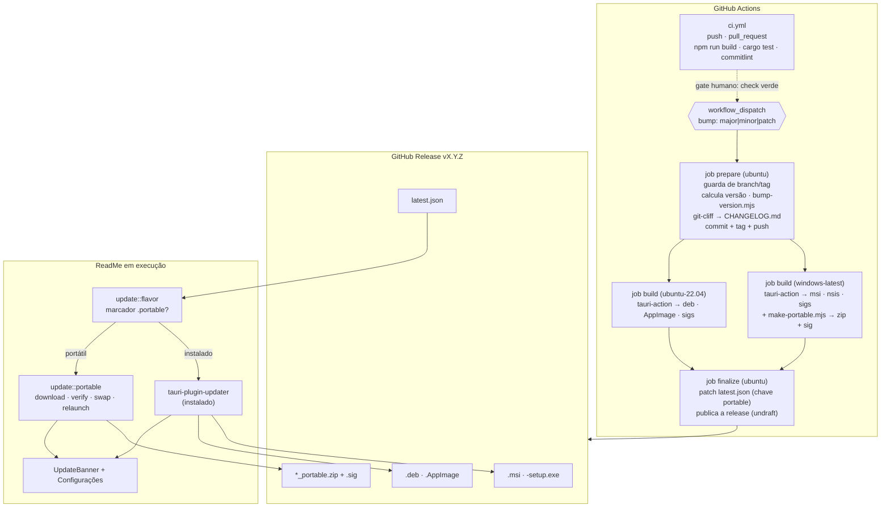

# Release & Distribution (M8) — Design

**Spec**: `.specs/features/release-distribution/spec.md`
**Context**: `.specs/features/release-distribution/context.md`
**Status**: Draft

---

## Overview

Três blocos, acoplados só pelo `latest.json` e pela chave de assinatura:

1. **CI** — dois workflows: `ci.yml` (valida, roda sempre) e `release.yml` (publica, roda só quando o mantenedor manda).
2. **Empacotamento** — os bundles nativos que o Tauri já sabe fazer, mais um `.zip` portátil montado por script no runner do Windows.
3. **App** — um módulo `update/` no backend que descobre em que modo o app está rodando e escolhe entre o updater oficial e o atualizador portátil próprio, expondo **uma única superfície** de comandos para o frontend.

O ponto de junção é a **chave minisign**: o mesmo par assina os instaladores (via `tauri-action`) e o zip portátil (via `tauri signer sign`), e a mesma chave pública em `tauri.conf.json` valida os dois lados no cliente. Não existem dois mecanismos de confiança.



---

## Parte 1 — CI

### `.github/workflows/ci.yml` (REL-25, REL-26)

**Gatilhos:** `push` em `master`, `pull_request`.

| Job | Runner | Faz |
| --- | --- | --- |
| `frontend` | `ubuntu-latest` | `npm ci` → `npm run build` (tsc + Vite) |
| `rust` | `ubuntu-22.04` | deps de sistema + `protoc` → `cargo test --manifest-path src-tauri/Cargo.toml` |
| `commits` | `ubuntu-latest` | só em `pull_request`: valida Conventional Commits |

**Por que só Linux no `rust`:** o build Rust deste projeto é caro (lancedb, rusqlite bundled, fastembed) e o compilador não é o que diverge entre plataformas aqui — o que diverge é o *bundling*, e isso a release exercita nos dois SOs. Rodar a matriz completa em todo push dobraria o tempo sem cobrir risco novo. Registrado como trade-off consciente.

**Deps de sistema do Linux** (confirmadas na doc do Tauri): `libwebkit2gtk-4.1-dev build-essential curl wget file libxdo-dev libssl-dev libayatana-appindicator3-dev librsvg2-dev patchelf libfuse2`. Mais `protobuf-compiler` (`protoc`), exigido pelo `lancedb` — já documentado em `STACK.md`.

**Cache:** `Swatinem/rust-cache` no job Rust; `actions/setup-node` com `cache: npm` no frontend.

**`cargo test` e a rede:** existem 4 testes `#[ignore]` que exercitam ONNX/LanceDB de verdade (AD-025). O CI roda `cargo test` **sem** `--include-ignored` — os ignorados baixam modelo e não devem virar dependência de rede do pipeline.

### `.github/workflows/release.yml` (REL-01 → REL-11)

**Gatilho:** exclusivamente `workflow_dispatch`. Não existe `push`, `tag` nem `schedule` neste arquivo — é o que garante REL-02 estruturalmente, não por convenção.

```yaml
on:
  workflow_dispatch:
    inputs:
      bump:
        description: 'Tipo de incremento da versão'
        required: true
        type: choice
        options: [patch, minor, major]
```

#### Job `prepare` (ubuntu-latest)

Ordem exata — as guardas vêm **antes** de qualquer escrita:

1. `checkout` com `fetch-depth: 0` (o cálculo de versão e o CHANGELOG precisam do histórico e das tags inteiras).
2. **Guarda de branch (REL-07):** se `github.ref_name != 'master'` → falha.
3. **Cálculo da versão (REL-03, REL-04):** última tag por `git tag --list 'v*' --sort=-v:refname | head -1`. Se não houver nenhuma, a base é a versão de `package.json`. Aplica o bump escolhido.
4. **Guarda de tag (REL-07):** se `vX.Y.Z` já existe (local ou remoto) → falha antes de escrever qualquer arquivo.
5. **`node scripts/bump-version.mjs <versão>`** — grava a versão nos arquivos que a duplicam (revisão de 2026-07-26: 4, não 5 — ver abaixo).
6. **CHANGELOG (REL-05):** `git-cliff` gera o arquivo completo e, numa segunda chamada, só a seção nova (para o corpo da release).
7. **Commit + tag + push (REL-06):** `chore(release): vX.Y.Z`, tag anotada `vX.Y.Z`, push de ambos.
8. **Outputs:** `version`, `tag`, `notes`.

#### Job `build` (matriz, `needs: prepare`)

| `os` | `runner` | `bundles` |
| --- | --- | --- |
| windows | `windows-latest` | `msi,nsis` |
| linux | `ubuntu-22.04` | `deb,appimage` |

- `checkout` no **`ref: ${{ needs.prepare.outputs.tag }}`** — o build sai da tag, não do branch, para o artefato corresponder exatamente ao que foi tagueado.
- Instala `protoc` (`choco install protoc` no Windows, `apt` no Linux) e as deps de sistema no Linux.
- `tauri-apps/tauri-action` com `tagName`, `releaseName`, `releaseBody: needs.prepare.outputs.notes`, **`releaseDraft: true`** (REL-11) e `args: --bundles <lista>`.
- Env de assinatura: `TAURI_SIGNING_PRIVATE_KEY`, `TAURI_SIGNING_PRIVATE_KEY_PASSWORD`.
- **Passo extra só no Windows (REL-12):** `node scripts/make-portable.mjs` monta o zip, `npx tauri signer sign` assina, `gh release upload` anexa os dois.

**`rpm` fica fora** do `--bundles` do Linux: nada no projeto pede RPM e ele adiciona uma dependência de `rpmbuild` no runner sem contrapartida.

#### Job `finalize` (ubuntu-latest, `needs: build`)

1. `gh release download <tag> -p latest.json`
2. `node scripts/patch-latest-json.mjs` — acrescenta a chave `windows-x86_64-portable` com a URL do zip e a assinatura lida do `.sig`.
3. `gh release upload --clobber` do `latest.json` corrigido.
4. `gh release edit <tag> --draft=false` — a release só fica pública aqui, depois de **todos** os artefatos estarem no lugar.

### Segredos e chave de assinatura

Passo **manual, feito uma vez** pelo mantenedor (não dá para o CI gerar um segredo que ele mesmo precisa guardar):

```
npx tauri signer generate -w ~/.tauri/readme.key
gh secret set TAURI_SIGNING_PRIVATE_KEY < ~/.tauri/readme.key
gh secret set TAURI_SIGNING_PRIVATE_KEY_PASSWORD
```

A **chave pública** vai para `tauri.conf.json` → `plugins.updater.pubkey` e é commitada (é pública por definição). A privada nunca entra no repositório.

### `scripts/bump-version.mjs` (REL-03)

Node puro, sem dependência. Recebe a versão nova e grava em:

| Arquivo | Onde |
| --- | --- |
| `package.json` | `version` |
| `package-lock.json` | `version` e `packages[""].version` |
| `src-tauri/Cargo.toml` | `[package] version` (primeira ocorrência, regex ancorada na seção) |
| `src-tauri/Cargo.lock` | via `cargo update -p tauri-app --precise <versão>`… **não** — o lock é atualizado rodando `cargo metadata`/`cargo check` depois do bump do `Cargo.toml`, que é o caminho que não corre risco de corromper o arquivo |

O parsing/serialização de versão semântica e a função de bump são **puras** → cobertas por teste unitário (ver Testing, abaixo).

**Revisão de 2026-07-26 — `tauri.conf.json` saiu da tabela.** O schema do Tauri 2 aceita, no campo `version`, **ou** um semver **ou** o caminho de um `package.json` de onde ler a versão. Passou a ser `"../package.json"`: uma cópia a menos para divergir, e o próprio `tauri-build` valida — apontar para um arquivo inexistente falha o build com ``tauri.conf.json > version` must be a semver string`` (verificado por experimento nesta máquina, não deduzido do schema). Dois testes protegem a decisão: um afirma que o campo continua sendo o caminho, o outro que `applyVersion` escreve exatamente os três arquivos restantes.

---

## Parte 2 — Empacotamento

### `mainBinaryName`

Hoje o executável compilado é **`tauri-app.exe`** (nome do pacote Cargo), enquanto o `productName` é `ReadMe`. Para o zip portátil ter um nome apresentável e para o atualizador portátil saber qual arquivo trocar, `tauri.conf.json` passa a declarar `"mainBinaryName": "ReadMe"`. É uma mudança de config, sem impacto no código.

### Layout do `.zip` portátil (REL-12)

```
ReadMe_<versão>_x64-portable.zip
└── ReadMe/
    ├── ReadMe.exe
    ├── .portable          ← marcador vazio; é isto que define o modo
    └── README.txt         ← 3 linhas: descompacte, rode, os dados ficam em ./data
```

A pasta raiz única existe para o usuário não espalhar arquivos ao descompactar. O atualizador portátil **descarta o primeiro componente do caminho** ao extrair, escrevendo direto na pasta do app.

`data/` não vai no zip — nasce na primeira execução.

### `scripts/make-portable.mjs`

Monta a árvore acima a partir de `src-tauri/target/release/ReadMe.exe`, compacta e imprime o caminho do zip. Sem dependências externas de compressão: usa o `Compress-Archive`/`zip` do runner via `child_process`, ou a API nativa do Node, o que for mais direto no runner do Windows.

### Alterações em `tauri.conf.json`

```jsonc
{
  "version": "0.1.0",
  "mainBinaryName": "ReadMe",
  "bundle": {
    "createUpdaterArtifacts": true,     // gera os .sig e o latest.json
    "windows": {
      "nsis": { "installMode": "currentUser" }   // explícito: sem UAC (REL-09)
    }
  },
  "plugins": {
    "updater": {
      "pubkey": "<chave pública minisign>",
      "endpoints": ["https://github.com/rafaelsene01/read-me/releases/latest/download/latest.json"],
      "windows": { "installMode": "passive" }
    }
  }
}
```

`installMode: currentUser` **já é o padrão** do Tauri; deixar explícito é para que ninguém regrida isso sem perceber que quebrou o requisito de "sem administrador".

`capabilities/default.json` ganha `"updater:default"`.

---

## Parte 3 — App

### Estrutura de arquivos

```
src-tauri/src/
├── update/
│   ├── mod.rs        InstallFlavor + detect() + UpdateInfo + comparação de versão
│   ├── manifest.rs   busca e parse do latest.json
│   ├── signature.rs  decodificação da pubkey/sig do Tauri + verificação minisign
│   └── portable.rs   download, extração, troca de arquivos, rollback, limpeza de .old
├── update_commands.rs
├── config.rs         (modificado: caminhos portáteis + campos novos no AppConfig)
└── lib.rs            (modificado: plugin updater, comandos, limpeza no boot)

src/
├── lib/updateApi.ts
├── store/updateStore.ts
├── components/Update/UpdateBanner.tsx
├── components/Settings/SettingsPanel.tsx   (modificado: seção Atualizações)
└── App.tsx                                  (modificado: monta o banner)
```

O módulo espelha o padrão já usado em `runtime/` (release/download/detect/process/store) — mesma divisão por responsabilidade, mesmo estilo de erro `Result<_, String>`.

### Detecção do modo (REL-13, REL-14)

```rust
pub enum InstallFlavor { Installed, Portable }

pub fn flavor() -> InstallFlavor  // marcador `.portable` ao lado do current_exe()
pub fn app_dir() -> Option<PathBuf>
```

Marcador de arquivo, não heurística de caminho: um usuário pode descompactar o portátil em qualquer lugar, inclusive dentro de `Program Files`, e um instalador NSIS `currentUser` instala em `%LOCALAPPDATA%` — nenhum caminho distingue os dois de forma confiável.

### Config portátil (REL-13)

`config.rs` ganha uma bifurcação em **dois** pontos, e só neles:

| Função | Instalado (hoje) | Portátil (novo) |
| --- | --- | --- |
| `bootstrap_file_path` | `app_config_dir()/config.json` | `<exe_dir>/data/config.json` |
| `default_base_path` | `app_data_dir()` | `<exe_dir>/data` |

Isso preserva a AD-012 (o bootstrap continua sendo um ponteiro separado dos dados) e a AD-008 (a pasta-base continua configurável) — muda só *onde* o ponteiro mora quando o app é portátil. `ensure_folder_structure` já falha cedo em pasta sem permissão de escrita, o que cobre de graça o caso do pendrive protegido.

`AppConfig` ganha dois campos, ambos com `#[serde(default)]` para não invalidar configs existentes:

```rust
pub auto_update_check: bool,      // default: true  (REL-24)
pub skipped_version: Option<String>, // (REL-18)
```

### Comandos Tauri

| Comando | Retorno | Requisito |
| --- | --- | --- |
| `check_for_update` | `Option<UpdateInfo>` | REL-15, REL-23 |
| `install_update` | `()` (progresso por evento, reinicia ao fim) | REL-17, REL-19, REL-20 |
| `skip_update_version(version)` | `()` | REL-18 |
| `get_update_settings` | `{ current_version, auto_check, flavor }` | REL-22 |
| `set_auto_update_check(enabled)` | `()` | REL-24 |

```rust
pub struct UpdateInfo {
    pub version: String,
    pub current_version: String,
    pub notes: Option<String>,
    pub pub_date: Option<String>,
    pub flavor: InstallFlavor,
}
```

**Evento** `update-download-progress` → `{ downloaded: u64, total: Option<u64> }`. É o mesmo padrão de push já usado por download de modelo (M3), indexação de documento (M5) e streaming de chat (AD-018) — a quarta ocorrência da mesma decisão, não uma nova.

### `latest.json` — o formato

Produzido pelo `tauri-action` e completado pelo `finalize`:

```json
{
  "version": "0.1.2",
  "notes": "...",
  "pub_date": "2026-07-26T12:00:00Z",
  "platforms": {
    "windows-x86_64-nsis":     { "signature": "...", "url": "...ReadMe_0.1.2_x64-setup.exe" },
    "windows-x86_64-msi":      { "signature": "...", "url": "...ReadMe_0.1.2_x64_en-US.msi" },
    "linux-x86_64-appimage":   { "signature": "...", "url": "...ReadMe_0.1.2_amd64.AppImage" },
    "windows-x86_64-portable": { "signature": "...", "url": "...ReadMe_0.1.2_x64-portable.zip" }
  }
}
```

`platforms` é um mapa; a chave `-portable` é inerte para o `tauri-plugin-updater`, que procura a chave do próprio formato instalado. Nosso código portátil procura só a dele. Um formato, dois leitores, nenhum conflito.

### Fluxo do update portátil (REL-20, REL-21)

O ponto delicado é que **no Windows não se sobrescreve um `.exe` em execução** — mas **se renomeia**. É isso que dispensa um processo auxiliar:

```
1. GET latest.json → há versão maior? (senão, fim)
2. Pasta do app é gravável? (senão, erro explicando, antes de baixar)
3. Baixa o .zip para %TEMP%, emitindo update-download-progress
4. Baixa o .sig / lê a assinatura do manifesto → verifica minisign
   ├─ inválida → aborta, apaga o temp, versão atual intacta (REL-21)
   └─ válida → segue
5. Extrai para <app_dir>/.update/ (descartando o primeiro componente do caminho)
6. Renomeia ReadMe.exe → ReadMe.exe.old          ← permitido com o processo vivo
7. Move .update/* para <app_dir>/
   └─ falhou? renomeia .old de volta e aborta          ← rollback
8. Apaga .update/ e o temp
9. Spawna <app_dir>/ReadMe.exe e chama app.exit(0)
10. No boot seguinte, cleanup() apaga qualquer *.old
```

Nada nesse fluxo escreve fora da pasta do app nem toca no registro — daí o "sem elevação" ser uma propriedade do desenho, não uma esperança.

`app.restart()` **não** serve no passo 9: ele relança a partir do `current_exe()`, que depois do passo 6 aponta para o `.old`. Spawn explícito do caminho novo + `exit(0)`.

### Verificação de assinatura (REL-21) — a pegadinha

`tauri signer generate` e `tauri signer sign` produzem **arquivos minisign inteiros codificados em base64** (o formato tem duas linhas: um comentário `untrusted comment:` e a chave/assinatura). Já o `minisign-verify::PublicKey::from_base64` espera a **linha da chave**, não o arquivo. Então:

```
pubkey do tauri.conf.json → base64-decode → texto de 2 linhas → linha[1] → PublicKey::from_base64
signature do latest.json  → base64-decode → texto de 2 linhas → Signature::decode(texto)
```

Isso é conhecido por gerar confusão (há issue aberta no repo do Tauri justamente sobre incompatibilidade percebida entre assinaturas do `tauri signer` e do `minisign` CLI). Por ser uma transformação **pura de string**, vai coberta por teste unitário com um par de chaves real gerado para o teste — é o tipo de bug que passa em `cargo check` e falha só no dia do update.

### Frontend

| Peça | Responsabilidade |
| --- | --- |
| `updateApi.ts` | `invoke` dos 5 comandos + `listen` do progresso — espelha `documentsApi.ts` |
| `updateStore.ts` | `available`, `progress`, `installing`, `error`, `dismissed`; chamada de boot com atraso (~5 s) e só se `onboarding_completed && auto_update_check` |
| `UpdateBanner.tsx` | Faixa no topo do painel direito com versão, notas e os três botões. Some com "Depois"; durante o download vira barra de progresso |
| `SettingsPanel.tsx` | Seção "Atualizações": versão instalada, badge do modo (Instalado/Portátil), "Verificar agora" com resultado visível nos dois casos, toggle de verificação automática |

Strings novas em `src/i18n/locales/{en,pt}.json` — EN é o default (AD-007), nenhuma string literal na UI.

**Chat gerando + Atualizar (edge case):** o banner lê `generatingChatId` do `chatStore` (que já existe, AD-027) e pede confirmação antes de reiniciar.

---

## Tech Decisions

| # | Decisão | Alternativa descartada | Por quê |
| --- | --- | --- | --- |
| 1 | Bump por select `workflow_dispatch` | `semantic-release` / `release-please` deduzindo dos commits | Escolha explícita do usuário. Também elimina o modo de falha "commit mal formatado publicou a versão errada" |
| 2 | `git-cliff` para o CHANGELOG | `conventional-changelog-cli` | Binário único, config declarativa (`cliff.toml`), sem árvore de deps Node só para gerar texto. Os commits continuam sendo a fonte |
| 3 | Portátil só no Windows | Zip portátil também no Linux | O `.AppImage` já roda sem instalar, já é atualizável pelo plugin oficial sem root, e embute o `webkit2gtk` que o binário nu exigiria do sistema |
| 4 | Marcador `.portable` | Heurística por caminho do executável | NSIS `currentUser` instala em `%LOCALAPPDATA%` e o portátil pode ser descompactado em qualquer lugar — caminho não distingue |
| 5 | Rename-then-replace, sem helper externo | Processo auxiliar (`updater.exe`) que troca os arquivos e relança | Windows permite renomear um `.exe` em execução. Um helper seria mais um binário para assinar, distribuir e manter — e mais uma coisa que um antivírus corporativo estranha |
| 6 | Uma chave minisign para os dois caminhos | Chave/mecanismo separado para o portátil | Um segredo, uma rotação, uma superfície de confiança |
| 7 | Chave `-portable` no mesmo `latest.json` | Manifesto próprio para o portátil | Um único arquivo publicado, uma única URL, e as duas versões nunca divergem |
| 8 | Release nasce draft, publicada no `finalize` | Publicar direto no `tauri-action` | Falha de um job da matriz não pode deixar uma release meio-pronta visível (REL-11) |
| 9 | `cargo test` só em `ubuntu-22.04` no CI | Matriz Windows+Linux em todo push | O build é caro e o que diverge por SO é o bundling, exercitado na release. Trade-off consciente |
| 10 | Verificação automática ligada por padrão, com opt-out | Desligada por padrão | O usuário escolheu opt-out. Tensão real com o "offline-first" do PROJECT.md: o toggle é o que a resolve como escolha, e a verificação só roda **depois** do onboarding |

---

## Riscos

| Risco | Impacto | Mitigação |
| --- | --- | --- |
| Primeira release é a que descobre todos os erros do pipeline | Alto | O workflow tem as guardas antes de escrever; se falhar depois do push da tag, a correção é apagar tag+release e re-rodar. Documentar isso no `docs/RELEASING.md` |
| Build Rust no CI é longo (lancedb, fastembed, rusqlite bundled) e pode estourar tempo/custo | Médio | `Swatinem/rust-cache`; release é manual e rara por definição |
| Conversão da assinatura minisign errada | Alto — quebra **todo** update, e só na hora do update | Teste unitário com par de chaves real + validar o primeiro `latest.json` publicado antes de anunciar a versão |
| Antivírus corporativo bloqueia a troca de arquivos do update portátil | Médio | Rollback já previsto; a falha é visível e o app continua na versão antiga |
| Artefato de ~226 MB por atualização | Médio | REL-27 (`strip` + LTO) mede a redução; delta updates ficam deferidos |
| Sem code signing, SmartScreen avisa na 1ª execução | Médio | Fora de escopo por decisão; documentar no README |
| `mainBinaryName` mudar o nome do executável pode afetar o `.msi`/NSIS de instalações anteriores | Baixo | Não existe versão anterior publicada — é a hora certa de mudar |

---

## Testing

Segundo a matriz de `.specs/codebase/TESTING.md`:

| Camada | Tipo exigido | O que fica coberto aqui |
| --- | --- | --- |
| Funções puras Rust | **unit** (`cargo test`) | comparação de versão semântica; parse do `latest.json`; escolha da chave de plataforma; decodificação pubkey/assinatura minisign; strip do primeiro componente no caminho extraído |
| Comandos Tauri (I/O) | none | `check_for_update`, `install_update` — verificação manual rodando o app |
| Componentes React | none | Banner e seção de Configurações — verificação manual |
| Scripts Node do CI | unit (`node --test`) | `bump-version` (bump semântico e reescrita dos arquivos) e `patch-latest-json` são lógica pura sobre string/JSON, o mesmo perfil que a matriz cobre com unit |

**Gate `full` desta feature não é `npm run tauri dev`** — é **uma release de verdade publicada e um update de verdade aplicado nos dois modos**. Nada aqui pode ser declarado pronto por compilar; é exatamente a classe de bug que a AD-024/AD-028 mostraram que só aparece quando se executa.

---

## Open Questions (para a execução, não bloqueiam o plano)

1. **`tauri-action` + `--bundles`**: confirmar a flag exata da versão corrente da action ao escrever o workflow (a superfície de `args` mudou entre releases da action).
2. **Chave `-portable` no `latest.json`**: confirmar rodando que o `tauri-plugin-updater` ignora chaves desconhecidas em vez de falhar o parse. Se falhar, o plano B é um `portable.json` separado — muda uma linha do `finalize` e uma URL no `manifest.rs`.
3. **`Cargo.lock` após o bump**: confirmar qual comando atualiza a versão do pacote no lock sem tocar em mais nada (`cargo check` costuma bastar; se não, `cargo update -p tauri-app`).
4. **Nome exato dos artefatos** gerados pelo Tauri 2 nesta versão (`ReadMe_0.1.2_x64-setup.exe` vs `ReadMe_0.1.2_x64_en-US.msi`) — o `patch-latest-json.mjs` deve **ler os nomes do release**, não presumi-los.
