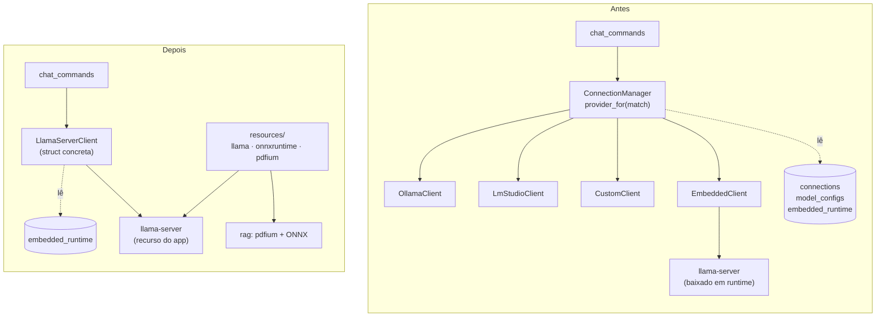
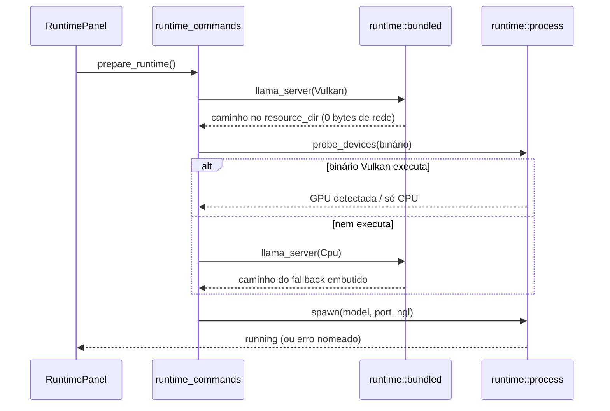

# Runtime autossuficiente — Design

**Spec:** `.specs/features/self-contained-runtime/spec.md`
**Context:** `.specs/features/self-contained-runtime/context.md`
**Status:** Draft

---

## Architecture Overview

A mudança tem duas metades independentes que se encontram no `runtime/`:

1. **Colapso do multi-provider** — quatro clientes, uma tabela de conexões e um trait com despacho dinâmico viram **um cliente concreto** e **uma linha de banco**.
2. **Vendoring dos componentes** — o que era baixado em runtime passa a ser resolvido dentro dos recursos do app, empacotados no build.



Fluxo de preparação do runtime, que é onde o download desaparece:



---

## Research Findings

Cadeia de verificação cumprida. O que foi confirmado e o que ficou declarado como incerto:

**Confirmado ao vivo (2026-07-26):**
- Release corrente do llama.cpp é `b10142`. Tamanhos dos assets relevantes: `bin-win-vulkan-x64.zip` **33.561.026 B**, `bin-win-cpu-x64.zip` **18.292.093 B**, `bin-ubuntu-vulkan-x64.tar.gz` **32.342.805 B**, `bin-ubuntu-x64.tar.gz` **16.383.407 B**.
- `bundle.resources` do Tauri 2 aceita **forma de array** (preserva a estrutura de diretórios sob `$RESOURCE`) e **forma de mapa** (controle fino do destino). `"pasta/"` com barra final copia recursivamente preservando a estrutura. `**` sozinho é erro; usa-se `**/*`.
- Resolução em Rust é `app.path().resolve("<caminho declarado>", BaseDirectory::Resource)`.
- `resource_dir` documentado por plataforma: **Windows** → o diretório do executável principal; **AppImage** → `${APPDIR}/usr/lib/${exe_name}`; **instalação Linux** → `/usr/lib/${exe_name}`; **desenvolvimento** → `${exe_dir}/../lib/${exe_name}`.
- Em `tauri dev` os recursos são copiados para `src-tauri/target/debug/<pasta>` — **com uma pegadinha**: a cópia só acontece quando um recurso já conhecido muda ou quando o build script reexecuta. Arquivo novo numa pasta já conhecida é ignorado. O contorno documentado é `println!("cargo:rerun-if-changed=<pasta>")` no `build.rs`.

**Declarado incerto (não achei documentação conclusiva, e não dá para verificar desta máquina Windows):**
- **Se `bundle.resources` preserva o bit de execução no `.deb` e no `.AppImage`.** A busca só encontrou relatos adjacentes (permissão do próprio AppImage, updates que não marcam +x). Como não sei, o design **não aposta**: o caminho de execução garante o bit por conta própria (ver `ensure_executable` abaixo), o que torna a resposta irrelevante para a corretude. A verificação empírica vira uma task com gate real (inspecionar o `.deb` gerado).
- **Se o `tauri build` de release copia os recursos para `target/release/<pasta>`** do mesmo jeito que o dev copia para `target/debug/`. O `make-portable.mjs` depende disso; a task correspondente confere o resultado do build em vez de assumir.

**Tamanhos que faltam medir (não estimar):** o extraído de cada archive, o instalador final por SO e o delta de update. Ficam como saída obrigatória da task de build.

---

## Code Reuse Analysis

### O que já existe e passa a ser reaproveitado

| Componente | Local | Como é usado |
| --- | --- | --- |
| `find_server_binary` | `embedded_commands.rs` | Move para `runtime::bundled`; a busca recursiva serve igual para achar o binário dentro do recurso |
| `find_dylib` / `find_library` | `rag/onnxruntime.rs`, `rag/pdfium.rs` | Mesma função, apontada para o `resource_dir` em vez da pasta de download |
| `probe_devices` / `classify_output` | `runtime/detect.rs` | Inalterado — a decisão Vulkan vs CPU continua sendo "rode `--list-devices` e leia a saída" (AD-022) |
| `process::spawn` / `build_args` / `free_port` / health check | `runtime/process.rs` | Inalterado; muda só de onde vem o `binary` |
| `store::load` / `store::save` | `runtime/store.rs` | Ganha os campos que vinham de `model_configs`; continua sendo a linha singleton |
| `download_with_progress` | `runtime/download.rs` | Continua servindo o download de GGUF e o updater portátil |
| `CustomClient` | `providers/custom.rs` | É o cliente OpenAI-compatible genérico que o `EmbeddedClient` já delegava; vira a base do `LlamaServerClient` |
| `openai_stream` | `providers/openai_stream.rs` | Parser SSE, inalterado |
| `move_tree` | `update/portable.rs` | Já recursivo — a atualização portátil lida com a pasta de recursos sem mudança |

### Pontos de integração

| Sistema | Como conecta |
| --- | --- |
| `chat_commands::send_message` | Deixa de resolver `ActivePair` e passa a pedir o cliente e o modelo ao `runtime` |
| `chat::context_assembler` (`budget_context`) | Continua chamando `model_limits`, agora no cliente concreto |
| Migrações `db.rs` | Ganha a migração 6; o mecanismo de `PRAGMA user_version` já existe desde a AD-020 |
| `release.yml` | O vendoring entra via `beforeBuildCommand`, então nenhum passo novo de workflow é obrigatório — vale porque quem constrói é o `tauri-action`, que passa pelo Tauri CLI |
| `ci.yml` | **Não vale.** O job `rust` chama `cargo test` direto e nunca percorre o CLI, então a pasta de recursos nunca é criada e o `tauri-build` aborta. Resolvido versionando `src-tauri/resources/.gitkeep` (AD-049), não com passo de workflow |
| `make-portable.mjs` | Passa a copiar a pasta de recursos junto do `.exe` |

### CONCERNS.md — o que esta feature toca

| Concern | Efeito |
| --- | --- |
| C-03 (tipos duplicados Rust↔TS à mão) | Melhora por subtração: `Connection`, `ConnectionProvider`, `ConnectionStatus` e `ActivePair` deixam de existir dos dois lados |
| C-05 (providers verificados sem servidor real) | **Resolvido por remoção**: os dois clientes nunca exercitados contra um servidor real são justamente os que saem |
| C-10 / C-11 | Não tocados |

---

## Components

### `runtime::bundled` (novo)

- **Purpose:** responder "onde está o componente X neste app instalado?" sem nunca ir à rede.
- **Location:** `src-tauri/src/runtime/bundled.rs`
- **Interfaces:**
  - `resource_root(app: &AppHandle) -> Result<PathBuf, String>` — `resolve("resources", BaseDirectory::Resource)`
  - `llama_server(app: &AppHandle, backend: Backend) -> Result<PathBuf, String>` — acha o executável sob `resources/llama/<backend>/` e garante que é executável
  - `onnxruntime_dylib(app: &AppHandle) -> Result<PathBuf, String>`
  - `pdfium_library(app: &AppHandle) -> Result<PathBuf, String>`
  - `ensure_executable(path: &Path, fallback_dir: &Path) -> Result<PathBuf, String>` — ver abaixo
- **Dependencies:** `tauri::Manager` (path resolver), `runtime::Backend`
- **Reuses:** a busca recursiva de `find_server_binary`/`find_dylib`, unificada numa única `find_file(dir, name)`

**`ensure_executable` — a parte que não aposta na sorte.** No Unix, lê o modo do arquivo; se já tem `0o111`, devolve o caminho e acabou. Se não tem, tenta `set_permissions` no lugar; se isso falhar (o caso real: `/usr/lib/ReadMe` pertence ao root e o app roda como usuário), **copia** a pasta inteira do backend para `<pasta-base>/runtime/llama/<backend>`, marca `0o755` e devolve o caminho da cópia. No Windows é um no-op — não existe bit de execução. O custo (uma cópia de ~100 MB) só aparece se o empacotador realmente perder o bit, e a corretude não depende de descobrirmos se ele perde.

### `providers::llama_server::LlamaServerClient` (substitui 4 clientes)

- **Purpose:** falar HTTP com o `llama-server` local. Uma struct concreta, sem trait, sem `Box<dyn>`.
- **Location:** `src-tauri/src/providers/llama_server.rs` (funde `custom.rs` + `embedded.rs`)
- **Interfaces:**
  - `LlamaServerClient::new(port: u16) -> Self`
  - `health_check(&self) -> Result<(), ProviderError>`
  - `list_installed_models(&self, models_dir: &Path) -> Result<Vec<InstalledModel>, ProviderError>` — lê os `.gguf` da pasta (o `/v1/models` só conhece o que está carregado, AD-028)
  - `model_limits(&self, model: &str) -> Result<ModelLimits, ProviderError>` — `GET /v1/models` → `meta.n_ctx_train` / `meta.n_ctx` (AD-029)
  - `stream_chat(&self, model, messages, context_length, gpu_offload) -> Result<ChatStream, ProviderError>`
- **Dependencies:** `providers::openai_stream`, `providers::http_client`
- **Reuses:** o corpo de `CustomClient` praticamente inteiro; `EmbeddedClient` já delegava a ele

**O que some junto:** o trait `ProviderClient`, `ConnectionManager`, `EmbeddedContext`, `provider_for`, `detect_known_connections`, `configure_model` como chamada de provedor (no llama.cpp contexto e GPU são flags de inicialização, nunca uma chamada HTTP — `apply_runtime_config` já fazia o trabalho de verdade), e a dependência `async-trait` se não sobrar outro uso.

### `runtime::store` (ampliado)

- **Purpose:** única fonte de verdade de "qual modelo responde e como".
- **Location:** `src-tauri/src/runtime/store.rs`
- **Mudança:** a linha `embedded_runtime` absorve o que `model_configs` guardava. `gpu_layers` já existe e cobre o `gpu_offload`; `context_length` já existe; o modelo já é `model_path`. Ou seja: **nenhuma coluna nova é necessária** — o que muda é que ninguém mais escreve em outro lugar.

### `runtime_commands` (renomeia `embedded_commands` + absorve o resto)

- **Purpose:** a superfície Tauri de tudo que é runtime e modelo.
- **Location:** `src-tauri/src/runtime_commands.rs`
- **Comandos depois da mudança:**

| Antes | Depois |
| --- | --- |
| `list_connections`, `add_connection`, `set_active_connection`, `clear_active_connection`, `refresh_connection_status` | **removidos** |
| `setup_embedded_runtime`, `start_embedded_runtime`, `stop_embedded_runtime`, `embedded_runtime_status` | `prepare_runtime`, `start_runtime`, `stop_runtime`, `runtime_status` |
| `list_installed_models`, `set_active_model`, `configure_model`, `model_limits`, `get_active_pair` | mesmos nomes, sem o parâmetro `connection_id`; `get_active_pair` vira `get_active_model` |
| `list_downloadable_models`, `pull_model`, `download_embedded_model` | `list_downloadable_models`, `download_model` (um só — todo download agora é GGUF por URL) |

### Frontend: `RuntimePanel` (substitui `ConnectionsPanel`)

- **Purpose:** uma tela: estado do runtime + modelos.
- **Location:** `src/components/Runtime/`
- **Composição:**
  - `RuntimeCard` — evolução do `EmbeddedRuntimeCard`: estado (instalado/rodando/erro), backend detectado, botão preparar/parar. Sem etapa de download de binário.
  - `ModelsList` — instalados (nome + tamanho) e catálogo para baixar, filtrado por RAM. Reaproveita `ModelDownloadCard` e `ModelConfigForm` quase inteiros, tirando `connectionId`.
- **Sai:** `ConnectionsList.tsx` (lista + formulário de URL), a aba "Conexões", `ConnectionProvider` e `Connection` de `types.ts`.
- **Sidebar:** a seção "Conexões" vira "Runtime" (chave i18n nova, ícone mantido).

### `scripts/vendor-runtime.mjs` (novo)

- **Purpose:** trazer os três componentes para `src-tauri/resources/` antes do build.
- **Interfaces:** `node scripts/vendor-runtime.mjs [--force]`; sem argumentos, é no-op se tudo já estiver lá.
- **Comportamento:** lê `vendor.json`, baixa o asset da plataforma **hospedeira**, extrai, poda e grava um `.vendor-stamp.json` com as versões instaladas (é o que torna o no-op confiável e o `--force` desnecessário no dia a dia).
- **Poda (regra explícita, para não adivinhar quais DLLs importam):** dos archives do llama.cpp remove apenas os **outros executáveis** `llama-*` (cli, bench, quantize…), preservando **toda** biblioteca compartilhada. Do ONNX Runtime preserva a pasta `lib/` inteira. Do pdfium preserva o archive extraído inteiro (3,74 MB não justifica risco).
- **Reuses:** o estilo dos scripts existentes (`bump-version.mjs`): ESM, sem dependências, funções puras exportadas e testadas com `node --test`.

---

## Data Models

### Migração 6 — `MIGRATION_6_SINGLE_RUNTIME`

```sql
DROP TABLE IF EXISTS model_configs;
DROP TABLE IF EXISTS connections;
```

`embedded_runtime` fica como está:

```sql
CREATE TABLE embedded_runtime (
    id INTEGER PRIMARY KEY CHECK (id = 1),
    release_tag TEXT,      -- agora a versão vendorizada, vinda do vendor.json
    backend TEXT,          -- 'vulkan' | 'cpu', decidido por probe
    binary_path TEXT,      -- caminho resolvido (recurso ou cópia com +x)
    model_path TEXT,       -- o .gguf ativo
    context_length INTEGER,
    gpu_layers INTEGER
);
```

**Por que `binary_path` continua persistido** mesmo com o binário vindo do recurso: o caminho muda entre versões instaladas e entre modos (instalado/portátil), e o `ensure_executable` pode devolver uma cópia. Persistir o resolvido mantém o autostart do boot igual ao que já funciona, e revalidar é um `Path::exists()`.

### `vendor.json` (novo, na raiz de `scripts/`)

```jsonc
{
  "llamaCpp": {
    "tag": "b10142",
    "assets": {
      "win32":  { "vulkan": "llama-b10142-bin-win-vulkan-x64.zip",     "cpu": "llama-b10142-bin-win-cpu-x64.zip" },
      "linux":  { "vulkan": "llama-b10142-bin-ubuntu-vulkan-x64.tar.gz","cpu": "llama-b10142-bin-ubuntu-x64.tar.gz" }
    }
  },
  "onnxruntime": { "version": "1.28.0" },
  "pdfium":      { "release": "chromium/7961" }
}
```

Os nomes de asset ficam **escritos por extenso**, não montados por template: foi assim que `pick_asset` evitou baixar o build CUDA por engano (comentário em `release.rs`), e um nome errado aqui falha o build em vez de trazer o arquivo errado.

### Tipos que somem do `types.ts`

`ConnectionProvider`, `ConnectionStatus`, `Connection`, `ActivePair`, `ModelDownloadProgressEvent.connection_id`. Entram: `RuntimeStatus` (evolução de `EmbeddedRuntimeStatus`, sem os estágios de download de binário) e `ActiveModel` sem `connection_id`.

---

## Error Handling Strategy

| Cenário | Tratamento | O que o usuário vê |
| --- | --- | --- |
| Recurso ausente/instalação corrompida | Erro nomeando o arquivo procurado e o diretório | "Componente não encontrado em … — reinstale o ReadMe" (nunca uma tentativa de download) |
| Vulkan não executa | Fallback silencioso para o binário CPU embutido | "Nenhuma GPU compatível — usando CPU" |
| Nenhum dos dois executa | Erro com o motivo do último `probe` | Card do runtime em estado de erro, app segue aberto |
| Bit de execução ausente e `/usr/lib` só-leitura | Cópia para a pasta-base + `0o755` | Nada — resolve sozinho, com uma linha de log |
| Sem modelo ativo ao enviar mensagem | Erro nomeado no envio (SELF-05) | "Escolha um modelo em Runtime" |
| Migração 6 falha | Transação reverte; o app abre com o erro de banco atual | Mensagem de erro de banco existente |
| Download de modelo interrompido | Comportamento atual preservado (`.part`, sem arquivo final) | Progresso volta a zero, nada corrompido |

---

## Tech Decisions

| Decisão | Escolha | Racional |
| --- | --- | --- |
| Onde declarar os recursos | `bundle.resources: ["resources/"]` (forma de array, barra final) | Preserva a estrutura sob `$RESOURCE`; a forma de mapa achata glob e é ambígua para diretório |
| Quem dispara o vendoring | `beforeBuildCommand` e `beforeDevCommand` do próprio Tauri | CI e máquina local passam pelo mesmo caminho; nenhum passo de workflow que alguém possa esquecer de copiar |
| Trait vs struct concreta | Struct concreta | Um trait com um implementador é cerimônia; o `Box<dyn>` e o `match` de provedor existiam só para escolher entre quatro |
| `connections`/`model_configs` | Removidas por migração | Sem o que escolher, viram tabelas que só podem divergir de `embedded_runtime` — que é como o EMBED-12 nasceu |
| Ambos os backends embutidos | Sim | Embutir só o Vulkan trocaria "baixa 18 MB uma vez" por "não funciona nessa máquina" |
| Bit de execução no Linux | Garantido no código, não confiado ao empacotador | A pergunta "o `.deb` preserva +x?" não tem resposta documentada; o código não precisa dela |
| `release.rs` (API do GitHub) | Removido | A versão passa a ser de build; resolver "o último release" em runtime é justamente o que D2 elimina |
| `download::extract` | Removido se ficar sem chamador | A extração migra para o script de vendoring; `zip` continua no `Cargo.toml` por causa do updater portátil, `tar`/`flate2` provavelmente saem |
| Nome do recurso no disco | `resources/llama/<backend>/`, `resources/onnxruntime/`, `resources/pdfium/` | Espelha o layout que o código de download já criava, então a busca recursiva existente continua valendo |

---

## Open Questions

1. **O `.deb`/`.AppImage` preserva o bit de execução dos recursos?** Não sei, e o design foi construído para não depender disso. A task de verificação inspeciona o `.deb` gerado (`dpkg -c`) e registra a resposta — se preservar, a cópia de fallback nunca dispara e vira só uma rede de segurança.
2. ~~**O `tauri build` copia recursos para `target/release/`?**~~ — **RESPONDIDA em 2026-07-27, medindo.** Sim: `src-tauri/target/release/resources/`, com **79 arquivos e 115,0 MiB**, preservando a estrutura `llama/{vulkan,cpu}`, `onnxruntime/`, `pdfium/`, mais o `icon.ico` e o `.vendor-stamp.json`. É de lá que o `make-portable.mjs` copia, e o zip gerado confirma o caminho.
3. ~~**Quanto o instalador cresce, de fato?**~~ — **RESPONDIDA em 2026-07-27, medindo** (Windows x64; o Linux continua por medir, porque exige o runner do CI):

   | Artefato | Tamanho |
   | --- | --- |
   | `ReadMe_0.1.1_x64-setup.exe` (NSIS) | **47,6 MiB** |
   | `ReadMe_0.1.1_x64_en-US.msi` | **83,8 MiB** |
   | `ReadMe_0.1.1_x64-portable.zip` | **92,0 MiB** |
   | `ReadMe.exe` (binário nu) | **159,2 MiB** |
   | `resources/` descompactado | **115,0 MiB** |

   **Ficou muito abaixo do teto de ~450 MB que dispararia a reavaliação da poda** — o instalador NSIS cabe em menos de um nono dele. A razão é que os 274 MiB de payload (binário + recursos) comprimem bem: DLLs de `ggml` e o `onnxruntime.dll` são código, e o LZMA sólido do NSIS resolve. **A poda agressiva do `lib/` do ONNX Runtime não é necessária**; a que já existe (`.pdb`/`.lib`/`.exp`/headers) foi suficiente.

   **Nota de unidade, para uma leitura futura não achar divergência onde não há:** a AD-043 registra a árvore vendorizada como **120,5 MB** e este quadro como **115,0 MiB**. É o mesmo número em bases diferentes (120,5 × 10⁶ bytes = 114,9 × 2²⁰).
