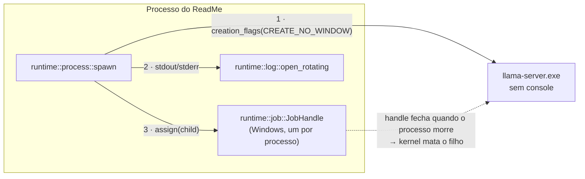

# Sidecar sem console e com ciclo de vida garantido — Design

**Spec**: `.specs/features/sidecar-lifecycle/spec.md`

## Visão geral

Três mudanças, todas concentradas em `runtime/`, e nenhuma delas atravessa a fronteira para o frontend — não há comando Tauri novo, não há evento novo, não há tipo espelhado em `src/types.ts`. É deliberado: o pedido é sobre a relação do app com o sistema operacional, não sobre o que o usuário faz na tela.

O ponto que amarra tudo: **o handle do job pertence ao processo do ReadMe**. Quando esse processo termina — normalmente, por crash, ou por `TerminateProcess` — o Windows fecha todos os handles dele. Fechar o último handle de um job com `JOB_OBJECT_LIMIT_KILL_ON_JOB_CLOSE` faz o kernel matar tudo que estiver dentro. Não há polling, não há watchdog, não há processo auxiliar: a garantia é do kernel, e é por isso que ela vale mesmo quando o nosso código não tem chance de rodar.

---

## Decisões técnicas

### 1. `CREATE_NO_WINDOW` via `std`, sem dependência nova

`std::os::windows::process::CommandExt::creation_flags(0x08000000)`. Está na biblioteca padrão; não precisa de crate nenhum.

**Verificado** na documentação do Rust e na de Process Creation Flags da Microsoft: `CREATE_NO_WINDOW` = `0x08000000`, e a doc registra a ressalva de que a flag **é ignorada se o executável não for uma aplicação de console** — o que é inofensivo aqui e explica por que o mesmo tratamento não faz diferença para o relaunch do próprio ReadMe em `update_commands.rs`.

Descartado: `Stdio::null()` como forma de esconder — não esconde, o console aparece do mesmo jeito. E `#[cfg(windows)]` espalhado pelo `spawn`: em vez disso, uma função `configure(cmd: &mut Command)` com duas implementações por `cfg`, chamada num ponto só (SIDE-03).

### 2. Job Object para o ciclo de vida

`CreateJobObjectW` → `SetInformationJobObject(JobObjectExtendedLimitInformation)` com `LimitFlags = JOB_OBJECT_LIMIT_KILL_ON_JOB_CLOSE` → `AssignProcessToJobObject(job, child)`.

**Precedente forte:** é exatamente a técnica que o **Cargo** usa (`cargo/util/job.rs`) para não deixar processos órfãos quando é interrompido. Não é um truque obscuro; é o padrão da plataforma para este problema.

**Crate:** `windows-sys`, com as features `Win32_System_JobObjects` e `Win32_Foundation`. O `Cargo.lock` já traz `windows-sys` transitivamente (0.45 até 0.61.2, várias versões, puxadas pelo Tauri), mas a dependência entra **explícita** no `Cargo.toml` — depender de algo que só está lá porque outro crate puxou é uma quebra esperando a próxima atualização do Tauri. Fica sob `[target.'cfg(windows)'.dependencies]`, para não pesar no build do Linux.

**Por que não substituir o `kill` atual:** o job é rede de segurança para o caminho que o nosso código não controla. No fechamento normal, matar explicitamente continua sendo melhor — é síncrono, é observável, e é o que a AD-028 já verificou funcionando (SIDE-06).

**Degradação (SIDE-07):** `CreateJobObject` e `AssignProcessToJobObject` podem falhar — políticas de grupo, ambientes já dentro de um job em Windows anterior ao 8, contêineres. Nesse caso o sidecar sobe do mesmo jeito e o app registra o motivo. A alternativa (recusar-se a iniciar o motor de IA porque uma garantia secundária falhou) seria trocar um vazamento de processo por um app inutilizável.

**Um job por processo do app, não um por sidecar (SIDE-08):** o job é criado uma vez, guardado ao lado do `SidecarState`, e cada processo novo é associado a ele. Criar um job por reinício vazaria um handle a cada troca de modelo.

### 3. Log em arquivo com uma geração de rotação

`File::create` em `<pasta-base>/runtime/llama-server.log`, passado como `Stdio::from(file)` para `stdout` e `stderr` (dois handles, dois `try_clone`).

Rotação simples: no início, se o arquivo existe, `rename` para `.log.1` (substituindo o `.1` anterior). Uma execução por arquivo, duas execuções de histórico, tamanho limitado por construção. Nada de rotação por tamanho — o `llama-server` não é verboso o bastante para justificar a máquina de estados.

**A pasta `runtime/` já existe** na estrutura da pasta-base (`config.rs`, `SUBDIRS`) e é onde o binário do llama.cpp mora. O log ao lado dele é o lugar óbvio.

---

## Arquivos

| Arquivo | Mudança |
| --- | --- |
| `src-tauri/Cargo.toml` | `windows-sys` sob `[target.'cfg(windows)'.dependencies]` |
| `src-tauri/src/runtime/job.rs` | **novo** — `JobHandle`, com implementação vazia fora do Windows |
| `src-tauri/src/runtime/log.rs` | **novo** — abertura com rotação, funções puras para o caminho e a decisão de rotacionar |
| `src-tauri/src/runtime/process.rs` | `configure_command`, `Stdio` do log, associação ao job; `SidecarConfig` ganha `log_path: Option<PathBuf>` |
| `src-tauri/src/runtime/detect.rs` | mesma `configure_command` no `--list-devices` |
| `src-tauri/src/runtime/mod.rs` | declara `job` e `log` |
| `src-tauri/src/embedded_commands.rs` | passa o `log_path` ao montar o `SidecarConfig` |
| `src-tauri/src/lib.rs` | cria o `JobHandle` no `setup` e o gerencia como estado |

---

## O que dá para testar sem um Windows na mesa

A matriz do `TESTING.md` classifica funções puras como unit. Aqui as puras são:

- **o caminho do log e a decisão de rotacionar** — testável em qualquer SO com `tempdir`
- **a montagem dos argumentos** — já coberta em `process.rs`

O que **não** é testável por unit test, e precisa estar escrito como tal no `tasks.md` em vez de fingir cobertura:

- que a janela não aparece (é observação visual)
- que o kernel mata o filho quando o app é morto (é `taskkill` + `tasklist`)

Esses dois viram uma task de verificação manual, no mesmo espírito da T24 do M8. A lição da L-005 se aplica: compilar não é evidência.

---

## Open Questions

1. **O `CREATE_NO_WINDOW` interfere no `--list-devices`?** O `detect.rs` lê o **stdout** do processo via `.output()`. A flag suprime a janela, não a captura de stdout, mas isso precisa ser confirmado rodando — se a detecção de GPU parar de funcionar, o app cai para CPU silenciosamente, que é exatamente o tipo de regressão cara e invisível.
2. **`Stdio` para arquivo e `try_wait` convivem?** O health check usa `child.try_wait()`. Redirecionar não deveria afetar, mas o par redirecionamento + `CREATE_NO_WINDOW` nunca foi exercitado neste código.
3. **A rotação com o arquivo aberto pelo processo anterior.** Se um sidecar antigo ainda estiver escrevendo (reinício rápido), o `rename` no Windows falha com arquivo em uso. O tratamento é ignorar a falha e truncar — mas o comportamento precisa ser visto, não suposto.
