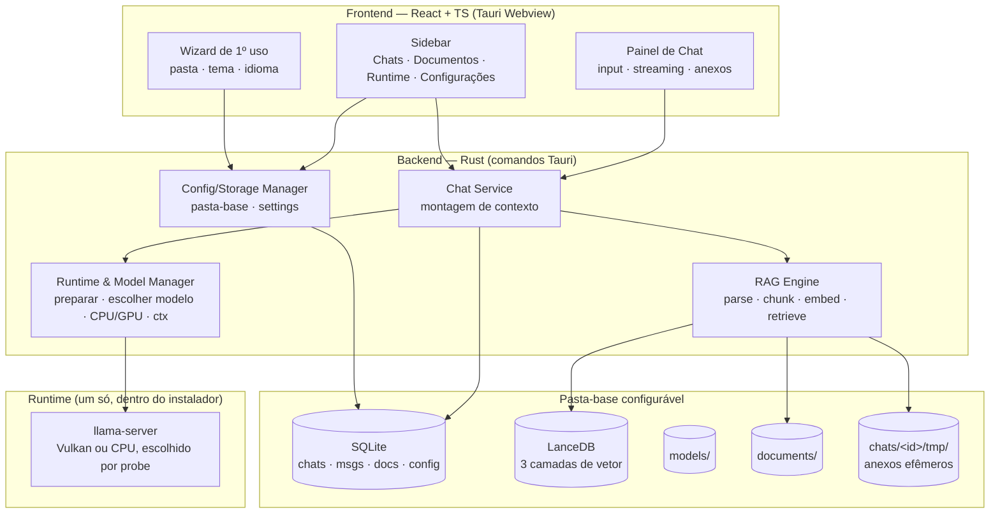

# Roadmap

**Current Milestone:** M6 — Memória de conversa. **9 das 9 tasks. A T9 fechou inteira em 2026-07-27** (AD-050): o backfill rodou numa conversa real e o efeito de desligar o toggle foi observado na resposta, os dois dirigindo a UI do app.
**Status:** In Progress — M3.1, M7, M7.1, M5 e M4 concluídos; **M8 implementado em 2026-07-26** (23 das 24 tasks; falta só a T24, que é publicar uma release de verdade e atualizar nos dois modos); **M9 implementado em 2026-07-27** (21 das 22; falta a T22, a verificação numa máquina sem rede). **Todo milestone tem spec agora** — o M6 era o último sem, e ganhou a sua em 2026-07-27.

> **Atualizado em 2026-07-27 (AD-048).** Das quatro pendências de UAT, **duas fecharam**: a T7 do M7.1 (janela e `taskkill`, medidos no app real) e o item central da T9 (a conversa lembrou do primeiro turno depois de 16 turnos). E a T24 deixou de estar bloqueada: **`v0.1.1` e `v0.2.0` foram publicadas de verdade**.
>
> ⚠️ **Mas a `v0.2.0` marcada como "Latest" não serve.** A tag é anterior ao M9 e carrega o estado quebrado em runtime da AD-042 — frontend chamando comandos que o backend já não registra. **Uma release nova a partir de `master` é o que resolve**, e disparar release é do mantenedor.
>
> **Atualizado em 2026-07-27 (AD-050).** A UAT que faltava foi executada **dirigindo o app** — `tauri dev` com o debug remoto do WebView2 exposto, cada ação despachada como evento DOM na página real, e o seletor de arquivos nativo respondido por um script Win32 à parte. Isso fechou: a **T9 do M6** inteira, a **T12 do M4** inteira, e a importação de documento do **M5**.
>
> ⚠️ **E achou um defeito que nenhum gate automatizado pegaria:** com *"usar meus documentos"* ligado e um PDF irrelevante na base, a pergunta sobre o primeiro turno era respondida a partir do PDF. Medido, corrigido e reverificado no mesmo cenário. Ver AD-050.
>
> **O que continua exigindo uma pessoa:** instalar sem administrador e aplicar um update de verdade (T24), e instalar com a rede desligada e conversar (T22).

> **Mudança de rumo aplicada (2026-07-27):** o M9 removeu Ollama, LM Studio e a URL manual, e passou a embutir os componentes binários no instalador. O PROJECT.md foi atualizado junto (T21) — ele não promete mais detectar runtimes externos.

> **Ordem de execução revisada (2026-07-25):** o usuário puxou o M7 (runtime embutido) para antes de M4/M5, e pediu a regra de "um único ativo" (M3.1). Ordem real agora: **M3.1 → M7 → M5 → M4**.

---

## Arquitetura (visão geral)

**RAG em 3 camadas** (montado a cada mensagem):
1. **Global** — documentos da base de conhecimento (tabela global), buscáveis por qualquer chat.
2. **Chat/anexos** — arquivos enviados dentro do chat (namespace `chat_id`, arquivos em `tmp/` efêmeros).
3. **Conversa (memória)** — turnos da própria conversa serializados/embeddados no namespace `memory:<chat_id>`; recuperação híbrida (últimas N verbatim + top-k antigos relevantes). Ver AD-009 e AD-044. **Implementada no M6, em 2026-07-27** — até então este item descrevia uma camada que não existia.

**Config inicial** por wizard de 1º uso (não no instalador — AD-010). **Storage** numa pasta-base configurável (AD-008). **i18n** EN padrão + PT; temas claro/escuro/extras (AD-007).

---

## M1 — Fundação & Shell — ✅ COMPLETE (verificado 2026-07-24)

- Scaffold Tauri 2 + React + TS + Tailwind v4 + Zustand
- Sidebar com Chats (topo), Documentos e Conexões (placeholders)
- SQLite + migrações; CRUD de chats (criar/listar/renomear/excluir) persistido
- Verificado: compila, janela abre, `readme.db` criado

---

## M2 — Configurações, Storage & i18n — ✅ COMPLETE (2026-07-24)

**Goal:** Base de configuração de todo o app: pasta de armazenamento, temas e idioma, mais o wizard de 1º uso.
**Target:** 1ª abertura mostra o wizard; Configurações permite trocar tema/idioma/pasta; tudo persiste.

### Features

**Config & Storage Manager** — DONE

- Pasta-base configurável contendo `models/`, `documents/`, `vectors/`, `chats/<id>/tmp/`, `readme.db`
- Persistência de settings; validação/criação da pasta; realocar `readme.db` para a pasta escolhida

**Wizard de 1º uso** — DONE

- Na 1ª execução: escolher pasta de dados, tema e idioma antes de entrar no app

**Seção Configurações na sidebar** — DONE

- Tema: claro, escuro + temas de cor extras (CSS variables)
- Idioma: inglês (padrão) + português (i18n)
- Editar pasta de armazenamento

---

## M3 — Conexões & Modelos — ✅ COMPLETE (2026-07-25) · ⛔ **REVOGADO PELO M9 (2026-07-27)**

> O que este milestone entregou — detecção de Ollama e LM Studio, conexão manual por URL, tabela `connections` — **não existe mais no app**. Foi removido inteiro pela AD-039/AD-042. O texto abaixo fica como histórico do que foi construído e por quê; não descreve o produto atual.

**Goal:** Descobrir runtimes locais, escolher quais usar, e gerenciar modelos (usar/baixar) com config de execução.
**Target:** Usuário vê conexões disponíveis, marca as ativas, vê/baixa modelos compatíveis com sua memória e ajusta contexto e CPU/GPU.

### Features

**Connection Manager** — DONE

- Detectar Ollama (`:11434`) e LM Studio (`:1234`); listar disponíveis; marcar quais usar (habilitar/desabilitar)
- Status/saúde por conexão; adicionar conexão manual (URL)

**Model Manager** — DONE

- Listar modelos instalados (para usar) e disponíveis para baixar
- Filtrar modelos para download pela memória disponível (RAM do sistema; ocultar os que não cabem)
- Baixar modelo com progresso (via API pull do Ollama)

**Config de execução** — DONE

- Tamanho de contexto (context window) configurável
- Escolha CPU vs GPU

---

## M3.1 — Conexão & modelo ativos únicos — ✅ COMPLETE (2026-07-25)

**Goal:** Eliminar a ambiguidade "várias conexões habilitadas, qual responde?" deixada pelo M3.
**Target:** Uma conexão ativa, um modelo ativo (sempre dela), escolhidos numa única ação.

### Features

**Par ativo único** — DONE (`.specs/features/single-active-connection/`, 10/10 tasks)

- `connections.enabled` (múltiplas) vira `is_active` (exclusiva); `toggle_connection` sai
- Escolher modelo ativa a conexão dona na mesma transação — invariante garantida no backend
- Conexões inativas seguem listadas com status e modelos inspecionáveis
- Revoga a AD-016 (modelo por chat) — ver AD-021

**Migração de schema versionada** — DONE

- `PRAGMA user_version` + lista ordenada de migrações (resolve C-01 do CONCERNS.md)
- Pré-requisito real do M7, que precisa adicionar tabela em banco já existente

---

## M7 — Runtime embutido (llama.cpp) — ✅ COMPLETE (2026-07-25)

> **Puxado para antes de M4/M5** a pedido do usuário (era o último antes do empacotamento).

**Goal:** Funcionar do zero sem nenhum programa externo instalado.
**Target:** Em máquina limpa, o app baixa o runtime + um modelo e conversa sozinho.

### Features

**Sidecar llama.cpp gerenciado pelo app** — DONE (`.specs/features/embedded-runtime/`, 16/16 tasks)

- Baixa o binário `llama-server` do release mais recente (Windows + Linux), com progresso
- Backend **Vulkan** (cobre NVIDIA/AMD/Intel sem toolkit); CPU como fallback — AD-022
- Detecção de GPU pelo próprio binário (`--list-devices`), sem lib pesada
- Modelo padrão: Phi-3.5 Mini Instruct Q4_K_M (MIT, ~2.4GB), escolhido pelo usuário
- Processo filho com porta livre automática, health check e kill no `RunEvent::ExitRequested`
- ~~Aparece como mais uma conexão (`provider = "embedded"`), ativável pela mesma regra do M3.1~~ — desde o M9 é o **único** runtime, e não há conexão a ativar

---

## M7.1 — Sidecar sem console e com ciclo de vida garantido — ✅ COMPLETE (2026-07-26; **T7 verificada no app real em 2026-07-27**, ver AD-041 e AD-048)

**Goal:** Fechar as três pontas soltas que o M7 deixou entre o sidecar e o sistema operacional.
**Target:** Abrir o app mostra **uma** janela; matar o app à força não deixa `llama-server` órfão; a saída do sidecar continua legível, em arquivo.

**Spec:** `.specs/features/sidecar-lifecycle/` — `spec.md` (11 requisitos SIDE-01…SIDE-11) + `design.md` + `tasks.md` (8 tasks).

### Features

> **Corrigido em 2026-07-27:** as três features abaixo estavam marcadas `PLANNED` desde o planejamento (AD-037), embora a AD-041 registre o milestone `✅ COMPLETE` desde 2026-07-26. É o mesmo tipo de divergência que a AD-036 já tinha encontrado no M8 — o documento não acompanhou a execução. O que continua aberto é só a observação visual da barra de tarefas (T7), não o código.

**Nenhuma janela de console** — DONE (SIDE-01…SIDE-03)

- `CREATE_NO_WINDOW` no spawn do sidecar e na detecção de GPU, via `std`, sem dependência nova
- Fora do Windows, nada muda

**Ciclo de vida atado ao app** — DONE (SIDE-04…SIDE-08)

- Job Object com `JOB_OBJECT_LIMIT_KILL_ON_JOB_CLOSE`: quem mata o filho é o kernel, então a garantia vale mesmo quando o nosso código não roda (crash, `taskkill /F`)
- Fortalece o EMBED-07, que hoje só cobre o fechamento normal
- Falha ao criar o job degrada para o comportamento atual — nunca impede o app de funcionar

**Log em arquivo** — DONE (SIDE-09…SIDE-11)

- `<pasta-base>/runtime/llama-server.log`, com uma geração de rotação
- Sem isso, esconder a janela trocaria um incômodo visual por cegueira de diagnóstico — foi lendo esse log que a AD-028 achou o bug do timeout de 5 s

---

## M4 — Chat: envio, streaming & anexos — ✅ COMPLETE (2026-07-25)

**Goal:** Conversar de verdade: enviar mensagem, receber streaming e anexar arquivos como RAG do chat.
**Target:** Envio de texto + anexo → resposta em streaming usando o modelo marcado, com os anexos como contexto.

### Features

**Envio & streaming** — DONE

- Campo de mensagem no chat; enviar → resposta em streaming (OpenAI-compatible); cancelar
- Seleção de modelo por chat + system prompt opcional

**Anexos no chat** — DONE

- Enviar arquivos junto com o texto; serializar para `chats/<id>/tmp/`
- Processar → RAG do chat (namespace `chat_id`); usados junto da pergunta
- Arquivos do chat são apagados quando o chat é excluído

---

## M5 — Base de Conhecimento & RAG global — ✅ COMPLETE (2026-07-25)

**Goal:** Importar documentos para a base global com feedback de processamento e usá-los como RAG.
**Target:** Importar documento → ver progresso → quando pronto, fica buscável; respostas citam trechos.

### Features

**Ingestão com progresso** — DONE

- Aba Documentos: botão importar (PDF, DOCX, TXT, MD)
- Barra/indicador de processamento; só arquivos **processados** entram no RAG
- Listar, ver status, remover

**Embedding & Retrieval** — DONE

- Embeddings (fastembed ONNX, modelo multilíngue) → LanceDB (tabela global)
- Recuperação top-k + injeção no contexto + citações; toggle por chat

---

## M6 — Memória de conversa (RAG híbrido) — ✅ COMPLETE (2026-07-27, 9/9 tasks)

> **A T9 fechou inteira em 2026-07-27 (AD-050).** Além da recuperação já registrada na AD-047/AD-048, os dois critérios que faltavam foram medidos em A/B, com a pergunta feita **uma única vez por conversa**: numa conversa cujo histórico nunca fora indexado, ligar a memória e clicar em *Indexar histórico* (12 turnos, ~1,6 s, `vectors/` +133.963 B) fez a pergunta sobre o turno 1 ser respondida com **"Falcão Azul … 82 mil reais"**; e numa conversa cuja memória **existia** no banco vetorial, desligar o toggle bastou para o modelo responder *"não tenho a capacidade de lembrar interações anteriores"*. Gates **daquele dia**: **177 testes Rust**, `npm run build` limpo. *(Registro histórico, preservado de propósito: diz o que era verdade quando a T9 passou. O baseline de hoje é **181 / 0 / 16** — a feature `generated-types` acrescentou 4 testes depois disto. Remedido na run 002.)*
>
> ⚠️ **A camada mudou de forma na mesma sessão (AD-050).** A memória continua a ser a última a receber **orçamento**, mas deixou de ser sempre a última em **posição**: quando o turno recuperado é o acerto mais próximo, é ele que fica colado na pergunta. Isso revisa MEM-10 e MEM-12.

**Goal:** Serializar a conversa e usá-la como memória via RAG híbrido, junto das outras camadas.
**Target:** Chat lembra de coisas ditas muito antes (além da janela de contexto) recuperando turnos relevantes.

**Spec:** `.specs/features/conversation-memory/` — `context.md` + `spec.md` (20 requisitos MEM-01…MEM-20) + `design.md` + `tasks.md` (9 tasks). Ver AD-044.

### Features

**Memória de sessão** — VERIFICADO NUMA CONVERSA REAL (MEM-01…MEM-13)

- Cada turno **completo** (o par pergunta+resposta) é embeddado num namespace próprio da conversa, `memory:<chat_id>`, depois de a resposta ser persistida e fora do caminho da requisição
- Geração cancelada ou com erro não vira memória: um turno pela metade recuperado depois seria uma frase truncada com autoridade de resposta completa
- Montagem híbrida: system prompt + últimas N verbatim + **memória** + RAG global + RAG anexos + pergunta
- **A memória é a última a receber orçamento**, depois dos documentos e do histórico recente — a AD-033 mediu que o que está perto da pergunta é o que o modelo lê, e a camada nova não pode deslocar isso
- Teto próprio de 2 turnos, separado do `TOP_K` de 4 dos documentos
- Um turno que já está no prompt verbatim não é recuperado de novo; um que o orçamento derrubou, é

**Confinamento à conversa** — DONE (MEM-07…MEM-09)

- Namespace exclusivo, disjunto do de anexos (`chat:<id>`) e do global — restrição explícita do usuário, verificada contra um LanceDB real
- Excluir o chat apaga os dois namespaces

**Toggle e backfill** — VERIFICADO CLICANDO (MEM-14…MEM-20, AD-050) — o botão de indexar foi clicado numa conversa real, o progresso (`Indexando histórico… (3/15)`) foi lido da tela, e o efeito de desligar o toggle foi observado **na resposta**, não só na gravação

- Interruptor por conversa, ligado por padrão (migração **8**); desligado para de recuperar **e** de gravar
- Indexação do histórico existente **sob demanda**, por conversa, com progresso — a varredura automática no boot foi recusada no planejamento: numa base grande é CPU de embedding logo depois de um update, o que se parece com travamento

**Fora do escopo:** resumo da conversa pelo LLM, memória entre conversas diferentes, e curadoria turno a turno.

---

## M7 — Runtime embutido — ⬆️ movido para antes do M4 (ver acima)

---

## M8 — Empacotamento & Distribuição — ⚙️ PUBLICADO, ATUALIZAÇÃO NÃO EXERCITADA (2026-07-26; publicado em 2026-07-27)

> **Atualizado em 2026-07-27 (AD-048).** O pipeline **rodou de verdade**: `v0.1.1` e `v0.2.0` publicadas por `workflow_dispatch`, 11 assets na última, release fora de rascunho. Isso fecha REL-01, REL-02, REL-06, REL-08 e REL-11 com evidência de execução. O que **não** aconteceu: nada foi instalado e nenhum update foi aplicado — a T24 segue parcial. E a publicação expôs um defeito real: o `latest.json` apontava o update portátil para uma URL de rascunho que responde **404**, corrigido na mesma sessão e **ainda não provado numa release**.

**Goal:** Gerar os instaladores finais multiplataforma, publicá-los por disparo manual com versão semântica, e fazer o app se atualizar sozinho — inclusive sem direitos de administrador.
**Target:** Um "Run workflow" + escolher `major`/`minor`/`patch` produz versão, CHANGELOG, tag e uma release com `.msi`, `-setup.exe`, `.deb`, `.AppImage` e `.zip` portátil, todos assinados. O app instalado **e** o portátil detectam a versão nova, perguntam e se atualizam.

**Spec:** `.specs/features/release-distribution/` — `context.md` + `spec.md` (27 requisitos REL-01…REL-27) + `design.md` + `tasks.md` (24 tasks). Ver AD-034.

### Features

**Pipeline de release manual com versão semântica** — CÓDIGO PRONTO, NUNCA EXECUTADO (REL-01…REL-07, REL-25, REL-26)

- `ci.yml`: valida todo push/PR (`npm run build`, `cargo test`, Conventional Commits)
- `release.yml`: **só** `workflow_dispatch`, com select `bump`. Push em `master` nunca publica
- Uma execução faz tudo: calcula a versão da última tag, grava nos arquivos que a duplicam, gera CHANGELOG (git-cliff), commita, tagueia e publica

**Instaladores + bundle portátil** — CÓDIGO PRONTO, NENHUM ARTEFATO GERADO (REL-08…REL-12)

- Matriz `windows-latest` + `ubuntu-22.04` via `tauri-action`; release nasce draft e só é publicada com todos os artefatos no lugar
- NSIS em `installMode: currentUser` — instala em `%LOCALAPPDATA%`, **sem UAC**
- `.zip` portátil de Windows assinado com a mesma chave minisign dos instaladores
- Linux não ganha zip: o `.AppImage` já roda sem instalar e já é atualizável sem root

**Auto-update nos dois modos** — CÓDIGO PRONTO, NUNCA EXERCITADO (REL-13…REL-24)

- Modo detectado por arquivo marcador `.portable` ao lado do executável
- Portátil grava config e dados ao lado do executável (nunca `%APPDATA%`)
- Instalado → `tauri-plugin-updater` oficial; portátil → troca de arquivos in-place (rename-then-replace, com rollback), sem elevação
- Banner não bloqueante com Atualizar / Depois / Pular esta versão; Configurações ganha versão, "Verificar agora" e toggle de opt-out
- Config inicial segue no wizard de 1º uso, não no instalador (AD-010)

**Fora do escopo:** code signing (SmartScreen vai avisar), macOS, canal beta, delta updates.

---

## M9 — Runtime autossuficiente — ⚙️ IMPLEMENTADO, COM UMA REGRESSÃO CORRIGIDA NA PRIMEIRA EXECUÇÃO (2026-07-27)

> **Leia isto antes de confiar no "implementado".** As 21 primeiras tasks passam nos gates automatizados, mas **na primeira vez que o app foi aberto o runtime empacotado não executou**: a poda do vendoring apagava `llama-server-impl.dll` e `llama-common.dll`, e o `llama-server.exe` que sobrava é um lançador de 9 KB (AD-046). Corrigido, e o binário empacotado agora responde `Vulkan0: NVIDIA GeForce RTX 3060`. **Os instaladores medidos na AD-045 foram gerados com a árvore quebrada e não servem** — precisam ser refeitos, e os tamanhos daquele registro não valem mais. A T22 segue parcial: nada foi instalado, nada foi testado com a rede desligada.
>
> **Atualizado em 2026-07-27 (AD-048):** o app foi aberto de novo depois da correção e **o runtime empacotado subiu** — Phi-3.5 carregado da árvore vendorizada, `n_ctx_slot = 21760`, escutando em `127.0.0.1:53773`. Isso desfaz a dúvida da AD-046 em ambiente de desenvolvimento. **Mas nada deste milestone está publicado:** a tag `v0.2.0` é anterior ao vendoring (sem `vendor.json`, sem `bundle.resources`, sem `runtime/bundled.rs`, frontend ainda em `components/Connections`), e por isso o zip portátil publicado tem 3 arquivos e nenhum recurso.

**Goal:** Um runtime só, embutido, e nada para baixar além do modelo. O app deixa de conversar com programas externos e deixa de buscar componentes na internet.
**Target:** Numa máquina **sem rede**, com um `.gguf` já na pasta de modelos: instalar → abrir → escolher o modelo → conversar. Importar um PDF offline chega a `ready`.

**Spec:** `.specs/features/self-contained-runtime/` — `context.md` + `spec.md` (19 requisitos SELF-01…SELF-19) + `design.md` + `tasks.md` (22 tasks). Ver AD-039.

### Features

**Ollama, LM Studio e URL manual saem** — DONE (SELF-01…SELF-08)

- Os quatro `ProviderClient` viram **um cliente concreto**; some o trait, o `Box<dyn>`, o `ConnectionManager` e o `match` de provedor
- Migração **7** derruba `connections` e `model_configs` (o número 6 tinha sido gasto pela coluna `documents.namespace`); `embedded_runtime` fica como única fonte de "qual modelo responde, com qual contexto e qual GPU" — que é o lugar onde o EMBED-12 nasceu por duplicação
- A tela de Conexões vira a tela de Runtime; a sidebar acompanha

**Componentes dentro do instalador** — CÓDIGO PRONTO, NENHUM INSTALADOR GERADO (SELF-09…SELF-17)

- `llama-server` **Vulkan e CPU**, ONNX Runtime e pdfium passam a viajar como recursos do bundle, com versões fixadas num `vendor.json` e trazidas por `beforeBuildCommand` (mesmo caminho em CI e na máquina local)
- A escolha de backend vira um `probe` local, sem download nenhum
- O bit de execução no Linux é garantido **pelo código**, não confiado ao empacotador — a pergunta "o `.deb` preserva +x?" não tem resposta documentada e o design foi feito para não depender dela
- O zip portátil passa a levar os recursos; `move_tree` já é recursivo, então a atualização portátil não muda

**Faxina** — DONE (SELF-18)

- Os ~150 MB que a versão anterior baixava em `<base>/runtime/{vulkan,cpu,onnxruntime,pdfium}` são apagados no boot

**Medições que a implementação produziu** (a spec pedia número, não estimativa):

- Árvore vendorizada no Windows x64: **120,5 MB** — llama Vulkan 73,8 MB, llama CPU 23,1 MB, ONNX Runtime 16,2 MB, pdfium 7,4 MB
- O ONNX Runtime extrai **425,9 MB** cru. **408 MB disso é um único `onnxruntime.pdb`** (símbolos de debug). A poda do script derruba `.pdb`/`.lib`/`.exp`/headers — sem ela, o instalador do Windows teria crescido mais que todo o resto do app junto. Isso responde a Open Question #3 do design pelo lado que ela não previa: o risco não era o `lib/` inteiro, era um arquivo só.
- Tag do llama.cpp fixada: **b10146** (o design tinha pesquisado b10142)
- **Instaladores medidos em 2026-07-27** (Windows x64): `-setup.exe` **47,6 MiB**, `.msi` **83,8 MiB**, `-portable.zip` **92,0 MiB**, binário **159,2 MiB**. O teto de ~450 MB que dispararia uma poda mais agressiva do ONNX Runtime **não chegou perto** de ser alcançado. Linux por medir

**Fora do escopo:** embutir um modelo GGUF (o usuário escolhe o que cabe na máquina), CUDA/ROCm, macOS, e voltar Ollama atrás de flag.

> **Interação com o M7.1:** os dois mexem em `runtime/`. O M7.1 muda **como** o sidecar é iniciado (sem console, dentro de um Job Object, com log em arquivo); o M9 muda **de onde vem o binário** e quem pergunta por ele. São eixos independentes e podem ser executados em qualquer ordem — só não em paralelo por dois agentes, porque `runtime/process.rs` e `runtime/detect.rs` são tocados pelos dois. A faxina do M9 apaga apenas os quatro subdiretórios listados, nunca `<base>/runtime/` inteiro, justamente para não levar junto o `llama-server.log` do M7.1.

---

## M10 — Pivô para leitor — ⚙️ EM EXECUÇÃO (planejado 2026-09-04 pela AD-052; **M10.1 implementado em 2026-09-05, não verificado clicando**)

O produto deixa de ser um chat com RAG e passa a ser um **leitor**: importar livros, remontá-los para leitura na tela e lê-los em voz alta com marcação estilo karaokê. Planejado em três fatias; **só a primeira tem tasks**.

> **Leia isto antes de confiar no "implementado".** As oito primeiras tasks da M10.1 passaram nos gates automatizados — `cargo test --lib` saiu de **177 / 0 falhas / 15 ignorados** (baseline medido na T1, que **não** bate com os 181/16 que o `AGENTS.md` registrava) para **195 / 0 / 15**, `cargo check --lib` com **zero warnings**, `npm run build` exit 0 com o bundle mudando de `index-ng6tE1z0.js` para `index-BhmqRmEJ.js` (o sinal de que a rota realmente ligou) e i18n em **158/158 chaves**. **Mas o app não foi aberto uma única vez** (`npm run tauri dev` não rodou) e **nenhum `invoke` foi disparado**. Nenhum requisito LIB-xx está `Verified`; todos estão `Implemented`. A T9 é a UAT que fecha isso.

### M10.1 — Biblioteca de livros — ⚙️ 8 de 9 tasks (2026-09-05); **falta a T9, a UAT**
`.specs/features/book-library/` (spec + design + tasks)

**O que foi entregue e passa nos gates:**

- Importar PDF e Kindle (`.epub`, `.mobi`, `.azw`, `.azw3`) pela aba que era Documentos — a aba **é** a Biblioteca desde a T7: `ActiveView` só tem `"library"` e `App.tsx` renderiza o `LibraryPanel`
- Guardar em `<base_path>/library/`; botão que abre a pasta no explorador, com o caminho absoluto na tela
- **Sem nenhum passo de RAG** sobre esses arquivos — fixado por teste: depois de importar, `SELECT COUNT(*) FROM documents` é **0**
- Recusar na importação o que o leitor não vai abrir: extensão fora da lista, PalmDB com o campo de criptografia ≠ 0 e EPUB com `META-INF/encryption.xml`. Um arquivo **ilegível** vira erro de leitura, nunca "sem DRM" — o teste pegou o inverso disso durante a T3 e a asserção continua lá
- Tabela nova `books` (**migração 9**) — o porquê de não reusar `documents` está na AD-052
- 18 testes novos em Rust (3 na migração, 9 na detecção de formato/DRM, 6 nos comandos)

**O que o leitor deste roadmap precisa saber que NÃO está provado:**

- **O app nunca foi aberto nesta rodada.** LIB-01 (seletor nativo), LIB-04 (recusa sem pasta-base configurada), LIB-11 (abrir a pasta) e LIB-12 (caminho na tela) estão **escritos, não medidos** — `library_dir()` exige um `AppHandle` e nunca rodou
- **Os quatro comandos Tauri não têm teste** (não há runner de integração Tauri). O que está provado são as funções puras e o SQL contra banco em memória
- **Nenhum arquivo `.mobi`/`.azw`/`.azw3`/`.epub` real** passou pelo detector de DRM — tudo sintético, montado byte a byte
- **Não há teste de frontend**: o store e os componentes nunca rodaram. `vitest.config.ts` existe e aponta para `src/test/setup.ts` e dois dobles que **não existem na árvore**
- **A migração 9 não foi ensaiada contra cópia de banco real** (`db::real_database` continua `#[ignore]`)

### M10.2 — Leitor — ⛔ NÃO PLANEJADO
Extrair o texto, remontar o livro em formato navegável **preservando as gravuras**, renderizar na tela. É esta fatia que define a **âncora de posição de leitura**, e é por isso que a `reading-history` está bloqueada.

### M10.3 — Audiobook com karaokê — ⛔ NÃO PLANEJADO, VIABILIDADE NÃO MEDIDA
Ler em voz alta marcando a palavra corrente. **Gate:** existe TTS local com limite por palavra (*word boundary*)? Não foi medido. Se não existir, esta fatia cai ou muda de forma — medir **antes** de construir o leitor em volta dela.

### Histórico de leitura — 📋 REQUISITOS ESCRITOS, SEM TASKS
`.specs/features/reading-history/` — a área de chat vira o histórico, com "onde parou". Sem tasks de propósito: a posição não tem quem a escreva até o M10.2 existir, e o que "posição" significa depende do design dele.

### O que o M10 revoga

- **M5 (RAG global):** a UI de importação para RAG **saiu em 2026-09-05**, junto com a aba. O backend fica. Anotado em `.specs/features/documents-rag/spec.md`, requisito a requisito, sem apagar nenhum: DOC-01, DOC-02, DOC-03, DOC-05, DOC-08 e DOC-09 perderam a porta; DOC-10/11/12 continuam valendo porque o chat não foi revogado nesta rodada.
- **M4/M6 (chat e memória):** a lista de chats dá lugar ao histórico de leituras. **Nada disso foi executado ainda** — o chat continua inteiro e é o único caminho verificado do app.

A revogação do **código** continua **marcada, não executada** (AD-052). Gatilho escrito da remoção: a primeira sessão após o leitor (M10.2) renderizar um livro ponta a ponta. Órfãos de rota, presentes e compilando: `DocumentsPanel.tsx`, `DocumentRow.tsx`, `DocumentStatusBadge.tsx`, `documentsStore.ts`, `documentsApi.ts` e as chaves `sidebar.documents` / `documents.*`. Único arquivo apagado: `DocumentsSection.tsx`, e por obrigação do `tsc`, não por escolha.

---

## Future Considerations

- Perfis de agente reutilizáveis (persona + modelo + docs vinculados)
- Agentes com ferramentas (busca em arquivos, execução de código, web opcional)
- Página customizada no instalador NSIS Windows (pasta durante a instalação)
- Detecção de VRAM por GPU para filtragem de modelos mais precisa
- Suporte a macOS · OCR de documentos escaneados
- Export/import de chats e da base de conhecimento
